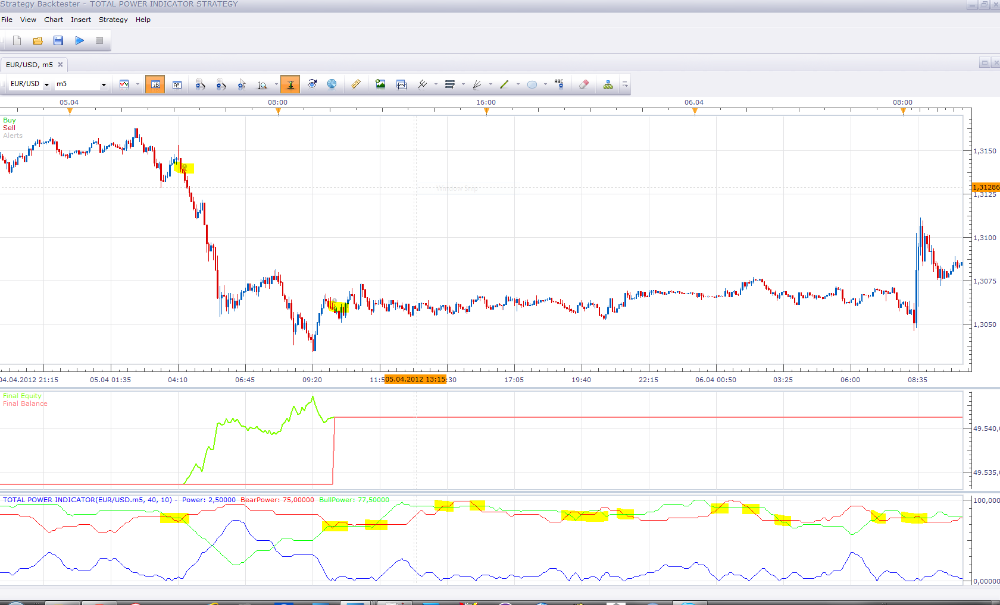

# Total Power Indicator Strategy

> Source: https://fxcodebase.com/code/viewtopic.php?f=31&t=16962  
> Forum: 31 · Topic 16962 · 3 post(s)

---

## Total Power Indicator Strategy

**Apprentice** · Wed Apr 25, 2012 7:45 am

 [Total Power Indicator Strategy.lua](files/31218/Total%20Power%20Indicator%20Strategy.lua)

Install Total Power Indicator
[viewtopic.php?f=17&t=6307&p=31123&hilit=Total+Power+Indicator#p31123](https://fxcodebase.com/code/viewtopic.php?f=17&t=6307&p=31123&hilit=Total+Power+Indicator#p31123)

The Strategy was revised and updated on January 22, 2019.

---

## Re: Total Power Indicator Strategy

**Coondawg71** · Wed Apr 25, 2012 9:21 am

Wow! Apprentice, you are the MAN!!!

Just downloaded the strategy, will report back any tweeking we may need, love the parameter settings you installed, you sir have a great job!

Thanks!

sjc

---

## Re: Total Power Indicator Strategy

**Apprentice** · Wed Jan 03, 2018 11:20 am

The strategy was revised and updated.
