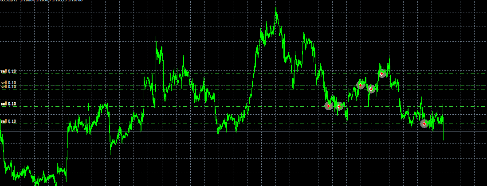

# trade at time and week

> Source: https://fxcodebase.com/code/viewtopic.php?f=31&t=70045  
> Forum: 31 · Topic 70045 · 16 post(s)

---

## trade at time and week

**Apprentice** · Fri Jun 19, 2020 5:10 am

Based on request.
[viewtopic.php?f=17&t=70040](https://fxcodebase.com/code/viewtopic.php?f=17&t=70040)

 [trade at time and week.lua](files/135109/trade%20at%20time%20and%20week.lua)

 [trade at time week and month.lua](files/135109/trade%20at%20time%20week%20and%20month.lua)

MT4/MQ4 version.
[viewtopic.php?f=38&t=70079](https://fxcodebase.com/code/viewtopic.php?f=38&t=70079)

---

## Re: trade at time and week

**marcoleghorn1972** · Fri Jun 19, 2020 7:44 am

Thaks a lot.
Is possible to add the month? For exemple:
go long in February, March April and on Monday and Friday from 01 to 12;
go short in July August, September, October, November, December and January, Monday and Friday from 12 to 13
Can add a filter, like adx, rsi, mva?
Thanks.

---

## Re: trade at time and week

**Apprentice** · Sun Jun 21, 2020 4:15 am

Your request is added to the development list.
Development reference 1525.

---

## Re: trade at time and week

**marcoleghorn1972** · Tue Jun 23, 2020 6:49 am

Hello, waiting for the required strategy to be developed, I am trying to use the existing one but, the error that I am attaching to you is generated.
Thank you.

---

## Re: trade at time and week

**Apprentice** · Wed Jun 24, 2020 5:47 am

trade at time week and month.lua added.

---

## Re: trade at time and week

**marcoleghorn1972** · Wed Jun 24, 2020 9:49 am

> **Apprentice wrote:**
> trade at time week and month.lua added.

Good afternoon apprentice, thanks for the work done. Unfortunately I have to inform you that marketscope 2.0 generates the attached error and it is not possible to perform the backtest.
Thank you.

---

## Re: trade at time and week

**Apprentice** · Wed Jun 24, 2020 12:44 pm

Can you share the parameters used?
Please post parameters when adding the strategy to the chart.

---

## Re: trade at time and week

**marcoleghorn1972** · Wed Jun 24, 2020 3:09 pm

> **Apprentice wrote:**
> Can you share the parameters used?
> Please post parameters when adding the strategy to the chart.

---

## Re: trade at time and week

**Apprentice** · Thu Jun 25, 2020 4:27 am

Your request is added to the development list.
Development reference 1553.

---

## Re: trade at time and week

**Apprentice** · Thu Jun 25, 2020 5:26 am

There is nothing I can do with that. FXTS2 issue

---

## Re: trade at time and week

**marcoleghorn1972** · Thu Jun 25, 2020 7:17 am

> **Apprentice wrote:**
> There is nothing I can do with that. FXTS2 issue

Ok, thanks a lot. Can you develope the same startegy for MT4?

---

## Re: trade at time and week

**Apprentice** · Thu Jun 25, 2020 1:40 pm

Your request is added to the development list.
Development reference 1562.

---

## Re: trade at time and week

**Apprentice** · Fri Jun 26, 2020 3:59 am

MT4/MQ4 version.
[viewtopic.php?f=38&t=70079](https://fxcodebase.com/code/viewtopic.php?f=38&t=70079)

---

## Re: trade at time and week

**marcoleghorn1972** · Fri Jun 26, 2020 9:05 am

> **Apprentice wrote:**
> MT4/MQ4 version.
> [viewtopic.php?f=38&t=70079](https://fxcodebase.com/code/viewtopic.php?f=38&t=70079)

Hi, the EA do nothing

---

## Re: trade at time and week

**Apprentice** · Sun Jun 28, 2020 4:35 am

Your request is added to the development list.
Development reference 1569.

---

## Re: trade at time and week

**Apprentice** · Wed Jul 01, 2020 4:12 am

I don't have any issues. Make sure you set the correct time.
