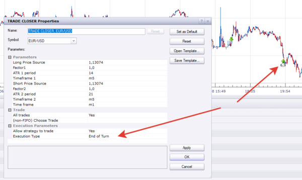
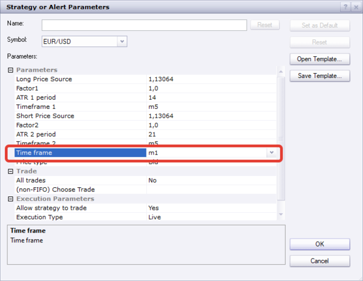

# TRADE CLOSER

> Source: https://fxcodebase.com/code/viewtopic.php?f=31&t=69856  
> Forum: 31 · Topic 69856 · 28 post(s)

---

## TRADE CLOSER

**Apprentice** · Wed May 13, 2020 6:31 am

Based on request.
[viewtopic.php?f=27&t=69835](https://fxcodebase.com/code/viewtopic.php?f=27&t=69835)

 [TRADE CLOSER.lua](files/133886/TRADE%20CLOSER.lua)

---

## Re: TRADE CLOSER

**SerifKocdemir** · Wed May 13, 2020 4:07 pm

Thank you so much

Just When I try to use ''Execution Type =End Of Turn'' not working
Can You fix It??

---

## Re: TRADE CLOSER

**Apprentice** · Wed May 13, 2020 4:13 pm

Define not working?

---

## Re: TRADE CLOSER

**SerifKocdemir** · Wed May 13, 2020 4:19 pm

> **Apprentice wrote:**
> Define not working?

 When I chose ''Execution Type =End Of Turn'' Strategy not close trade/do nothing.

---

## Re: TRADE CLOSER

**Apprentice** · Wed May 13, 2020 4:22 pm

Your request is added to the development list.
Development reference 1293

---

## Re: TRADE CLOSER

**Apprentice** · Thu May 14, 2020 4:18 am

I don't have any issues, It works with end of turn well.
If the end of the turn is used the action will be delayed.

---

## Re: TRADE CLOSER

**SerifKocdemir** · Thu May 14, 2020 6:02 am

> **Apprentice wrote:**
> I don't have any issues, It works with end of turn well.
> If the end of the turn is used the action will be delayed.

Thank You so much
In Similation mod It didnt work, still dont work in my computer.
I will try Real Trade and real account than I will inform you result a.s.a.p.

---

## Re: TRADE CLOSER

**SerifKocdemir** · Thu May 14, 2020 11:50 am

> **Apprentice wrote:**
> I don't have any issues, It works with end of turn well.
> If the end of the turn is used the action will be delayed.

I have tried in real account,
But
It is not work when I chose ''End of Turn'' neither in Similation Mod or Real Account.
What can be problem?

---

## Re: TRADE CLOSER

**SerifKocdemir** · Sat May 16, 2020 4:19 pm

Hi Everbody
and Thank you so much

I have a problem with TRADE CLOSER'S ''End of turn'' function
It is not work.
I uninstal and reinstal again and again but result same 'end of turn'' not work.
Can FXCODEBASE Team can fix The problem??

---

## Re: TRADE CLOSER

**Apprentice** · Sun May 17, 2020 3:41 am

Your request is added to the development list.
Development reference 1306.

---

## Re: TRADE CLOSER

**Apprentice** · Mon May 18, 2020 8:06 am

I don't have any issues

---

## Re: TRADE CLOSER

**SerifKocdemir** · Mon May 18, 2020 9:32 am

> **Apprentice wrote:**
>
>
> image.png
>
>
> I don't have any issues

I have uninstaled and instaled again then I tried again.
I am sorry but,
Problem still same nothing change

---

## Re: TRADE CLOSER

**SerifKocdemir** · Mon May 18, 2020 9:54 am

> **Apprentice wrote:**
>
>
> image.png
>
>
> I don't have any issues

I uninstalled and reinstal whole Trading Station and Strategy
But Still there is problem.
''End of Turn'' not working .

---

## Re: TRADE CLOSER

**SerifKocdemir** · Tue May 19, 2020 6:00 am

> **Apprentice wrote:**
>
>
> image.png
>
>
> I don't have any issues

Hi Apprentice
I worked until late night about Strategy and Indicator
Your photos made me recognize that There is 2 typos Short Side of Indicator's formula that You can see in photo

Because of You tried TRADE CLOSER with Short Position but I tried Long Position , We couldn't see eror of ''End of Turn'' until now.
Now everything is clear

---

## Re: TRADE CLOSER

**Apprentice** · Tue May 19, 2020 8:12 am

Your request is added to the development list.
Development reference 1308.

---

## Re: TRADE CLOSER

**SerifKocdemir** · Wed May 27, 2020 10:49 pm

Hi Everbody
Is it possible add options chose Price Type Bid/Ask to TRADE CLOSER?

---

## Re: TRADE CLOSER

**Apprentice** · Tue Jun 02, 2020 6:25 am

Your request is added to the development list.
Development reference 1408.

---

## Re: TRADE CLOSER

**Apprentice** · Mon Jun 08, 2020 5:37 am

[TRADE CLOSER.lua](files/134664/TRADE%20CLOSER.lua)

Try this version.

---

## Re: TRADE CLOSER

**SerifKocdemir** · Thu Jun 11, 2020 2:32 am

> **Apprentice wrote:**
>
>
> TRADE CLOSER.lua
>
>
> Try this version.

Thank you so much. It is so good.
Is It possible add ''Execution Time Frame'' to THE TRADE CLOSER?

---

## Re: TRADE CLOSER

**Apprentice** · Thu Jun 11, 2020 5:26 am

Your request is added to the development list.
Development reference 1459.

---

## Re: TRADE CLOSER

**Apprentice** · Fri Jun 12, 2020 3:52 am

this parameter already responsible for that

---

## Re: TRADE CLOSER

**SerifKocdemir** · Fri Jun 12, 2020 8:38 am

> **Apprentice wrote:**
>
>
> image.png
>
>
> this parameter already responsible for that

I Try to explain
When I chose that parameter also TRADE CLOSER calculate and write lines according to chosen ''Time period'' close value.(This is not I want)

When I chose ''Timeframe1'' and ''Time frame2'' different time frame than ''Time frame'' ,Strategy make calculate and write lines according to ''Time frame'' close value and also send order according to ''Time frame'' close. (This is not exactly that I used Orginal Strategy and not efficient).

Orginal Strategy make calculate and write lines according to ''Time frame1 or Time Frame2' close value' (I use same time frame for both of them) but send order according to end of ''Time frame'' close .

In The Orginal Startegy ''Time Period'' value not related with calculation of lines only related about send of order and order's time.

When I use existing TRADE CLOSER and compare with original calculation different and results different also This will work lots of time aganist us.

I hope You Guys can add this feature to TRADE CLOSER.

---

## Re: TRADE CLOSER

**Apprentice** · Tue Jun 16, 2020 5:29 am

[TRADE CLOSER v2.lua](files/134985/TRADE%20CLOSER%20v2.lua)

Try this version.

---

## Re: TRADE CLOSER

**SerifKocdemir** · Tue Jun 16, 2020 1:13 pm

Thank you so much.
I never ever accomplished run ''End of Turn'' either at Live Account or at Similation Mod.
I dont know what is wrong.
I chosed same parameters with INDICATOr and controled them at Chart.
Still ''End of Turn'' doesnt work with both version of TRADE CLOSER.
I have upload of my Indicator also to use you control and find what is problem.

---

## Re: TRADE CLOSER

**Apprentice** · Tue Jun 16, 2020 6:55 pm

Your request is added to the development list.
Development reference 1500.

---

## Re: TRADE CLOSER

**Apprentice** · Wed Jun 17, 2020 6:30 am

Can't repeat. It works without any issues.
It's likely that strategy just loads data too long, and skips some of the candles.

---

## Re: TRADE CLOSER

**SerifKocdemir** · Wed Jun 17, 2020 8:24 am

> **Apprentice wrote:**
> Can't repeat. It works without any issues.
> It's likely that strategy just loads data too long, and skips some of the candles.

What we should do solve The problem?
How we can prevent Strategy loads too long data?

---

## Re: TRADE CLOSER

**SerifKocdemir** · Thu Jun 18, 2020 3:13 am

> **SerifKocdemir wrote:**
>
>
> > **Apprentice wrote:**
> > Can't repeat. It works without any issues.
> > It's likely that strategy just loads data too long, and skips some of the candles.
>
>
>
> What we should do solve The problem?
> How we can prevent Strategy loads too long data?

In my Program that I use I can limit number of bar using in strategy I think may be It is possible in FXCM TRADING STATION
