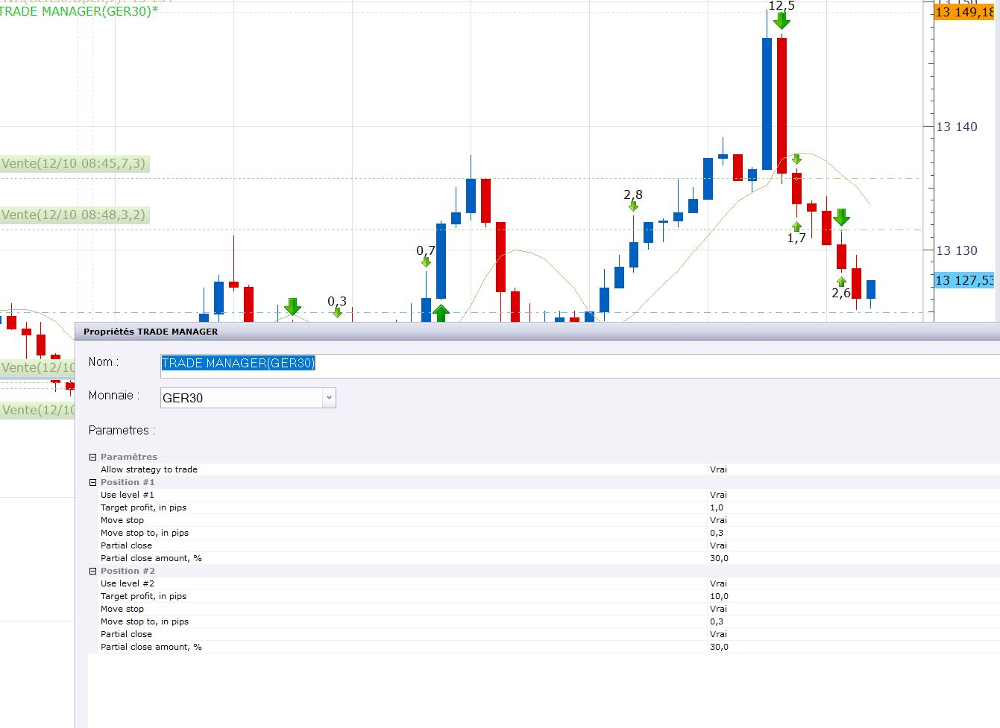
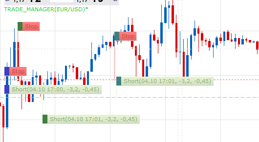
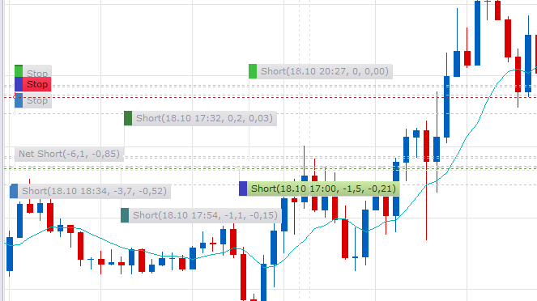

# Trade Manager

> Source: https://fxcodebase.com/code/viewtopic.php?f=31&t=66946  
> Forum: 31 · Topic 66946 · 34 post(s)

---

## Trade Manager

**Apprentice** · Wed Nov 21, 2018 8:40 am

Based on requests.
[viewtopic.php?f=27&t=64193](https://fxcodebase.com/code/viewtopic.php?f=27&t=64193)
[viewtopic.php?f=27&t=65942](https://fxcodebase.com/code/viewtopic.php?f=27&t=65942)

 [Trade Manager.lua](files/122227/Trade%20Manager.lua)

MT4 version.
[https://fxcodebase.com/code/viewtopic.php?f=38&t=71839](https://fxcodebase.com/code/viewtopic.php?f=38&t=71839)

---

## Re: Trade Manager

**Daveatt** · Wed Nov 21, 2018 9:42 am

Many many many thanks Apprentice

Could I get it also as an indicator ?
I'd like to select a trade in the UI and apply breakeven/trailing stop/trailing limit option/TP1/TP2/percentage of profit taken at TP1/percentage of profit taken at TP2/...

Thanks so much in advance once again. Your help is always very helpful for my trading

David

---

## Re: Trade Manager

**Apprentice** · Thu Nov 22, 2018 9:55 am

Unfortunately, for now, we can not encode UI interactions.
Only select trade from indicator/strategy parameters section.

---

## Re: Trade Manager

**Daveatt** · Sun Nov 25, 2018 11:43 am

Got it, your help is already very appreciated

---

## Re: Trade Manager

**Daveatt** · Mon Nov 26, 2018 11:14 am

Hi Apprentice

Hope you're doing well

Seems the TP2 is not working. I tested it in demo today and it's not taking the TP2.
Confirming the TP1 works fine however

Could you please have a quick look ?

Thanks

---

## Re: Trade Manager

**Apprentice** · Sat Dec 01, 2018 4:52 am

Fixed.

---

## Re: Trade Manager

**Daveatt** · Mon Dec 17, 2018 11:20 am

Sorry Apprentice, I didn't test it until this morning

In my screenshot below, you can see that I set a TP2 of 5 pips profit but it's not taken. TP1 working fine though

The attachment **2018-12-17_08h45_38.png** is no longer available

Sorry again for the pushback.

Thanks for your help
David

---

## Re: Trade Manager

**Apprentice** · Mon Dec 31, 2018 5:37 am

You have to set Partial Close - Yes for TP2

---

## Re: Trade Manager

**KusumS** · Thu Jan 03, 2019 11:43 am

Hi Apprentice,

Best wishes for a Happy and Prosperous New Year!

I have started using Trade Manager and find it a great tool for trades triggering in sessions that cannot be actively monitored (Ex due to time zone difference). Trade Manager helps to grab fist profit target that has high probability in triggering, thus securing some profits in case of reversal and stopping out before reaching 2nd target.

Apprentice, I am looking for an enhancement to Trade Manager. Currently I do not see an option to associate “Position #1” and “Position #2” to specific pairs. EX. Position #1 only triggers EURUSD and Position #2 only triggers GBPUSD.

Is it possible to modify the code to include user selection of currency pairs in the Positions 1 & 2?

Again, thank you very much for all your great work.

Regards

KusumS

---

## Re: Trade Manager

**Apprentice** · Fri Jan 04, 2019 7:11 am

Your request is added to the development list under Id Number 4404

---

## Re: Trade Manager

**KusumS** · Fri Jan 04, 2019 9:13 am

Thank you very much.

Regards

KusumS

---

## Re: Trade Manager

**Apprentice** · Sat Jan 05, 2019 5:04 am

What if? You run two instance instead of one.

---

## Re: Trade Manager

**KusumS** · Thu Jan 10, 2019 9:15 pm

Hi Apprentice,

Sorry, I missed your last post.

I did not think on two instances. and let me give it a try. It may solve the issue if multiple instances can be run.

Regards

KusumS

---

## Re: Trade Manager

**papynou34** · Thu Nov 14, 2019 2:06 pm

Hello all,
Is it possible to add a stop value in pips in Trade Managerwhen opening a transaction?
Thanks a lot in advance

---

## Re: Trade Manager

**Apprentice** · Wed Nov 27, 2019 6:15 am

Your request is added to the development list.
Development reference 365.

---

## Re: Trade Manager

**Apprentice** · Wed Nov 27, 2019 8:44 am

Try this version.

 [Trade_Manager.lua](files/129968/Trade_Manager.lua)

---

## Re: Trade Manager

**druuna** · Fri Feb 28, 2020 8:51 am

Hello apprentice, thank you very much about all your wonderful work, i'd like to use this strategy manager but just now i use it live (on demo account, dont worry) and it works very fine, i select GER 30 on a pos and i let it manage.

at the same time, i've take a FRA40 pos and ... Trader_manager has made partial close on both positions (but i put a trade manager only on GER30)

also i would like to know exactly when a strategy is working

can i set strategy when the trade is already on
can i change strategy while working on a trade ?
can i pause a strategy and play it again (does it still work ?)
do a strategy work on new trade ?

thak you again very much

---

## Re: Trade Manager

**Apprentice** · Sun Mar 01, 2020 4:25 pm

Your request is added to the development list.
Development reference 803.

---

## Re: Trade Manager

**druuna** · Wed Mar 04, 2020 4:13 pm

Thank you so much

I would like use this strategy to put my trade at break event at specified point

unfortunately, this strategy dont seem to work each trade,many time, i need to "change" the strategy, or pause it and play again, for the strategy is working on a trade that have already past the point specified.

Do you know why ?

Thank you very much

---

## Re: Trade Manager

**Apprentice** · Thu Mar 05, 2020 6:21 am

Your request is added to the development list.
Development reference 826.

---

## Re: Trade Manager

**Apprentice** · Thu Mar 05, 2020 7:05 am

[Trade_Manager.lua](files/131732/Trade_Manager.lua)

Try it now.

---

## Re: Trade Manager

**RuskyTraderBear** · Fri Mar 20, 2020 3:49 am

Any Chance of adding dynamic and fixed trailing stop options to this strategy, would be the perfect trading tool if this was included.

---

## Re: Trade Manager

**Apprentice** · Fri Mar 20, 2020 5:59 am

Your request is added to the development list.
Development reference 914.

---

## Re: Trade Manager

**Apprentice** · Mon Mar 23, 2020 6:36 am

[Trade_Manager.lua](files/132198/Trade_Manager.lua)

Added.

---

## Re: Trade Manager

**djtaktik** · Tue Apr 13, 2021 7:54 am

Hello apprentice,
when I open 3 lots on one position, your trade manager managed to setup a stop loss for the first position when it come in the positive side and close it effectively when the target is reached but for the two lots that are still open there is no stoploss positioned by your trade manager (see the picture for the two "vente" position at 8:45 and 8:48). Do you know why ? thanks.

---

## Re: Trade Manager

**djtaktik** · Tue Apr 13, 2021 12:27 pm

Hello,
I have a trouble with the trade manager. When I open a position with three lots, the trade manager setup a stoploss when the first target profit is reached. But for the two lots still open there is no stop loss. I don't know why. You can see on the pblm on the picture

 

trade 8:45, and 8:48.Do you know why ?

---

## Re: Trade Manager

**Apprentice** · Tue Apr 13, 2021 1:13 pm

Your request is added to the development list.
Development reference 351.

---

## Re: Trade Manager

**Apprentice** · Sun Apr 18, 2021 2:22 am

I can't repeat it. The code looks fine too.

---

## Re: Trade Manager

**djtaktik** · Tue Apr 20, 2021 3:18 am

and do you test it for several orders. I mean it seems to work for the first trade but not for the followings.

---

## Re: Trade Manager

**Apprentice** · Wed Apr 21, 2021 11:50 am

5 trades, no issues

---

## Re: Trade Manager

**Opusse** · Sat Dec 11, 2021 7:16 am

Hello Apprentice,

Would it be possible to adapt this strategy for mt4?

Thanks in advance for your answeer.

---

## Re: Trade Manager

**Apprentice** · Tue Dec 14, 2021 5:19 am

Your request is added to the development list.
Development reference 1015.

---

## Re: Trade Manager

**Opusse** · Tue Dec 14, 2021 1:44 pm

Thank you

---

## Re: Trade Manager

**Apprentice** · Tue Feb 01, 2022 4:21 am

MT4 version.
[https://fxcodebase.com/code/viewtopic.php?f=38&t=71839](https://fxcodebase.com/code/viewtopic.php?f=38&t=71839)
