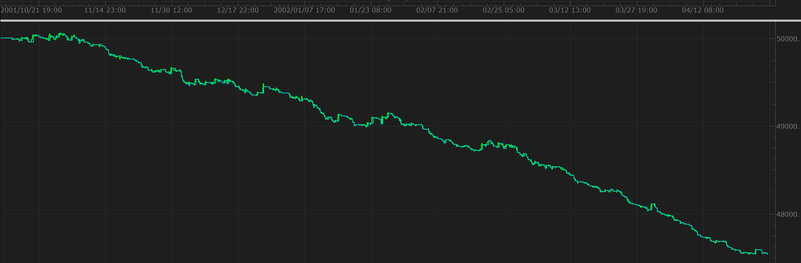
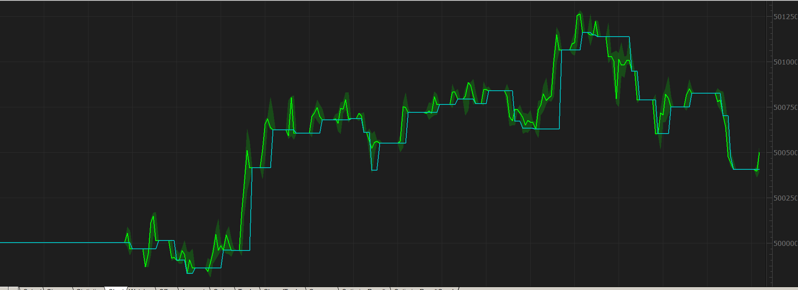
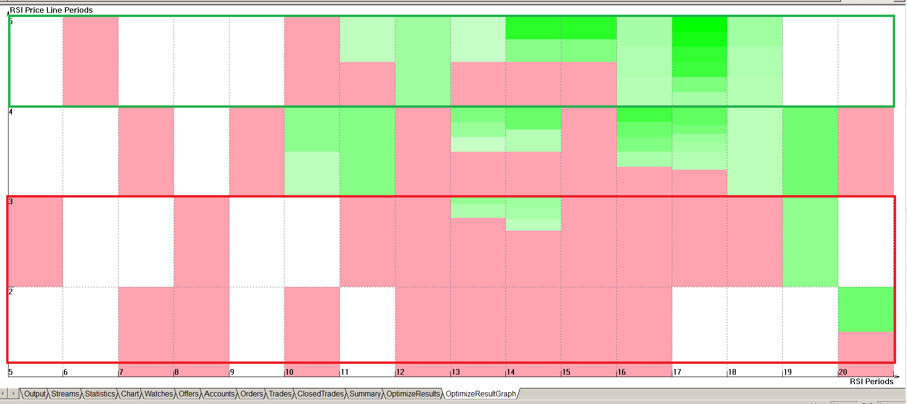
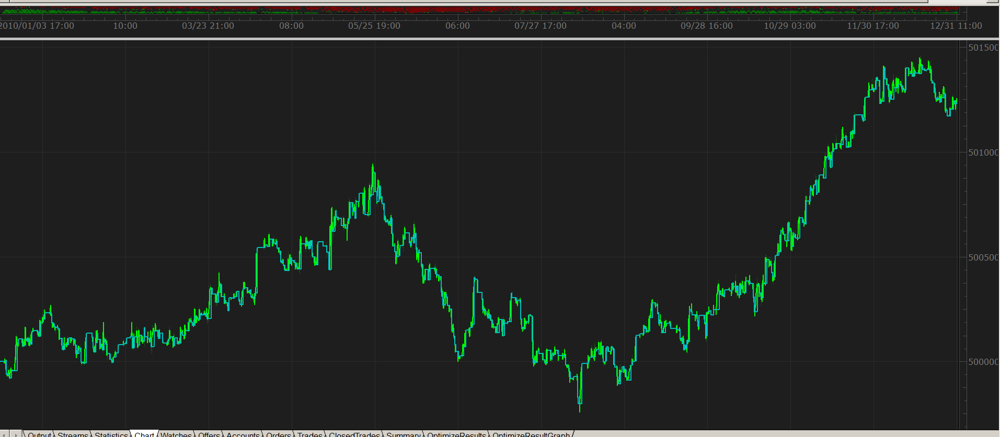
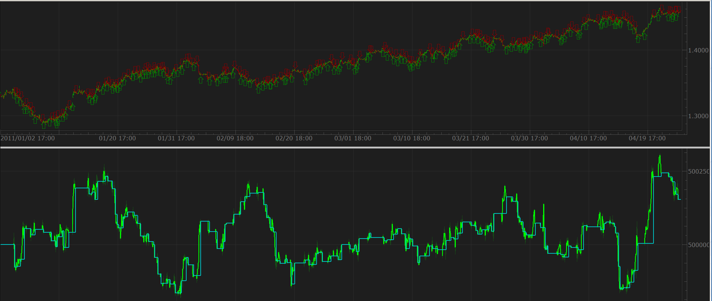

# Traders Dynamic Index Strategy

> Source: https://fxcodebase.com/code/viewtopic.php?f=31&t=4134  
> Forum: 31 · Topic 4134 · 17 post(s)

---

## Traders Dynamic Index Strategy

**Nikolay.Gekht** · Fri May 06, 2011 1:33 pm

Part I. Strategy

Here is a sample strategy developed on the base of the default [Traders Dynamic Index indicator rules](https://fxcodebase.com/code/viewtopic.php?f=17&t=2069). Please see the indicator description for these rules.

Notes:

1) The strategy work on all types of the account: FIFO, non-FIFO and hedging.

2) The strategy supports as working on the closed bar as well as working on the active bar.

3) The strategy is supposed to work on particular account/instrument alone. No manual trading or other strategy must work on the same account/instrument. However, you can trade on other accounts or other instruments of the same accounts.

4) The strategy keeps one position in either long or short direction.

Important:

1) this strategy is a demo strategy and is NOT supposed to real trade.

2) when backtesting/optimizing/running strategy, please do not forget to set "Allow Trading" parameter to "Yes". Otherwise the strategy will only show the alerts.

Download:

 [TradersDynamicIndexStrategy.lua](files/10377/TradersDynamicIndexStrategy.lua)

Please download and install the following indicators which are **required** to have the strategy properly working:

1) **new** version of the TradersDynamicIndex indicator:
[viewtopic.php?f=17&t=2069](https://fxcodebase.com/code/viewtopic.php?f=17&t=2069)

2) Traders dynamic index interpreter indicator:
[viewtopic.php?f=17&t=4133](https://fxcodebase.com/code/viewtopic.php?f=17&t=4133)

Please read the next topic in this post with analysis of the default parameters and brief optimization!

Code: [Select all](https://fxcodebase.com/code/)
`function Init()
    strategy:name("Trades the Traders Dynamic Index Indicator data");
    strategy:description("Implements scalping, active and moderate trading strategies for the Traders Index Indicator");

    strategy.parameters:addGroup("Traders Dynamic Index Calculation");

    strategy.parameters:addInteger("RSI_N", "RSI Periods", "Recommended values are in 8-25 range", 13, 2, 1000);
    strategy.parameters:addInteger("VB_N", "Volatility Band", "Number of periods to find volatility band. Recommended value is 20-40", 34, 2, 1000);
    strategy.parameters:addDouble("VB_W", "Volatility Band Width", "", 1.6185, 0, 100);

    strategy.parameters:addInteger("RSI_P_N", "RSI Price Line Periods", "", 2, 1, 1000);
    strategy.parameters:addString("RSI_P_M", "RSI Price Line Smoothing Method", "", "MVA");
    strategy.parameters:addStringAlternative("RSI_P_M", "MVA(SMA)", "", "MVA");
    strategy.parameters:addStringAlternative("RSI_P_M", "EMA", "", "EMA");
    strategy.parameters:addStringAlternative("RSI_P_M", "LWMA", "", "LWMA");
    strategy.parameters:addStringAlternative("RSI_P_M", "LSMA(Regression)", "", "REGRESSION");
    strategy.parameters:addStringAlternative("RSI_P_M", "SMMA", "", "SMMA");
    strategy.parameters:addStringAlternative("RSI_P_M", "WMA(Wilders)", "", "WMA");
    strategy.parameters:addStringAlternative("RSI_P_M", "KAMA(Kaufman)", "", "KAMA");

    strategy.parameters:addInteger("TS_N", "Trade Signal Line Periods", "", 7, 1, 1000);
    strategy.parameters:addString("TS_M", "Trade Signal Line Smoothing Method", "", "MVA");
    strategy.parameters:addStringAlternative("TS_M", "MVA(SMA)", "", "MVA");
    strategy.parameters:addStringAlternative("TS_M", "EMA", "", "EMA");
    strategy.parameters:addStringAlternative("TS_M", "LWMA", "", "LWMA");
    strategy.parameters:addStringAlternative("TS_M", "LSMA(Regression)", "", "REGRESSION");
    strategy.parameters:addStringAlternative("TS_M", "SMMA", "", "SMMA");
    strategy.parameters:addStringAlternative("TS_M", "WMA(Wilders)", "", "WMA");
    strategy.parameters:addStringAlternative("TS_M", "KAMA(Kaufman)", "", "KAMA");

    strategy.parameters:addGroup("Levels");
    strategy.parameters:addInteger("L1", "Low Level", "", 32, 0, 100);
    strategy.parameters:addInteger("L2", "Middle Level", "", 50, 0, 100);
    strategy.parameters:addInteger("L3", "High Level", "", 68, 0, 100);

    strategy.parameters:addGroup("Price");
    strategy.parameters:addString("TF", "Target Timeframe", "", "H1");
    strategy.parameters:setFlag("TF", core.FLAG_PERIODS);
    strategy.parameters:addString("T", "Target Price", "", "close");
    strategy.parameters:addStringAlternative("T", "Open", "", "open");
    strategy.parameters:addStringAlternative("T", "High", "", "high");
    strategy.parameters:addStringAlternative("T", "Low", "", "low");
    strategy.parameters:addStringAlternative("T", "Close", "", "close");
    strategy.parameters:addStringAlternative("T", "Median", "", "median");
    strategy.parameters:addStringAlternative("T", "Typical", "", "typical");
    strategy.parameters:addStringAlternative("T", "Weighed", "", "weighted");

    strategy.parameters:addGroup("Trading");
    strategy.parameters:addInteger("S", "Strategy", "", 2);
    strategy.parameters:addIntegerAlternative("S", "Scaliping", "", 0);
    strategy.parameters:addIntegerAlternative("S", "Active", "", 1);
    strategy.parameters:addIntegerAlternative("S", "Moderate", "", 2);

    strategy.parameters:addInteger("BM", "Bar Mode", "", 0);
    strategy.parameters:addIntegerAlternative("BM", "On Closed Bar", "", 0);
    strategy.parameters:addIntegerAlternative("BM", "On Active Bar", "", 1);

    strategy.parameters:addBoolean("AllowTrade", "Allow Strategy to Trade", "", false);
    strategy.parameters:addString("Account", "Choose Account to trade on", "", "");
    strategy.parameters:setFlag("Account", core.FLAG_ACCOUNT);
    strategy.parameters:addInteger("Amount", "Trading amount (in lots)", "", 1, 1, 100);

    strategy.parameters:addGroup("Alert");
    strategy.parameters:addBoolean("ShowAlert", "Show Alerts", "", false);
    strategy.parameters:addBoolean("PlaySound", "Play Sound", "", false);
    strategy.parameters:addFile("SoundFile", "  Sound File", "", "");
    strategy.parameters:setFlag("SoundFile", core.FLAG_SOUND);
    strategy.parameters:addBoolean("RecurrentSound", "  Recurrent Sound", "", false);
end

local ShowAlert, PlaySound, SoundFile, RecurrentSound;
local AllowTrade, OfferID, AccountID, LotSize, Instrument;
local Price, ATDI, E, X;
local loaded = false;
local BarMode, LastSerial, first;
local name;

function Prepare(onlyName)
    assert(core.indicators:findIndicator("TRADERSDYNAMICINDEX") ~= nil, "Please download and install TradersDynamicIndex.lua indicator");
    assert(core.indicators:findIndicator("ANALYZETRADERSDYNAMICINDEX") ~= nil, "Please download and install AnalyzeTradersDynamicIndex.lua indicator");
    assert(instance.parameters.TF ~= "t1", "The strategy cannot be applied on ticks");
    assert(not(instance.parameters.PlaySound) or (instance.parameters.PlaySound and instance.parameters.SoundFile ~= "" and instance.parameters.SoundFile ~= nil), "The sound file must be chosen");

    local sn;

    if instance.parameters.S == 0 then
        sn = "Scalping";
    elseif instance.parameters.S == 1 then
        sn = "Active";
    else
        sn = "Moderate";
    end

    name = profile:id() .. "(" .. instance.bid:instrument() .. "[" .. instance.parameters.TF .. "]" .. "." .. instance.parameters.T  .. "," ..
                                  sn .. "," ..
                                  instance.parameters.RSI_N .. "," ..
                                  instance.parameters.VB_N .. "," .. instance.parameters.VB_W .. "," ..
                                  instance.parameters.RSI_P_N .. "," .. instance.parameters.RSI_P_M .. "," ..
                                  instance.parameters.TS_N .. "," .. instance.parameters.TS_M .. ")";
    instance:name(name);

    if onlyName then
        return ;
    end

    ShowAlert = instance.parameters.ShowAlert;
    PlaySound = instance.parameters.PlaySound;

    if PlaySound then
        SoundFile = instance.parameters.SoundFile;
        RecurrentSound = instance.parameters.RecurrentSound;
    end

    AllowTrade = instance.parameters.AllowTrade;
    Instrument = instance.bid:instrument();

    if AllowTrade then
        AccountID = instance.parameters.Account;
        Amount = instance.parameters.Amount * core.host:execute("getTradingProperty", "baseUnitSize", Instrument, Account);
        OfferID = core.host:findTable("offers"):find("Instrument", Instrument).OfferID;
    end

    Price = core.host:execute("getHistory", 1, Instrument, instance.parameters.TF, 0, 0, true);

    local pTDI = core.indicators:findIndicator("ANALYZETRADERSDYNAMICINDEX");
    local p = pTDI:parameters();

    p:setInteger("RSI_N", instance.parameters.RSI_N);
    p:setInteger("VB_N", instance.parameters.VB_N);
    p:setDouble("VB_W", instance.parameters.VB_W);
    p:setInteger("RSI_P_N", instance.parameters.RSI_P_N);
    p:setString("RSI_P_M", instance.parameters.RSI_P_M);
    p:setInteger("TS_N", instance.parameters.TS_N);
    p:setString("TS_M", instance.parameters.TS_M);
    p:setInteger("L1", instance.parameters.L1);
    p:setInteger("L2", instance.parameters.L2);
    p:setInteger("L3", instance.parameters.L3);
    p:setInteger("S", instance.parameters.S);
    p:setString("T", instance.parameters.T);
    ATDI = pTDI:createInstance(Price, p);
    E = ATDI.E;
    X = ATDI.X;
    first = math.max(E:first(), X:first()) + 1;

    BarMode = instance.parameters.BM;
end

function Update()
    local period;

    if not loaded then
        return ;
    end

    period = Price:size() - 1;

    if BarMode == 1 and period < first then
        -- work on current bar, not enough data
        return ;
    end

    if BarMode == 0 then
        -- work on closed bar
        if LastSerial == nil then
            -- first tick received, ignore the current bar
            LastSerial = Price:serial(period);
            return;
        elseif LastSerial == Price:serial(period) then
            -- this bar has been already processed
            return;
        else
            -- the first tick of a new bar
            LastSerial = Price:serial(period);
            period = period - 1;
        end
    end

    ATDI:update(core.UpdateLast);

    -- check exit condition
    if X[period] > 0.1 then
        -- exit long
        ExitLong();
    elseif X[period] < -0.1 then
        ExitShort();
        -- exit shorts
    end

    -- check entry codition
    if E[period] > 0.1 and E[period - 1] <= 0 then
        EnterLong();
    elseif E[period] < -0.1 and E[period - 1] >= 0 then
        EnterShort();
    end
end

function ExitLong()
    Alert("Exit Long", false);
    if AllowTrade then
        Exit("B");
    end
end

function ExitShort()
    Alert("Exit Short", false);
    if AllowTrade then
        Exit("S");
    end
end

function EnterLong()
    Alert("Enter Long", false);
    if AllowTrade then
        Exit("S");
        Enter("B");
    end
end

function EnterShort()
    Alert("Enter Short", false);
    if AllowTrade then
        Exit("B");
        Enter("S");
    end
end

function Alert(msg, errorAlert)
    if ShowAlert or errorAlert then
        terminal:alertMessage(Instrument, instance.bid[NOW], name .. ":" .. msg, instance.bid:date(NOW));
    end

    if PlaySound and not errorAlert then
        terminal:alertSound(SoundFile, RecurrentSound);
    end
end

function Exit(side)
    if not hasPosition(side) then
        return ;
    end

    local msg, valuemap;

    valuemap = core.valuemap();
    valuemap.OrderType = "CM";
    valuemap.OfferID = OfferID;
    valuemap.AcctID = AccountID;
    if side == "B" then
        valuemap.BuySell = "S";
    else
        valuemap.BuySell = "B";
    end
    valuemap.NetQtyFlag = "y";
    success, msg = terminal:execute(101, valuemap);
    if not success then
        Alert("Close Order Failed:" .. msg, true);
    end
end

function Enter(side)
    if hasPosition(side) then
        return ;
    end

    local msg, valuemap;

    valuemap = core.valuemap();
    valuemap.OrderType = "OM";
    valuemap.OfferID = OfferID;
    valuemap.AcctID = AccountID;
    valuemap.Quantity = Amount;
    valuemap.BuySell = side;
    success, msg = terminal:execute(100, valuemap);
    if not success then
        Alert("Open Order Failed:" .. msg, true);
    end
end

function hasPosition(side)
    local enum = core.host:findTable("trades"):enumerator();
    local row;

    while true do
        row = enum:next();
        if row == nil then
            break;
        end
        if row.AccountID == AccountID and
           row.OfferID == OfferID and
           row.BS == side then
           return true;
        end
    end

    return false;
end

function AsyncOperationFinished(cookie, success, msg)
    if cookie == 1 then
        loaded = true;
    elseif cookie == 100 then
        if not success then
            Alert("Open Order Failed:" .. msg, true);
        end
    elseif cookie == 101 then
        if not success then
            Alert("Close Order Failed:" .. msg, true);
        end
    end
end`

The Strategy was revised and updated on January 21, 2019.

---

## Part II. Parameters, Backtesting and Optimization

**Nikolay.Gekht** · Fri May 06, 2011 2:06 pm

Part II. Parameters, Backtesting and Optimization.

Used on small timeframes (m1-H1) the indicator result is not impressive at all:

 

(1-hour, default parameters, EUR/USD 2010 1-minute price archive)

However, all the examples of the strategies based on that indicator are usually demonstrated on 1-day timeframe:

 

(1-day, default parameters, EUR/USD 2010 1-minute price archive)

Of course, this does not mean that the indicator and strategy cannot be used for shorter time frame at all. The first attempt of the optimization shows that the problem is rather in the too short moving average applied to the RSI to get the price line:

 

(optimization graph for EUR/USD 2010, 1-hour time frame. Map by RSI price line (Y) Signal Line (X) parameters).

RSI periods: 17
Vol.Band: 22
RSI Price Line: 5
Trade Signal: 8

We can get the equity curve which is more or less not so bad on EUR/USD 2010:

 

And even more or less works for the first four months of 2011:

 

---

## Re: Traders Dynamic Index Strategy

**Nikolay.Gekht** · Fri May 06, 2011 2:09 pm

Want to backtest on the whole year data too? Heh!

1) Read articles here:
[http://fxcodebase.com/wiki/index.php/Ca ... ndicoreSDK](https://fxcodebase.com/wiki/index.php/Category:IndicoreSDK)
to find out how to backtest and optimize parameters using Strategy Debugger and how to get the 2001-2011 1-minute price archive.

2) Participate in the strategies backtesting and parameters optimizing.

---

## Re: Traders Dynamic Index Strategy

**Kingpin** · Mon Jun 11, 2012 10:31 am

I get this error Message: "122: invalid account"

What is the reason for this and how could I solve this Problem?

Thx

---

## Re: Traders Dynamic Index Strategy

**jaricarr** · Thu Nov 03, 2016 11:31 pm

Hello Nikolay,

Can you please add the exit criteria used in TTC TDI STRATEGY

[http://fxcodebase.com/code/viewtopic.php?f=31&t=24914&p=42840&hilit=TRADERS+DYNAMIC#p42840](https://fxcodebase.com/code/viewtopic.php?f=31&t=24914&p=42840&hilit=TRADERS+DYNAMIC#p42840)

BUY ENTRY LEVEL
BUY EXIT LEVEL
SELL ENTRY LEVEL
SELL EXIT LEVEL

---

## Re: Traders Dynamic Index Strategy

**Carbine** · Sun Nov 13, 2016 8:07 pm

> **Kingpin wrote:**
> I get this error Message: "122: invalid account"
>
> What is the reason for this and how could I solve this Problem?
>
> Thx

Hi, I'm also getting this error, any help would be appreciated!

Many Thanks

---

## Re: Traders Dynamic Index Strategy

**Apprentice** · Mon Nov 14, 2016 4:16 am

Your request is added to the development list, Under Id Number 3672
 If someone is interested to do this task, please contact me.

---

## Re: Traders Dynamic Index Strategy

**Apprentice** · Mon Nov 14, 2016 4:26 am

Try it now.

---

## Re: Traders Dynamic Index Strategy

**Apprentice** · Sun Dec 18, 2016 8:21 am

Strategy was revised and updated.

---

## Re: Traders Dynamic Index Strategy

**jaricarr** · Tue Dec 20, 2016 11:53 pm

Hi Apprentice,

I re-downloaded the strategy. It still does not have the exit levels requested.

BUY ENTRY LEVEL
BUY EXIT LEVEL
SELL ENTRY LEVEL
SELL EXIT LEVEL

---

## Re: Traders Dynamic Index Strategy

**jaricarr** · Tue Dec 20, 2016 11:57 pm

Can you also add Vidya for RSI and Trade Signal Smoothing method please.

---

## Re: Traders Dynamic Index Strategy

**Apprentice** · Thu Dec 22, 2016 1:44 pm

Your request is added to the development list, Under Id Number 3703
 If someone is interested to do this task, please contact me.

---

## Re: Traders Dynamic Index Strategy

**papynou34** · Thu Nov 23, 2017 9:10 am

Hello All,
Is it possible to forbidden the trading (open order) during some time zone? For example The startegy will not be allowed to trade during a zone from 22h00 to 23h00?

Thanks in advance for your answer

---

## Re: Traders Dynamic Index Strategy

**papynou34** · Tue Nov 28, 2017 6:27 am

Hello,
Is it possible to add to this strategy a limit order and stop as precised in the picture?

Is it also possible to add a period for example from 17h00 to 17h30 where the tradinfg won't be allowed?

Thanks in advance

---

## Re: Traders Dynamic Index Strategy

**Apprentice** · Sun Dec 03, 2017 5:18 am

Your request is added to the development list under Id Number 3973

---

## Re: Traders Dynamic Index Strategy

**Apprentice** · Thu Dec 07, 2017 5:22 am

Something like this?

 [TradersDynamicIndexStrategy.lua](files/116402/TradersDynamicIndexStrategy.lua)

---

## Re: Traders Dynamic Index Strategy

**papynou34** · Thu Dec 07, 2017 7:09 am

Hello Apprentice,
This is more than perfect.
A great Thanks to you.
I will test it and let you know the result.
