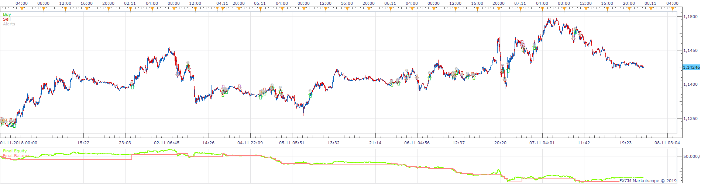
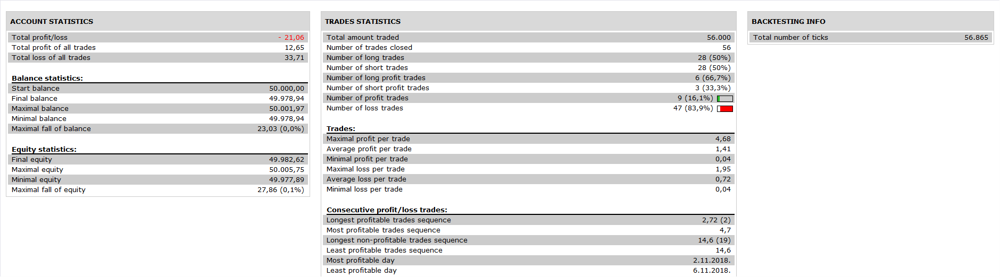

# Trading Day Moving Average Price MA Cross Strategy

> Source: https://fxcodebase.com/code/viewtopic.php?f=31&t=67395  
> Forum: 31 · Topic 67395 · 2 post(s)

---

## Trading Day Moving Average Price MA Cross Strategy

**Apprentice** · Thu Feb 28, 2019 6:07 am

 

Based on indicator.
[viewtopic.php?f=17&t=62804](https://fxcodebase.com/code/viewtopic.php?f=17&t=62804)
Open Long
Trading Day Moving Average / Price MA Cross Over
Viceversa for Short

 [Trading Day Moving Average Price MA Cross Strategy.lua](files/124166/Trading%20Day%20Moving%20Average%20Price%20MA%20Cross%20Strategy.lua)

---

## Re: Trading Day Moving Average Price MA Cross Strategy

**AEKARAOLE** · Fri Mar 01, 2019 12:34 pm

Why this message shows?

"failed create limit. The Rate must be a positive number"
