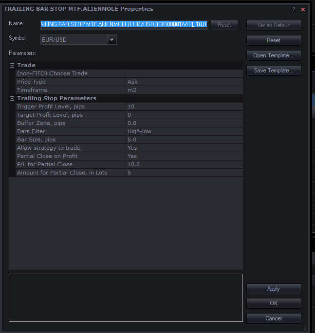

# Trailing Bar Stop MTF

> Source: https://fxcodebase.com/code/viewtopic.php?f=31&t=65831  
> Forum: 31 · Topic 65831 · 12 post(s)

---

## Trailing Bar Stop MTF

**Apprentice** · Wed Mar 14, 2018 4:56 pm

Based on the request.
[viewtopic.php?f=27&t=65825](https://fxcodebase.com/code/viewtopic.php?f=27&t=65825)

 [Trailing Bar Stop MTF.lua](files/118200/Trailing%20Bar%20Stop%20MTF.lua)

---

## Re: Trailing Bar Stop MTF

**alienmole** · Thu Mar 15, 2018 5:28 am

This is just what I wanted, what can I say....Thanks

There is a setting in there Im not sure about, in the Trailing Stop Parameters theres one called "Target Profit Level, Pips" is that like a global Target you have put in?

---

## Re: Trailing Bar Stop MTF

**alienmole** · Fri Mar 16, 2018 4:24 am

The Buffer setting is not doing what it was intended for, eg:

The Buffer is meant to be so you can set a distance the Stop moves behind the first qualifying bar after you have gone to break even to allow for spread etc, so that might be say 3 pips, however what it is doing is after you go to break even it is waiting for 3 bars before it looks for a qualifying bar to move the stop behind.

Thanks

---

## Re: Trailing Bar Stop MTF

**Curlyloxx** · Tue Mar 20, 2018 5:46 am

Hi
I've been using this Strategy for trailing and it works great apart from the buffer.

It would be great if you could add or modify it so you can add in a buffer with the choice of amount of pips to cover the spread.

So for example when the stop moves to the H/L of a bar/candle, it moves to the H/L plus the set amount of pips as a buffer.

Thankyou

---

## Re: Trailing Bar Stop MTF

**alienmole** · Tue Mar 20, 2018 8:48 am

Hi

If and when its possible to make the amendments in regards to my comments above, would you be able to add the following also please :-

1) At a specified distance in pips you can take off some of your position irrespective of any other parameters being used

Thanks

---

## Re: Trailing Bar Stop MTF

**Apprentice** · Mon Mar 26, 2018 10:16 am

Your request is added to the development list under Id Number 4092

---

## Re: Trailing Bar Stop MTF

**Apprentice** · Tue Mar 27, 2018 10:26 am

Try this version.

 [Trailing Bar Stop MTF.lua](files/118396/Trailing%20Bar%20Stop%20MTF.lua)

---

## Re: Trailing Bar Stop MTF

**alienmole** · Tue Mar 27, 2018 12:26 pm

> **Apprentice wrote:**
> Try this version.
>
>
> Trailing Bar Stop MTF.lua

Thank you for the amendments.

There does appear to be a few issues, Ill list these below and perhaps if you have time you might be able to amend the strategy.

1) There is no need for the entire **"Alerts"** section
2) **"P/L for Partial Close"** should be in Pips (I think it is, just checking)
3) The Variable **"Amount for Partial Close, in Lots"**, should be able to input down to as small as Micro lots (eg if I put 100, in TSII that is $10 per pip, if I put 10 that is $1.00 per pip and if I put 1 that is $0.10 per pip

**Edit on 28/03/18 :**- The Partial take profit does sometimes work, but not as (3) above, however when it does work the remaining balance left is not being trailed by the Stop Loss anymore

Many Thanks

---

## Re: Trailing Bar Stop MTF

**Apprentice** · Thu Apr 12, 2018 4:12 am

Try this version.

 [Trailing Bar Stop MTF.alienmole.lua](files/118606/Trailing%20Bar%20Stop%20MTF.alienmole.lua)

---

## Re: Trailing Bar Stop MTF

**alienmole** · Thu Apr 12, 2018 6:28 am

[quote="Apprentice"]Try this version.

I've attached an image of how I set it up. I initially entered for a position size of 10

Based on that I would expect it to go to +10 take 5 off and then trail 5 on bars over +5 pips in length from the hi/lo on a M2 Time frame chart.

What it does is take all the position off at +10.

Am I setting it up incorrectly or is it not working as I think it should?

 

Thanks

---

## Re: Trailing Bar Stop MTF

**Apprentice** · Mon Apr 23, 2018 5:21 am

Your request is added to the development list under Id Number 4119

---

## Re: Trailing Bar Stop MTF

**alienmole** · Tue May 22, 2018 3:24 am

Hi

My understanding it that there could be a bug in TSII in regards to taking partial profits, therefore can I suggest we remove the entire partial take profit section of the strategy so we just have a fully working trailing stop loss version.

Many Thanks
