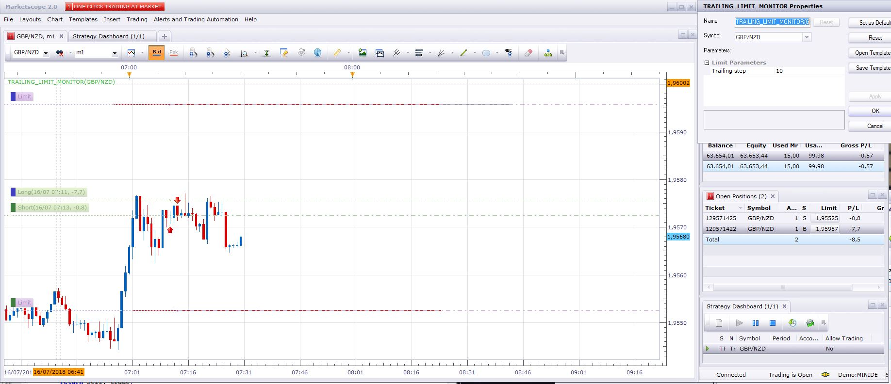

# Trailing_Limit_monitor

> Source: https://fxcodebase.com/code/viewtopic.php?f=31&t=66272  
> Forum: 31 · Topic 66272 · 5 post(s)

---

## Trailing_Limit_monitor

**Apprentice** · Mon Jul 16, 2018 7:26 am

Based on request.
[viewtopic.php?f=27&t=66259](https://fxcodebase.com/code/viewtopic.php?f=27&t=66259)

 [Trailing_Limit_monitor.lua](files/119959/Trailing_Limit_monitor.lua)

---

## Re: Trailing_Limit_monitor

**conjure** · Mon Jul 16, 2018 8:32 am

Thank you for all these lines you wrote Apprentice!!!!

I m trying it on a demo account but limit is not moving.
I m uploading a screenshot of settings.

 

---

## Re: Trailing_Limit_monitor

**Reymondpolanco** · Mon Jul 16, 2018 6:57 pm

I have the same problem with this similar strategy and no body solve it I wrote like 4 request to solve it and nothing.

[viewtopic.php?f=31&t=65947&start=10](https://fxcodebase.com/code/viewtopic.php?f=31&t=65947&start=10)

---

## Re: Trailing_Limit_monitor

**conjure** · Tue Jul 17, 2018 6:15 am

I tried to write to text the trade.Open and trade.Limit
and trade.Limit gives me result of 0

Code: [Select all](https://fxcodebase.com/code/)
`function CreateController(trade)
    local offer = core.host:findTable("offers"):find("Instrument", trade.Instrument);
    local controller = {};
    controller.TradeID = trade.TradeID;
    controller.TrailingSize = instance.parameters.TrailingStep;
    controller.InitialLimit = math.abs(trade.Open - trade.Limit) / offer.PointSize;
   local file = io.open("trade.Open.txt", "w")
file:write(trade.Open)
file:close()
   local file = io.open("trade.Limit.txt", "w")
file:write(trade.Limit)
file:close()
    return controller;
end`

---

## Re: Trailing_Limit_monitor

**Apprentice** · Mon Aug 06, 2018 9:18 am

I changed the algorithm a little bit to handle of trades with the limit set after the creation of the trade. I think that was the issue.

 [Trailing_Limit_monitor_1.lua](files/120347/Trailing_Limit_monitor_1.lua)
