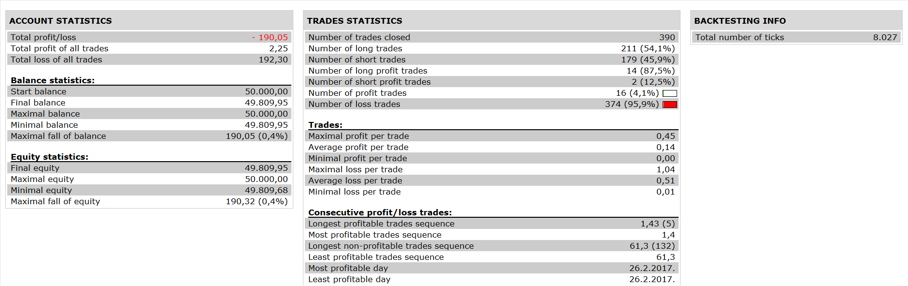

# Transient Zones Strategy

> Source: https://fxcodebase.com/code/viewtopic.php?f=31&t=65036  
> Forum: 31 · Topic 65036 · 1 post(s)

---

## Transient Zones Strategy

**Apprentice** · Tue Aug 29, 2017 6:44 am

 

Based on Transient Zones Indicator
[viewtopic.php?f=17&t=62219](https://fxcodebase.com/code/viewtopic.php?f=17&t=62219)

 [Transient Zones Strategy.lua](files/114549/Transient%20Zones%20Strategy.lua)

The Strategy was revised and updated on January 21, 2019.
