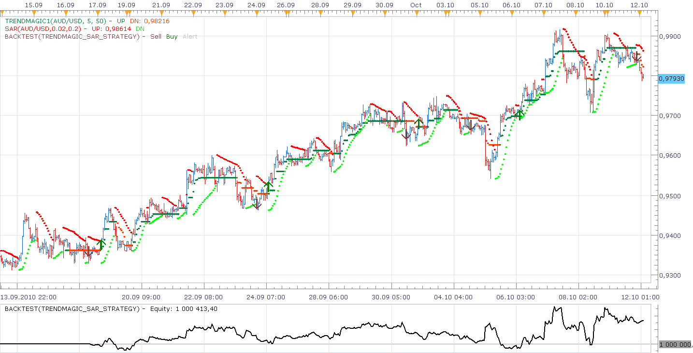
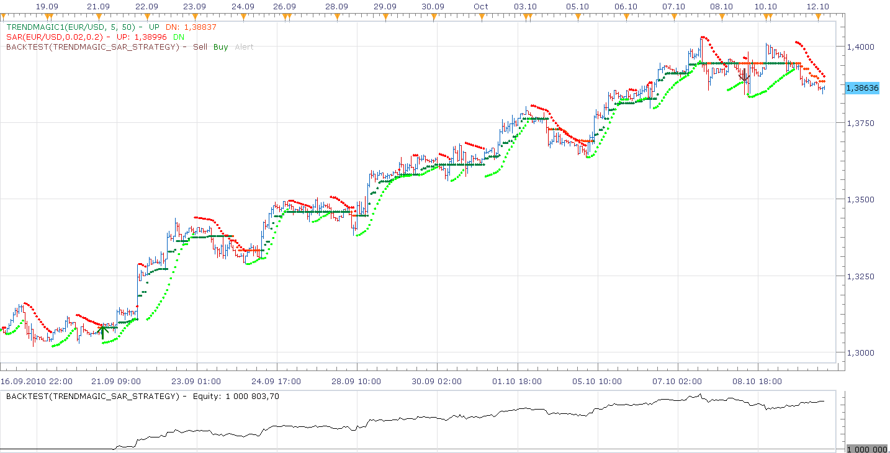
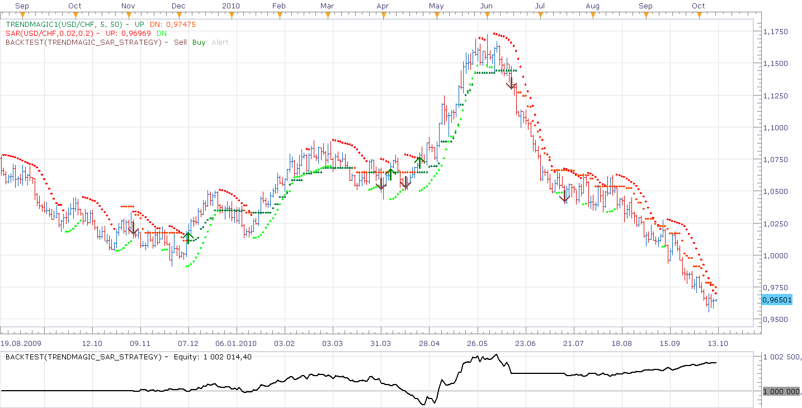

# Trend Magic + SAR strategy

> Source: https://fxcodebase.com/code/viewtopic.php?f=31&t=2375  
> Forum: 31 · Topic 2375 · 15 post(s)

---

## Trend Magic + SAR strategy

**Nikolay.Gekht** · Mon Oct 11, 2010 10:08 pm

The strategy is based on SAR indicator and [Trend Magic indicator](https://fxcodebase.com/code/viewtopic.php?f=17&t=2374) for confirmation of SAR signals.

Rules:

1) The strategy enters long when SAR switches up and trend magic shows up trend.

2) The strategy enters short when SAR switches down and trend magic shows down trend.

3) The strategy closes all opposite positions first.

4) The strategy does not enter in the same direction twice.

Options:

1) The strategy can show signals (alerts, sounds (including recurrent), emails) as well as can trade. By default trading is disabled. To let the strategy trade please go to the "Trading Parameters" and switch "AllowTrading" parameter to "On".

2) In trading parameters you can also switch on and configure stop and limit orders.

3) You can also configure "auto lot size". In case the previous trade wasn't profitable, the strategy will increase the next lot by the specified amount unless the maximum amount is reached. In case trade was profitable - the strategy will reset the trade size. Important note! In case trade is closed by stop or limit order and more than 30 trades was closed after that moment, the strategy cannot detect whether the trade was closed with profit or not. This is a limitation of the trading platform which shows only 30 last trades.

What to read?

There is a good article on dailyfx about the SAR-based strategies.
[http://www.dailyfx.com/forex/technical/ ... ategy.html](http://www.dailyfx.com/forex/technical/article/forex_strategy_corner/2010/09/27/Forex_Strategy_Corner_Using_Parabolic_SAR_as_Trading_Strategy.html)

How to use?

The default parameters, applied on 1 hour or higher time frame, the strategy works well on trendy market. On flat market careful risk management is required.

AUD/USD, 1 hour

 

EUR/USD, 1 hour

 

EUR/USD, 1 day, 300 pips trailing stop

 

Please, do not forget to download and install **new** version of Trend Magic indicator:
[viewtopic.php?f=17&t=2374](https://fxcodebase.com/code/viewtopic.php?f=17&t=2374)

Download strategy:

 [TrendMagic_Sar_Strategy.lua](files/5122/TrendMagic_Sar_Strategy.lua)

Updated Version

 [TrendMagic_Sar_Strategy.lua](files/5122/TrendMagic_Sar_Strategy%20%282%29.lua)

The Strategy was revised and updated on January 22, 2019.

---

## Re: Trend Magic + SAR strategy

**Apprentice** · Fri Oct 15, 2010 9:07 am

Update

---

## Re: Trend Magic + SAR strategy

**dathom05** · Fri Oct 15, 2010 11:39 am

Nikolay:

I have tried using the Trend Magic+ SAR strategy and the Trend Magic only strategy, using a 5 minute time frame, with a CCI of 10. Is there an optimal timeframe/setting for this strategy? On paper the concept is positive, however I have noticed the strategy signals are going opposite the chart signal and the actual move. The TM+SAR does not show many signals, even though the chart is suggesting the set-up should have taken place. In addition, the strategy signal says LONG, while the indicator signal on the chart says SHORT and chart looks like it should be a short.

This is also true with the Trend-Magic only strategy. I tested the Trend Magic only strategy in a live trade. The strategy signal said LONG, the chart dots were green-LONG, but the actual trade went SHORT.

Would you please review the settings and code. If it can follow what it says on the chart, the strategy could be very good. Thank you for your time.

Dwight Thomas

---

## Re: Trend Magic + SAR strategy

**alepan72** · Wed Nov 24, 2010 5:38 am

Hi there!
Great strategy, a lot of thanx!
I tried in a demo account and backtesting. I have a real big profit in three currency pair I use to trade (eurusd, eurjpy, audusd).
The problem is (based on my opinion) with "increase" option.
When strategy trade in auto, increase option work properly. But, if I change profit or stop loss manually, next trade don't increasing.

e.g.
I have an open trade with a profit of 40pips and the same as stop loss (-40pips).
In a profit of 25 pips I change manually the progit to 60pips. For some reason the pair change to opposite befor hit the profit. Next trade doesn't increase the number of lots....
Thanx for your attention and sorry for my bad english!!

---

## Re: Trend Magic + SAR strategy

**alepan72** · Mon Nov 29, 2010 4:02 am

Can you fix the problem I described above?
Thanx and have a nice week!!!

---

## Re: Trend Magic + SAR strategy

**mfe018** · Fri Apr 15, 2011 2:47 pm

Hello Nikolay,

I have been studying the SAR strategy for a while and then found this automated strategy, which I find very useful, but I would like to know if it is possible to modify the code so the strategy works without the Trend Magic indicator... I mean, just buy and sell based on the SAR signals:

BUY when SAR switches below price action
SELL when SAR switches above price action

And also to make the entry on the first SAR indicator (not the second, as i think it works now).

Thank you very much.

---

## Re: Trend Magic + SAR strategy

**Apprentice** · Sat Apr 16, 2011 9:38 am

Added to developmental cue.

---

## Re: Trend Magic + SAR strategy

**mfoste1** · Sun Apr 24, 2011 11:25 am

that would be great if someone could add a trend filter to this(only allow a long, short or both)

i think all strategies need this option as a standard....

---

## Re: Trend Magic + SAR strategy

**Apprentice** · Sun Apr 24, 2011 12:40 pm

Added to developmental cue.

---

## Re: Trend Magic + SAR strategy

**RJH501** · Mon Jul 04, 2011 11:56 am

Strategy logic is not correct:

LONG signals can only be entered when SAR switches DOWN and TREND is UP.

SHORT signals can only be entered when SAR switches UP and TREND is DOWN.

Can this be corrected?

Thanks much!

RJH

---

## Re: Trend Magic + SAR strategy

**RJH501** · Sat Sep 10, 2011 7:58 pm

Hello,

Just a follow-up: This strategy is entering into a long trade when it should be entering a short trade and a short trade when it should be a long trade.

It is reacting correctly according to your rules, BUT your rule definition is exactly opposite to how a parabolic SAR works.

See previous post.

Regards,

Richard

---

## Re: Trend Magic + SAR strategy

**my2pips** · Sun Oct 13, 2013 5:50 pm

Since the last Tradestation update to 01.13.092613 version, the strategy has stopped working. Everything was fine until last Friday. Now every attempt to optimize the strategy results in a "The file format or version is invalid" error and the optimization process stops.
Can you please fix it?

Thank you so much

---

## Re: Trend Magic + SAR strategy

**Valeria** · Tue Oct 15, 2013 6:38 am

Hi my2pips,

We have checked the strategy and it works right. I guess that there is a strategy installed in your Trading Station which was compiled in the previous version of Indicore (probably it is binary file). Since Indicore was updated along with Trading Station, Optimizer can't load the strategies compiled in the old version of Indicore. You should find this file and delete from Trading Station. The easiest way to find it is to open Backtester. Backtest any strategy, and click view->log. There will be shown the name of the file, which blocks the work of Optimizer.

---

## Re: Trend Magic + SAR strategy

**my2pips** · Tue Oct 15, 2013 12:12 pm

Hi Valeria! Thank you for your prompt reply.
Actually, backtesting is ok. It's the optimization process that fails, originating the following log:
"Loading quotes catalog...	-> Loading market data... -> Preparing for optimization ... -> The file format or version is invalid"
And this is true for every single strategy I own.

---

## Re: Trend Magic + SAR strategy

**Apprentice** · Tue Jan 02, 2018 4:30 pm

The strategy was revised and updated.
