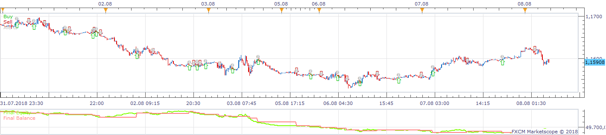
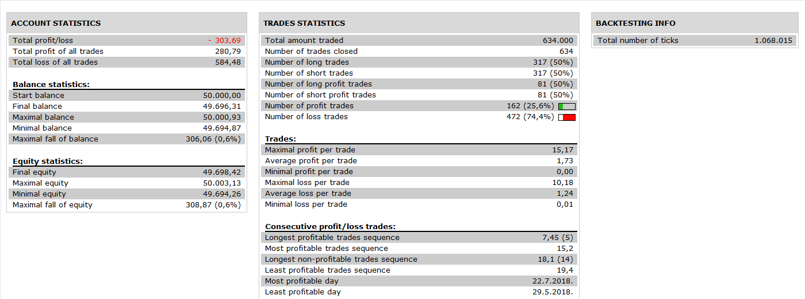

# Trend Signal Strategy

> Source: https://fxcodebase.com/code/viewtopic.php?f=31&t=4938  
> Forum: 31 · Topic 4938 · 6 post(s)

---

## Trend Signal Strategy

**Apprentice** · Fri Jul 01, 2011 2:15 pm

 

 [Trend Signal Strategy.lua](files/12236/Trend%20Signal%20Strategy.lua)

The indicator is based on Trend Signal Indicator.
[viewtopic.php?f=17&t=3918](https://fxcodebase.com/code/viewtopic.php?f=17&t=3918)
This indicator must be installed for this strategy.

Due to its construction this indicator gives a signal with a certain delay.

---

## Re: Trend Signal Strategy

**RJH501** · Mon Jul 04, 2011 1:42 pm

Is anyone familiar with the error attached and a fix?

Thanks much!

RJH

---

## Re: Trend Signal Strategy

**Apprentice** · Tue Jul 05, 2011 12:32 am

Do you have installed Trend Signal Indicator, of your TS

---

## Re: Trend Signal Strategy

**RJH501** · Wed Jul 06, 2011 11:43 am

Yes it has been installed.

---

## Re: Trend Signal Strategy

**Apprentice** · Wed Nov 30, 2016 8:11 am

Bump up.

---

## Re: Trend Signal Strategy

**Apprentice** · Sun Nov 18, 2018 9:19 am

The Strategy was revised and updated on November 18. 2018.
