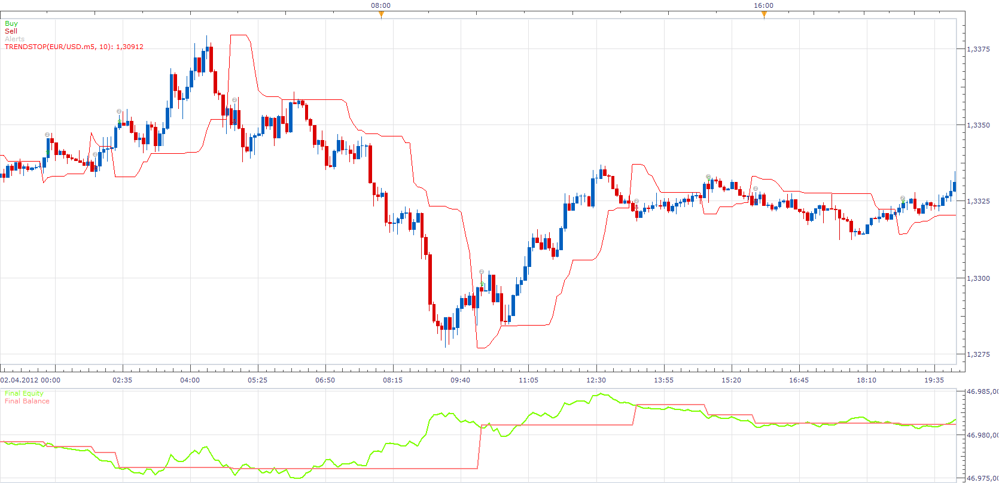
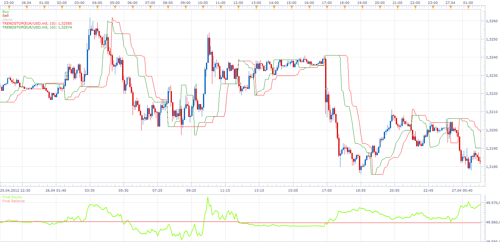

# Trend Stop Strategy

> Source: https://fxcodebase.com/code/viewtopic.php?f=31&t=16865  
> Forum: 31 · Topic 16865 · 47 post(s)

---

## Trend Stop Strategy

**Apprentice** · Tue Apr 24, 2012 9:10 am

 [Trend Stop Strategy.lua](files/31083/Trend%20Stop%20Strategy.lua)

You need to install Trend Stop Indicator
[viewtopic.php?f=17&t=12728&hilit=trend+stop](https://fxcodebase.com/code/viewtopic.php?f=17&t=12728&hilit=trend+stop)

 [Highly adaptable Trend Stop Strategy.lua](files/31083/Highly%20adaptable%20Trend%20Stop%20Strategy.lua)

The Strategy was revised and updated on January 21, 2019.

---

## Re: Trend Stop Strategy

**Apprentice** · Sun May 27, 2012 5:33 am

 [Trend Stop Strategy with Filters.lua](files/34192/Trend%20Stop%20Strategy%20with%20Filters.lua)

Filter one (MA Filter)
Long if Price > MA
Short if Price < MA

Filter one (MA Filter) "Reverse"
Long if Price < MA
Short if Price > MA

Filter Two (Trend Stop)
Long only if Price > TS Filter
Short only if Price < TS Filter
If Simultaneous is on, Both TS cross must happen in a single period

Trailing stop
Close Long
Price < TS - Trailing stop
Close Short
Price > TS + Trailing stop

---

## Re: Trend Stop Strategy

**Falkor** · Tue Jul 02, 2013 3:35 am

Hello Apprentice,

This is an excellent one but somehow this is just not practical as it tends to blow up during the ranging phase which as you know is almost 80% of the time. The filter of MA is also useless in most cases for understandable reasons. No matter what I use with the secondary trendstop confirmation, this too is insufficient. To summarise, this is an excellent one, perhaps the best here, but tends to blow up almost always.

Can we:

1. Add some more filters like MACD and /or

2. Add the features of the Breakout systems (like the highs or lows of nth period) to this strategy.

I am imagining that you haven't built up or modified the system here. If you have improved on this, please let me know the link to the new one.

IMO, these changes could really strengthen the strategy. Please share your thoughts on this, and if time permits create an update so that we can use summer time to study and backtest.

Thanks and regards,
Falkor

---

## Re: Trend Stop Strategy

**Apprentice** · Wed Jul 03, 2013 2:23 am

Your request is added to the development list.

Unfortunately not, in my trading, I do not I use strategies, indicators.

---

## Re: Trend Stop Strategy

**Falkor** · Wed Jul 10, 2013 8:21 am

Thank you, look forward for this one.

Falkor

---

## Re: Trend Stop Strategy

**Falkor** · Thu Jul 11, 2013 3:37 am

Hello Apprentice,

One more point I would like to add:

I have noticed that the MTF TS tends to exit the positions ONLY when the reverse criteria is met i.e. buy position is closed only when the sell signal is generated (and vice versa). This is actually good in many ways as it avoids the chop but also gives back lots of gains and time till the reverse signal is generated.

Is it possible / feasible to modify the strategy along with the above modifications requests (trendfilter + breakout), so that the exit of the trade is made when one 'special' TS (among the four and of higher TF) goes reverse (and not have to wait for all the four filters to reverse in same direction)

I hope I am not confusing you. But I do know I am asking quite a bit here but thats becoz I think this strategy has some good potential.

Thanks a lot,
Falkor

Ps:
For instance:- TS1,15m=Buy, TS2,15m=Buy, TS3,15m=Buy, SpecialTS4,4H=Buy then Strategy buys.
Later> TS1,15m=Buy, TS2,15m=Buy, TS3,15m=**Sell**, SpecialTS4,4H=**Sell**[This would remain a buy-position since the "Sell" is not generated but we will lose on pips becoz major trend has changed. Therefore we should ideally close or exit the position. However, the reverse position is (and should be) initiated only when all the TS's are back in the same direction.)

In other words, the trade is always in the direction Special (larger timeframe) TS)

I hope I am not confusing . I am excited about this, hope I can see this soon. Thanks.

---

## Re: Trend Stop Strategy

**Apprentice** · Sun Jul 14, 2013 2:24 am

Your request is added to the development list.

---

## Re: Trend Stop Strategy

**Halfloaf** · Sat Feb 15, 2014 3:15 pm

Hi Apprentice
Thanks for this fantastic Strategy it gets consistently good P/L!

I would like to request some additions if possible:

1 additional filter for a 'Slower MVA'
1 additional 'Trend Stop Trailing Stops' Parameter

If the 'Fast MVA' is going the same direction as 'Slow MVA' 1 Parameter is used and if the 'Fast MVA' is going against the 'Slow MVA' then the other Parameter is used.

This would in effect give the ability to take reduced Profit whilst going against the longer term market direction without losing the higher profit available with the Market.

I think having 2 sets of Profit and Loss stops could work too but could get messy!

Thanks again for all your great work!!!

---

## Re: Trend Stop Strategy

**Apprentice** · Sun Feb 16, 2014 3:58 am

Your request is added to the development list.

---

## Re: Trend Stop Strategy

**amazon1a** · Tue Apr 22, 2014 3:58 am

Hi Apprentice,

I am not able to find the MTF TS Strategy referenced here, but could you create one similar to the latest MTF HA Strategy where it is possible to limit the number of multiple entries?

viewtopic.php?f=31&t=24198&hilit=mtf+ha&start=10

Many thanks for all your great work, AG

---

## Re: Trend Stop Strategy

**Apprentice** · Thu Apr 24, 2014 3:37 am

Your request is added to the development list.

---

## Re: Trend Stop Strategy

**moomoofx** · Thu May 15, 2014 1:25 am

> **Halfloaf wrote:**
> Hi Apprentice
> Thanks for this fantastic Strategy it gets consistently good P/L!
>
> I would like to request some additions if possible:
>
> 1 additional filter for a 'Slower MVA'
> 1 additional 'Trend Stop Trailing Stops' Parameter
>
> If the 'Fast MVA' is going the same direction as 'Slow MVA' 1 Parameter is used and if the 'Fast MVA' is going against the 'Slow MVA' then the other Parameter is used.
>
> This would in effect give the ability to take reduced Profit whilst going against the longer term market direction without losing the higher profit available with the Market.
>
> I think having 2 sets of Profit and Loss stops could work too but could get messy!
>
> Thanks again for all your great work!!!

Halfloaf's requested enhancement above has been done. I also found a bug with the conditions used for the Trend Stop Trailing Stops... the greater than and less than signs were reversed, so it immediately exited positions which is undesirable.

This new version has replaced the original "Trend Stop Strategy with Filters.lua" file on Apprentice's post. Please redownload.

Cheers,
MooMooFX

---

## Re: Trend Stop Strategy

**JOKER83** · Wed Aug 20, 2014 6:56 pm

Hi
is it possible that I can set the indicator that he only opens trades
and does not include trades

---

## Re: Trend Stop Strategy

**Apprentice** · Thu Aug 21, 2014 1:51 am

Can you explain.
I do not understand your request.

---

## Re: Trend Stop Strategy

**JOKER83** · Thu Aug 21, 2014 5:24 am

trendstop
when i say bye
trenstope make bye open and later trendstop close
but trenstop make klose trade (ITS NOT GOOD)
CLOSE trade i want make self
trendstop only make open bye or sold NOT CLOSE MY TRADE

---

## Re: Trend Stop Strategy

**JOKER83** · Thu Aug 21, 2014 6:29 am

> **JOKER83 wrote:**
> Hi
> is it possible that I can set the indicator that he only opens trades
> and does not include trades

sorry its ok the make not close trades can you make trendstop make close but the streategy
must asser name

---

## Re: Trend Stop Strategy

**JOKER83** · Thu Aug 21, 2014 5:20 pm

SORRY MY ENGLISH
I need a Parameter
TRADE CLOSE = YES/NO

strategy is short
signal long i need a parameters yes/no close my trade

---

## Re: Trend Stop Strategy

**JOKER83** · Thu Aug 28, 2014 3:44 am

HELLLO

PLEAS I NEED A PARAMETER
TRADE CLOSE ON/OFF

I LONG =SHORT SIGNAL CLOSE MY TRADE
ISHORT =LONG SIGNAL CLOSE MY TRADE

PLEAS ON/OFF NOT ONLY ON

---

## Re: Trend Stop Strategy

**Apprentice** · Thu Aug 28, 2014 5:17 am

Your request is added to the development list.

---

## Re: Trend Stop Strategy

**Falkor** · Fri Sep 26, 2014 9:42 am

Hello Apprentice,

Just wanted to check on any developments on the requests. Thanks, looking forward to this.

regards,
Falkor

---

## Re: Trend Stop Strategy

**JOKER83** · Thu Nov 20, 2014 1:27 pm

HI
The strategy CLOSE my trades! NOT GOOD!
Can I switch off the

---

## Re: Trend Stop Strategy

**Apprentice** · Fri Nov 21, 2014 4:32 am

Can you explain your comment.

F.Y.I. I noticed that this strategy uses a poor (old) position management.
This could potentially lead to the closure of other strategy positions.

Please Re-Download.

---

## Re: Trend Stop Strategy

**JOKER83** · Sat Nov 22, 2014 2:52 am

i want strategy make trade open
of H4 sell.
i have more trades open
Bye signal of H4
Strategy make close my open traded
Not nice dont close my trades only open

---

## Re: Trend Stop Strategy

**Apprentice** · Mon Nov 24, 2014 3:55 am

From now forward, you can use the Custom Identifier to limit the scope of the strategy.
Be sure that all strategys use Custom Identifier functionality.

For example
EUR / USD - H1 can use id ID1
EUR / USD - D1 can use id ID2

---

## Re: Trend Stop Strategy

**JOKER83** · Tue Dec 02, 2014 6:15 am

PLEAS
MAKE A PARAMETER
CLOSE MY TRADE: SELL,BUY,BOTH

PLEAS

---

## Re: Trend Stop Strategy

**Apprentice** · Tue Dec 02, 2014 6:27 pm

Buy / Sell / Close are clear.
Can you explain both.

---

## Re: Trend Stop Strategy

**JOKER83** · Wed Dec 03, 2014 12:46 am

SIGNAL
CLOES MY TRADES =SIGNAL BYE
CLOES MY TRADES =SIGNAL SELL
CLOES MY TRADES =SIGNAL BYE AND SELL= BOTH

---

## Re: Trend Stop Strategy

**Apprentice** · Thu Dec 04, 2014 3:38 am

Try newly added Highly adaptable Trend Stop Strategy.lua
(see first, topmost post in topic)

---

## Re: Trend Stop Strategy

**JOKER83** · Thu Dec 04, 2014 5:35 am

NICE WORK
THANKS

---

## Re: Trend Stop Strategy

**JOKER83** · Mon Dec 08, 2014 5:05 am

HI
CAN YOU MAKE A PARAMETER

WHEN BYE SIGNAL OF D1
STRATEGIE MAKE BYE TRADES OPEN WHEN SIGNAL OF H4
WHEN SELL SIGNAL OF D1
STRATEGIE MAKE SELL TRADES OPEN WHEN SIGNAL OF H4
DONT TRADE OF D1 ONLY OPEN TRADE SIGNAL H4

BYE D1 TRADES OPEN WHEN BYE SIGNAL COME OF H4
SELL D1 TRADES OPEN WHEN SELL SIGNAL COME OF H4

---

## Re: Trend Stop Strategy

**JOKER83** · Mon Dec 08, 2014 9:50 am

HI
CAN YOU MAKE A PARAMETER

WHEN BYE SIGNAL OF D1
STRATEGIE MAKE BYE TRADES OPEN WHEN SIGNAL OF H4
WHEN SELL SIGNAL OF D1
STRATEGIE MAKE SELL TRADES OPEN WHEN SIGNAL OF H4
DONT TRADE OF D1 ONLY OPEN TRADE SIGNAL H4

BYE SIGNAL D1
TRADES OPEN WHEN BYE SIGNAL COME OF H4
SELL SIGNAL D1
TRADES OPEN WHEN SELL SIGNAL COME OF H4

---

## Re: Trend Stop Strategy

**Apprentice** · Tue Dec 09, 2014 5:00 am

Your request is added to the development list.

---

## Re: Trend Stop Strategy

**JOKER83** · Tue Dec 09, 2014 6:46 am

> **JOKER83 wrote:**
> HI
> CAN YOU MAKE A PARAMETER
>
> WHEN BYE SIGNAL OF D1
> STRATEGIE MAKE BYE TRADES OPEN WHEN SIGNAL OF H4
> WHEN SELL SIGNAL OF D1
> STRATEGIE MAKE SELL TRADES OPEN WHEN SIGNAL OF H4
> DONT TRADE OF D1 ONLY OPEN TRADE SIGNAL H4
>
> BYE SIGNAL D1
> TRADES OPEN WHEN BYE SIGNAL COME OF H4
> SELL SIGNAL D1
> TRADES OPEN WHEN SELL SIGNAL COME OF H4

THE PARAMETER
PLEAS NOT ONLY D1 AND H4
I WAND ALL TIME FRAMES
H4 AND H1 ALL TIMES
VERY THANKS

---

## Re: Trend Stop Strategy

**JOKER83** · Fri Dec 19, 2014 10:20 am

CAN YOU MAKE A STRATEGY

WHEN A TIMEFRAME BYE (D1)

STRATEGY MAKE BYE TRADES OPEN IN USER TIMEFRAME (H4)

WHEN A TIMEFRAME SELL (D1)

STRATEGY MAKE SELL TRADES OPEN IN USER TIMEFRAME (H4)

WITH ALL PARAMETERS

Please Please Please Please
WHEN CAN I TAKE

---

## Re: Trend Stop Strategy

**4x4partners** · Thu May 07, 2015 10:01 am

I'm not certain I understand the request directly above, but I believe it might be the same thing I am looking for, i.e.:

I would like the strategy to trigger buy/sell based on a lower timeframe (say after close of 30min bar) but only when that lower TF bar closes above/below the higher timeframe Trendstop line.

Would this be possible?

Thanks so much
4x4

---

## Re: Trend Stop Strategy

**Apprentice** · Fri May 08, 2015 5:04 am

Your request is added to the development list.

---

## Re: Trend Stop Strategy

**SavvyStrategist** · Thu Mar 03, 2016 2:01 pm

If I understand the two requests above, which supposedly ask for the same thing, such a strategy already exists.

MTF Trend Stop Strategy
[viewtopic.php?f=31&t=23181&p=100217&hilit=trendstop+mtf#p100217](https://fxcodebase.com/code/viewtopic.php?f=31&t=23181&p=100217&hilit=trendstop+mtf#p100217)

It's not exactly the same, but depending on which filters you select it might very well be.

---

## Re: Trend Stop Strategy

**SavvyStrategist** · Mon Mar 28, 2016 12:02 pm

I would like to request a variation on the Trend Stop with Filters strategy. It's very simple, and can probably be included in the same strategy. Signal only sell trades when above the specified MA and buy trades when below.

Thanks in advance.

---

## Re: Trend Stop Strategy

**FYMDGLV** · Wed Apr 27, 2016 1:46 pm

> **Apprentice wrote:**
> Your request is added to the development list.

Great strategy Apprentice! I have a comment and a request:

The Start time for trading from and to do not seem to work as changing them does not make any difference in all my back tests outcomes. Will you please check that.

Also, will it be possible to change the "start time from" and "Start Time to" options to simple integer inputs (from 1 to 24) so that they can be used in optimization of the strategy. I believe the strategy works really well as is at certain times of the day for certain currency pairs, but not at all times throughout the day. This will allow us to run different optimized copies for different pairs at different times throughout the day.

Thank you again,

Farzad

---

## Re: Trend Stop Strategy

**Apprentice** · Sun May 01, 2016 9:05 am

Fixed.
SavvyStrategist, Your request is added to the development list.

---

## Re: Trend Stop Strategy

**Apprentice** · Mon Jun 27, 2016 4:35 am

"Reverse" parameter added to MA Filter of Trend Stop Strategy with Filters

---

## Re: Trend Stop Strategy

**Apprentice** · Sat Dec 17, 2016 8:37 am

Strategy was revised and updated.

---

## Re: Trend Stop Strategy

**Falkor** · Mon Jan 23, 2017 2:27 pm

Is there an MT4/ MT5's strategy using Trend Stop? If so, please do share.

TY.

---

## Re: Trend Stop Strategy

**Apprentice** · Sun Dec 31, 2017 7:12 am

The strategy was revised and updated.

---

## Re: Trend Stop Strategy

**albertparis** · Tue Jul 23, 2024 12:29 am

Good morning
Can we have this strategy:
Highly adaptable Trend Stop Strategy.lua
With the indicator:
Supertrend.lua or st.lua
[https://fxcodebase.com/code/viewtopic.php?f=17&t=605](https://fxcodebase.com/code/viewtopic.php?f=17&t=605)
Thank you for your future work

---

## Re: Trend Stop Strategy

**Apprentice** · Thu Jul 25, 2024 4:03 pm

We have added your request to the development list.
Development reference 604

---

## Re: Trend Stop Strategy

**Apprentice** · Wed Aug 14, 2024 6:37 pm

Try this version.
[https://fxcodebase.com/code/viewtopic.php?f=31&t=75138](https://fxcodebase.com/code/viewtopic.php?f=31&t=75138)
If you need any other condition added, please specify.
