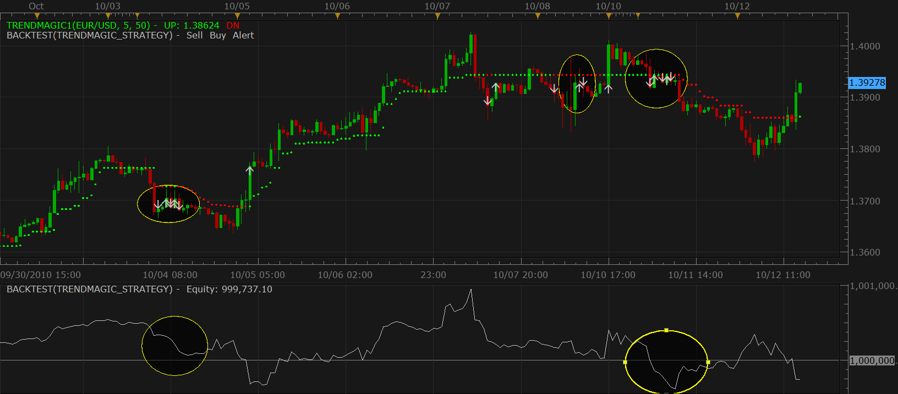
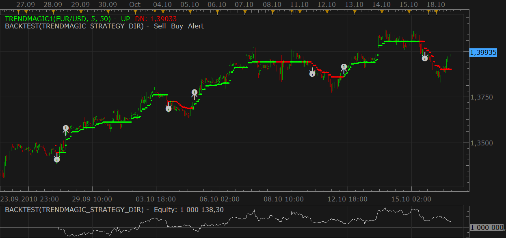

# Trendmagic signal/strategy [Upd Oct, 20]

> Source: https://fxcodebase.com/code/viewtopic.php?f=31&t=2387  
> Forum: 31 · Topic 2387 · 13 post(s)

---

## Trendmagic signal/strategy [Upd Oct, 20]

**Nikolay.Gekht** · Tue Oct 12, 2010 2:33 pm

Update Oct, 20. Trend Magic Direction strategy (second post below) is updated. Now the strategy does not create the first position until the signal is switched from opposite direction, i.e. if the current condition are buy it will wait until the first sell after buy appears.

There is a simple basic signal/strategy which works on [Trend Magic indicator](https://fxcodebase.com/code/viewtopic.php?f=17&t=2374).

The strategy enters long which trend magic turns green and enters short when trend magic turns red.

Options:

1) The strategy can show signals (alerts, sounds (including recurrent), emails) as well as can trade. By default trading is disabled. To let the strategy trade please go to the "Trading Parameters" and switch "AllowTrading" parameter to "On".

2) In trading parameters you can also switch on and configure stop and limit orders.

3) You can also configure "auto lot size". In case the previous trade wasn't profitable, the strategy will increase the next lot by the specified amount unless the maximum amount is reached. In case trade was profitable - the strategy will reset the trade size. Important note! In case trade is closed by stop or limit order and more than 30 trades was closed after that moment, the strategy cannot detect whether the trade was closed with profit or not. This is a limitation of the trading platform which shows only 30 last trades.

**Important note! The strategy is very sensitive for flat market! Pay attention on the highlighted areas where the strategy suffers significant loss**
Personally I don't recommend to use the strategy to trade unless you explicitly understand all pros and contras of trend magic indicator. This is rather useful for testing trend magic indicator and to use it just as signal, without no trading features switched on.

 

Please, do not forget to download and install **new** version of Trend Magic indicator:
[viewtopic.php?f=17&t=2374](https://fxcodebase.com/code/viewtopic.php?f=17&t=2374)

Download strategy:

 [TrendMagic_Strategy.lua](files/5153/TrendMagic_Strategy.lua)

---

## Version 2

**Nikolay.Gekht** · Mon Oct 18, 2010 12:17 pm

Another version of the Trendmagic strategy. Now it trades when the direction of the line is changed rather than when the color is changed. This version is a bit less sensitive to the flats than previous:

 

download:

 [TrendMagic_Strategy_Dir.lua](files/5300/TrendMagic_Strategy_Dir.lua)

Please, do not forget to download and install **new** version of Trend Magic indicator:
[viewtopic.php?f=17&t=2374](https://fxcodebase.com/code/viewtopic.php?f=17&t=2374)

p.s. I also fixed alert text in original strategy as well. It tells "short" opening "long" and vise versa.

---

## Re: Trendmagic signal/strategy [Upd Oct, 20]

**Nikolay.Gekht** · Wed Oct 20, 2010 4:54 pm

Update Oct, 20. Trend Magic Direction strategy (second post below) is updated. Now the strategy does not create the first position until the signal is switched from opposite direction, i.e. if the current condition are buy it will wait until the first sell after buy appears.

---

## Re: Trendmagic signal/strategy [Upd Oct, 20]

**borsaty** · Thu Oct 21, 2010 12:08 pm

Dear
Thanks for you effort
but you can add another filter for trading this strategy like ... it only take the position in the direction of H4 to this Indicator i.e ( only buy in **15m** while the trend magic in h4 is green and filter the sell order and only sell order in case the indicator is red in h4

---

## Re: Trendmagic signal/strategy [Upd Oct, 20]

**Ancient** · Tue Jan 11, 2011 8:20 am

The Strategy Opens Opposite Positions to those Informed on by the Alert Event.

i.e. Alert Signal Informs; Enter Short
................. Strategy Enters Long

---

## Re: Trendmagic signal/strategy [Upd Oct, 20]

**spinemaligna** · Sun Jan 16, 2011 9:01 pm

Hi all,

Is it possible to incorporate a filter so that the strategy monitors trendmagic colour and enters a trade when the SAR colour changes to match it. i.e Trendmagic is red, SAR is green, when SAR changes to red a sell position is opened.
Is it also possible to arrange that when the trade is opened a take profit limit is placed and the SAR Stop strategy is opened.

I have been paper trading this idea manually on 15 minute candles and it seems as if it could be profitable.

Thanks in advance,

Ross

---

## Re: Trendmagic signal/strategy [Upd Oct, 20]

**ancient-school** · Mon Jan 17, 2011 9:59 am

Can someone tell me whether this Strategy trades; or only Alerts to trades?

I understood that it does both? However the Strategy, Alerts to trades that are signalled, but Trades Signalled are not opened although Allow Trading is set to "Yes"? More, as I just noticed a trade opened, it seems to be Opening Trades Selectively? i.e. Some Alerts signalled are also traded... Other Alerts are not Traded? So what is this Strategy supposed to be doing?

I am running Trade Station version 01.10 010311, updated from previous installation 082610 with patch installed... Do I maybe need to remove this patch?

Any info is most welcome....

---

## Re: Trendmagic signal/strategy [Upd Oct, 20]

**ancient-school** · Mon Jan 17, 2011 2:42 pm

First, Addendum to Previous Comment: **Strategy is Opening Opening Positions** To Continue:

Nikolay,

With Reference too:

> **Nikolay.Gekht wrote:**
> Update Oct, 20. Trend Magic Direction strategy (second post below) is updated. Now the strategy does not create the first position until the signal is switched from opposite direction, i.e. if the current condition are buy it will wait until the first sell after buy appears.

Does it still show the signal for the first position created? As I have noticed there are more Alerts than Positions opened! If this is the case, can this be corrected?

---

## Re: Trendmagic signal/strategy [Upd Oct, 20]

**d10gen3** · Wed Jan 26, 2011 8:24 pm

I have a problem running TrendMagic

Whenever I try to "Allow Strategy to Trade" in backtesting, I get an error message:
[string "TrendMagic Strategy Dir.lua"]:99: Unsupported

Anyone knows why is this happening? (I have the latest version of Marketscope as well as the latest trading station)

Thanks,
Andres

---

## Re: Trendmagic signal/strategy [Upd Oct, 20]

**alepan72** · Thu Jan 27, 2011 7:39 am

> **d10gen3 wrote:**
> I have a problem running TrendMagic
>
> Whenever I try to "Allow Strategy to Trade" in backtesting, I get an error message:
> [string "TrendMagic Strategy Dir.lua"]:99: Unsupported
>
> Anyone knows why is this happening? (I have the latest version of Marketscope as well as the latest trading station)
>
> Thanks,
> Andres

Hi friend,
I sent you PM.

---

## Re: Trendmagic signal/strategy [Upd Oct, 20]

**forexdezert** · Thu Feb 03, 2011 12:09 pm

Hello all.

When attempting to backtest, and switching "allow startegy to trade parameter to yes", I get the same error just a little different.

[string "TrendMagic Strategy Dir.lua"]:157: Unsupported

I have tried to find a solution in the forum but have been unsuccessful. Any insight into this would be great.
 Thank you.

quote="d10gen3"]I have a problem running TrendMagic

Whenever I try to "Allow Strategy to Trade" in backtesting, I get an error message:
[string "TrendMagic Strategy Dir.lua"]:99: Unsupported

Anyone knows why is this happening? (I have the latest version of Marketscope as well as the latest trading station)

Thanks,
Andres[/quote]

---

## Re: Trendmagic signal/strategy [Upd Oct, 20]

**Apprentice** · Thu Feb 03, 2011 12:18 pm

We discovered a bug.

Developers already fixed this issue, and the fix will be submitted in
the next release.

Actually, there is a way to resolve the problem right now. The users
should just restart the Trading Station. After this, the error
shouldn't appear.

---

## Re: Trendmagic signal/strategy [Upd Oct, 20]

**Apprentice** · Mon Jan 29, 2018 7:50 am

The strategy was revised and updated.
