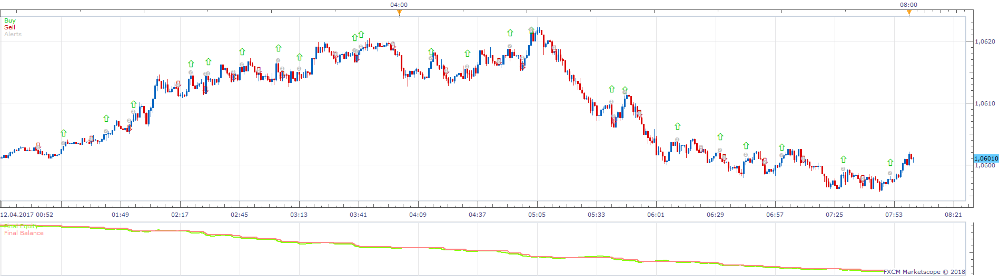
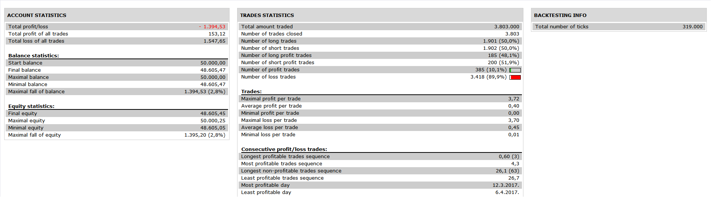

# Trendsignal Strategy

> Source: https://fxcodebase.com/code/viewtopic.php?f=31&t=65877  
> Forum: 31 · Topic 65877 · 9 post(s)

---

## Trendsignal Strategy

**Apprentice** · Fri Apr 06, 2018 7:01 am

 

 [Trendsignal Strategy.lua](files/118498/Trendsignal%20Strategy.lua)

Based on Trendsignal indicator.
[viewtopic.php?f=17&t=65833](https://fxcodebase.com/code/viewtopic.php?f=17&t=65833)

---

## Re: Trendsignal Strategy

**Armando92** · Sun Nov 04, 2018 12:50 pm

Hello Apprentice
I like this indicator since a long time. Could it be possible to add a 2 MA cross to this strategy?
For example with a 2 macross EMA20/EMA100, if the EMA20 is above EMA100, I would like to take a buy trade for each green Trend Signal

---

## Re: Trendsignal Strategy

**Apprentice** · Mon Nov 05, 2018 6:58 am

Try it now.

---

## Re: Trendsignal Strategy

**Armando92** · Mon Nov 05, 2018 7:47 am

Hi
Thank you very much for your quick answer, I'm gonna test it now.
Regards

---

## Re: Trendsignal Strategy

**Armando92** · Mon Nov 05, 2018 8:31 am

Hi Mario

Thanks for helping me out

I noticed a small issue though

When Trend signal is triggered after MA cross, the trade is well executed
However, when the MA cross after Trend Signal, the trade is not executed

I'd like to get a trade whenever Trend Signal and MA cross are convergent.

Also, would be awesome to get the close on Opposite based on the opposite Trend Signal. For instance, if we have a BUY signal based on UP Trend Signal + UP MA CROSS, I'd like to get the trade closed based on DOWN Trend Signal only

Thanks for your help

---

## Re: Trendsignal Strategy

**Armando92** · Fri Nov 16, 2018 1:53 pm

Hi Mario

Hope you're well

I confirm the issue is still happening now and would be great to get it solved. When the MA cross appears after the trend signal, the trade is not executed
Do you have any update regarding this issue ?
Do you need more details that I could provide ?

Thanks so much for your help

---

## Re: Trendsignal Strategy

**Apprentice** · Sat Nov 17, 2018 5:34 am

Your request is added to the development list under Id Number 4319

---

## Re: Trendsignal Strategy

**Apprentice** · Mon Nov 19, 2018 10:15 am

Try it now.

---

## Re: Trendsignal Strategy

**Armando92** · Wed Nov 21, 2018 6:41 am

Thanks a lot !
