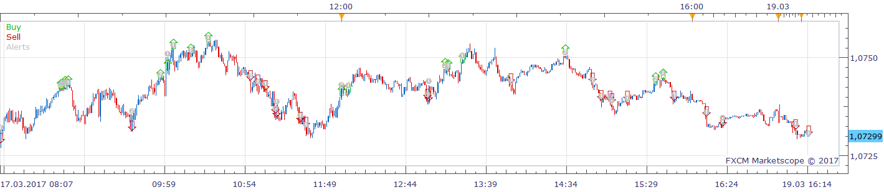
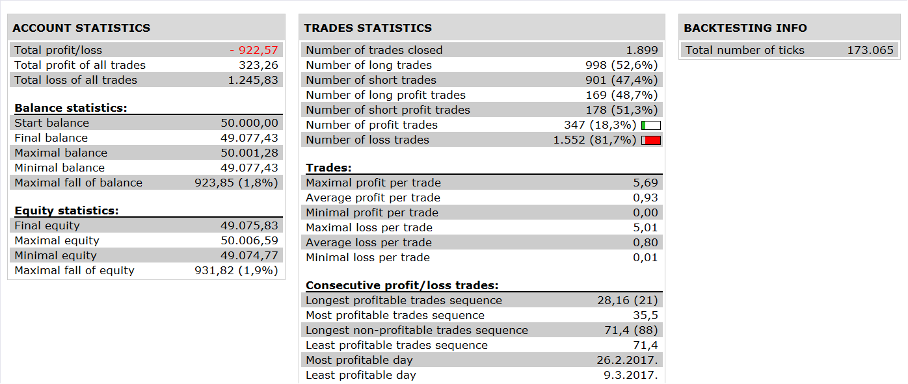

# TRIPLE EXTREME TMA LINE Strategy

> Source: https://fxcodebase.com/code/viewtopic.php?f=31&t=65062  
> Forum: 31 · Topic 65062 · 4 post(s)

---

## TRIPLE EXTREME TMA LINE Strategy

**Apprentice** · Wed Sep 06, 2017 8:49 am

 

Open Long if Price crosses Over first lower channel.
Open Short if Price crosses Under first upper channel.

Open Long if Price crosses Over second lower channel.
Open Short if Price crosses Under second upper channel.

Open Long if Price crosses Over third lower channel.
Open Short if Price crosses Under third upper channel.

 [TRIPLE EXTREME TMA LINE Strategy.lua](files/114745/TRIPLE%20EXTREME%20TMA%20LINE%20Strategy.lua)

Triple Extreme_TMA_Line.lua is available here.
[viewtopic.php?f=17&t=59406&hilit=TRIPLE+EXTREME+TMA+LINE](https://fxcodebase.com/code/viewtopic.php?f=17&t=59406&hilit=TRIPLE+EXTREME+TMA+LINE)

The Strategy was revised and updated on January 21, 2019.

---

## Re: TRIPLE EXTREME TMA LINE Strategy

**BigFOX** · Thu Nov 30, 2017 12:20 pm

Hello Apprentice,

The strategy does not work.
Sincerely BigFOX

---

## Re: TRIPLE EXTREME TMA LINE Strategy

**Apprentice** · Fri Dec 01, 2017 3:57 am

Additional checks added.
Unfortunately, was not been able to reproduce it in Simulator More or Backtester.

---

## Re: TRIPLE EXTREME TMA LINE Strategy

**BigFOX** · Fri Dec 01, 2017 3:51 pm

Thanks Apprentice for the best regard.

Cordialy BigFOX
