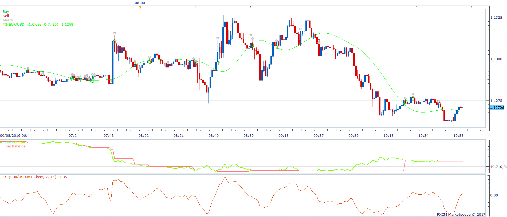
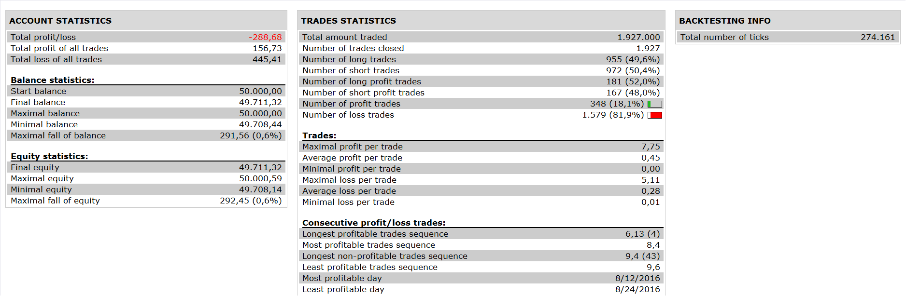

# True Strength Index Tilson T3 Average Cross Strategy

> Source: https://fxcodebase.com/code/viewtopic.php?f=31&t=64467  
> Forum: 31 · Topic 64467 · 2 post(s)

---

## True Strength Index Tilson T3 Average Cross Strategy

**Apprentice** · Sun Feb 19, 2017 3:32 pm

 

Open Long
TSI / Long Level CrossOver
and Price > T3
Open Short
TSI / Short Level CrossUnder
and Price < T3

Exit (Optional)
Exit Long
Price < T3
or TSI < Long Exit Level

Exit Short
Price > T3
or TSI > Short Exit Level

 [True Strength Index Tilson T3 Average Cross Strategy.lua](files/111120/True%20Strength%20Index%20Tilson%20T3%20Average%20Cross%20Strategy.lua)

T3.lua & GD.lua are available here.
[viewtopic.php?f=17&t=1302](https://fxcodebase.com/code/viewtopic.php?f=17&t=1302)

The Strategy was revised and updated on January 21, 2019.

---

## Re: True Strength Index Tilson T3 Average Cross Strategy

**Apprentice** · Sun Dec 31, 2017 7:00 am

The strategy was revised and updated.
