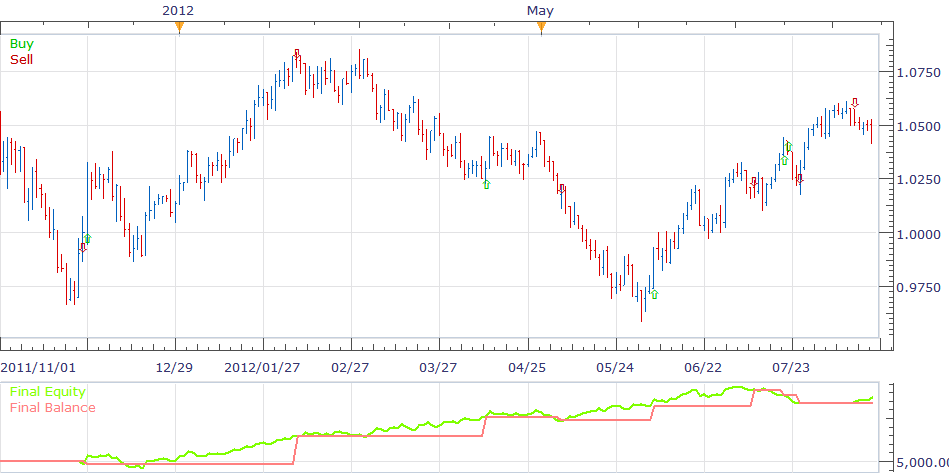
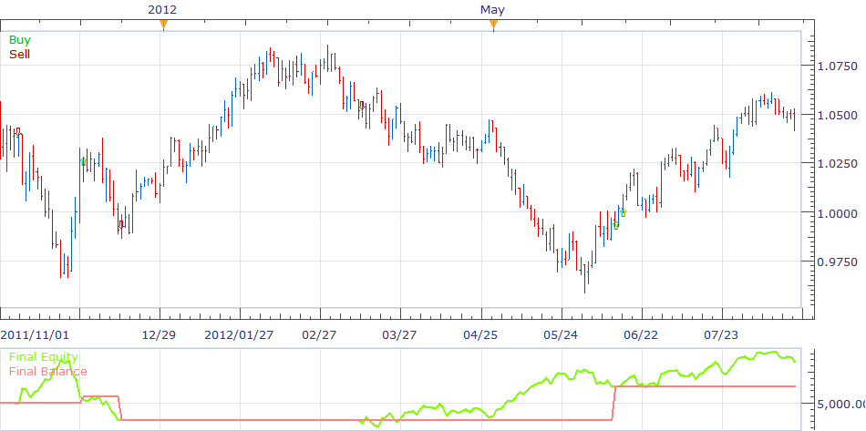
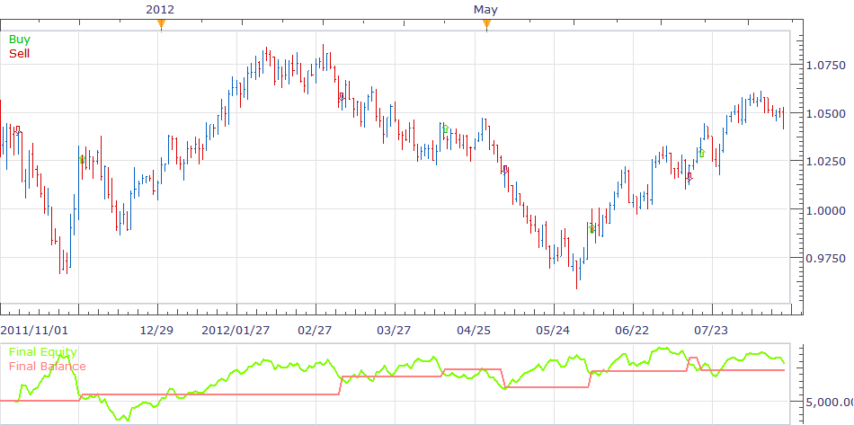

# TTF Strategy

> Source: https://fxcodebase.com/code/viewtopic.php?f=31&t=22845  
> Forum: 31 · Topic 22845 · 2 post(s)

---

## TTF Strategy

**richardtao** · Thu Aug 30, 2012 10:31 pm

backtest of strategy 1

 

backtest of strategy 2

 

backtest of strategy 3

 

The user apply TTF_beta_S strategy must load TTF_beta indicator first.
The parameter “Allow Stop” defines the stop type.
To select [PostStp] set the strategy will close position when price was break through the stop value after the specific time period.
To select [PreStp] set the strategy put the stop entry by sotp value automatically.
User have to input initial stop pips when selecting [FixStp]! Otherwise the position will not close until the next reversal action took place.
The recommend parameters setting please check TTF indicator.

 [TTF_beta_S.bin](files/39412/TTF_beta_S.bin)

---

## Re: TTF Strategy

**Apprentice** · Mon Dec 05, 2016 10:07 am

Bump up.
