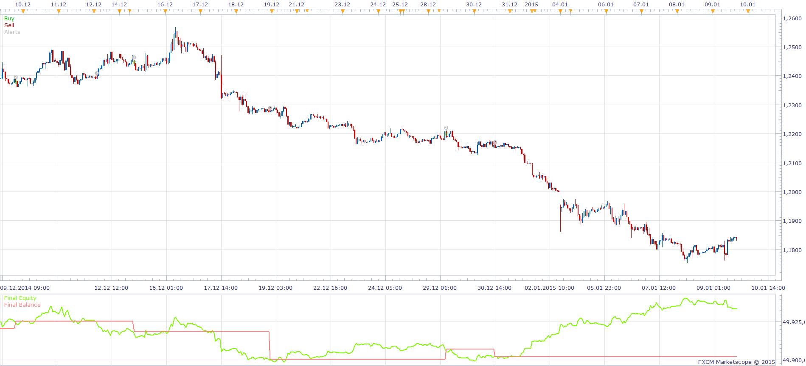

# TWO CCI MA STRATEGY

> Source: https://fxcodebase.com/code/viewtopic.php?f=31&t=61816  
> Forum: 31 · Topic 61816 · 2 post(s)

---

## TWO CCI MA STRATEGY

**Apprentice** · Fri Feb 13, 2015 4:50 am

Based on the request
[http://www.fxcodebase.com/code/viewtopi ... 27&t=61815](http://www.fxcodebase.com/code/viewtopic.php?f=27&t=61815)
INDICATORS:
1. CCI 1( 14 PERIOD):
BUY LEVEL1:0
SELL LEVEL1:0

2. MA(PREFERABLY EMA OR LSMA)( DATA SOURCE IS CCI1)( PERIOD 34)

3.CCI2(50 PERIOD):
BUY LEVEL 2:0
SELL LEVEL2:0

BUY: EMA> BUY LEVEL 1 AND CCI2> BUY LEVEL 2 AND CCI1 CROSS OVER BUY LEVEL 1

SELL: EMA < SELL LEVEL 1 AND CCI2< SELL LEVEL 2 AND CCI 2 CROSS UNDER SELL LEVEL 1

EXIT BUY: CCI 2 CROSS OVER BUY LEVEL 2

EXIT SELL: CCI 2 CROSS OVER SELL LEVEL 2

 [TWO CCI MA STRATEGY.lua](files/98635/TWO%20CCI%20MA%20STRATEGY.lua)

The Strategy was revised and updated on January 22, 2019.

---

## Re: TWO CCI MA STRATEGY

**Apprentice** · Sat Jan 06, 2018 8:33 am

The strategy was revised and updated.
