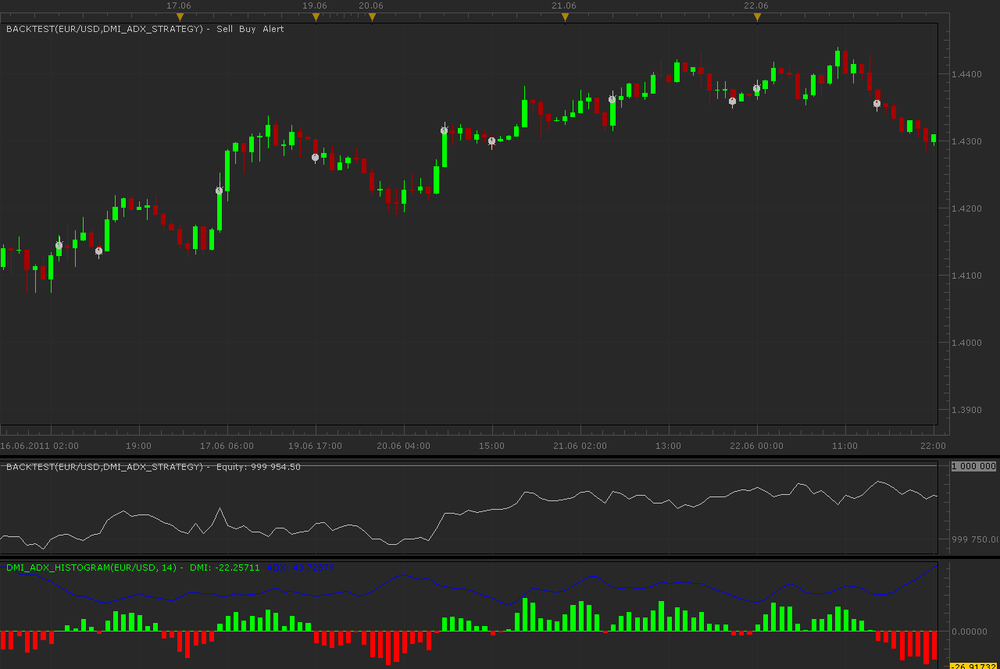

# Two DMI Histogram strategies

> Source: https://fxcodebase.com/code/viewtopic.php?f=31&t=5159  
> Forum: 31 · Topic 5159 · 3 post(s)

---

## Two DMI Histogram strategies

**Alexander.Gettinger** · Tue Jul 12, 2011 3:12 am

Both strategies based on DMI histogram ([viewtopic.php?f=17&t=5003](https://fxcodebase.com/code/viewtopic.php?f=17&t=5003)).

First startegy open/close orders on change histogram color and if ADX>[ADX level].

 

Download:

 [DMI_ADX_Strategy.lua](files/12615/DMI_ADX_Strategy.lua)

Second strategy open orders if ADX>[ADX level] in histogram direction and close orders if histogram change color.

Download:

 [DMI_ADX_Strategy2.lua](files/12615/DMI_ADX_Strategy2.lua)

For strategies must be installed DMI Histogram ([viewtopic.php?f=17&t=5003](https://fxcodebase.com/code/viewtopic.php?f=17&t=5003)).

The Strategy was revised and updated on December 11, 2018.

---

## Re: Two DMI Histogram strategies

**CHECEZAR** · Sun Dec 21, 2014 5:53 pm

> **Alexander.Gettinger wrote:**
> Both strategies based on DMI histogram ([viewtopic.php?f=17&t=5003](https://fxcodebase.com/code/viewtopic.php?f=17&t=5003)).
>
> First startegy open/close orders on change histogram color and if ADX>[ADX level].
>
>
>
> DMI_ADX_Strategy.png
>
>
>
> Download:
>
>
> DMI_ADX_Strategy.lua
>
>
>
> Second strategy open orders if ADX>[ADX level] in histogram direction and close orders if histogram change color.
>
> Download:
>
>
> DMI_ADX_Strategy2.lua
>
>
>
> For strategies must be installed DMI Histogram ([viewtopic.php?f=17&t=5003](https://fxcodebase.com/code/viewtopic.php?f=17&t=5003)).

Hello Alexander, could you please include in the strategy close in an opposite signal?

 Not dependent on TP and SL to open and close operations.

 Thank you very much.

---

## Re: Two DMI Histogram strategies

**Apprentice** · Sun Dec 11, 2016 1:03 pm

Strategy was revised and updated.
