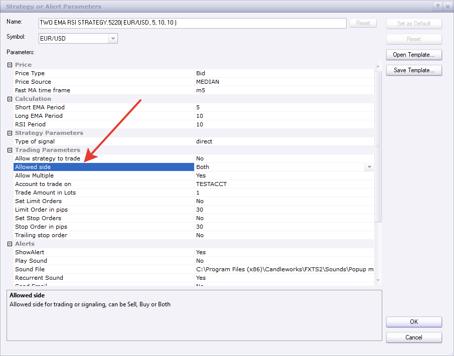

# Two EMA RSI Strategy

> Source: https://fxcodebase.com/code/viewtopic.php?f=31&t=9343  
> Forum: 31 · Topic 9343 · 13 post(s)

---

## Two EMA RSI Strategy

**Apprentice** · Sat Dec 10, 2011 8:04 am

Long
Short/Long Ema Crossover
RSI > 50

Short
Short/Long Ema Crossunder
RSI < 50

 [Two EMA RSI Strategy.lua](files/20192/Two%20EMA%20RSI%20Strategy.lua)

The Strategy was revised and updated on January 21, 2019.

---

## Re: Two EMA RSI Strategy

**luigifx** · Thu Apr 19, 2012 3:48 pm

Hi Apprentice !

This strategy is almost the one I search for, but I need a little improvement.

Is it possible to have the choice of (median,high,low,close,typical...) on each EMA (fast and slow)
and to have the choice of RSI value (instead of 50 , I would like 55 by example)

It would be really great !!

Luigifx

---

## Re: Two EMA RSI Strategy

**Apprentice** · Fri Apr 20, 2012 2:05 am

Your request is added to the development list.

---

## Re: Two EMA RSI Strategy

**Apprentice** · Thu Apr 26, 2012 4:55 am

I have added requested plus few of my own addons.

 [Two MA RSI Strategy.lua](files/31367/Two%20MA%20RSI%20Strategy.lua)

---

## Re: Two EMA RSI Strategy

**nrod80** · Tue Jul 10, 2012 3:42 pm

Hi Apprentice

Is there any chance to put this strategy in mt4?? i moved in fxcm to use mt4 but i don´t know how to make the changes, hope you can help me, thanks

---

## Re: Two EMA RSI Strategy

**Apprentice** · Wed Jul 11, 2012 5:06 am

Your request is added to the development list.

---

## Re: Two EMA RSI Strategy

**amorgos89** · Wed Dec 19, 2012 2:56 pm

Hello,
is it possible to add "Ilrs" as method MMA ?
Thanks

---

## Re: Two EMA RSI Strategy

**Apprentice** · Thu Dec 20, 2012 3:05 am

Your request is added to the development list.

---

## Re: Two EMA RSI Strategy

**Apprentice** · Tue Dec 26, 2017 6:53 am

The strategy was revised and updated.

---

## Re: Two EMA RSI Strategy

**Avignon** · Mon Jan 20, 2020 7:50 am

Hello,

Can you add "Allowed side" option (both, sell, buy) ?

Thanks.

---

## Re: Two EMA RSI Strategy

**Apprentice** · Mon Jan 20, 2020 8:45 am

Your request is added to the development list.
Development reference 569.

---

## Re: Two EMA RSI Strategy

**Apprentice** · Tue Jan 21, 2020 1:52 pm

these strategies already have such an option.

---

## Re: Two EMA RSI Strategy

**Avignon** · Tue Jan 21, 2020 7:09 pm

Sorry! I had checked well.
