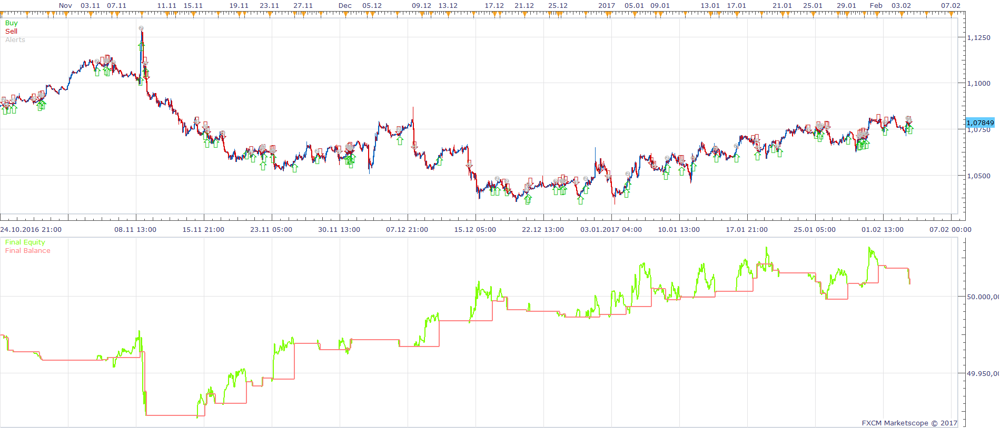
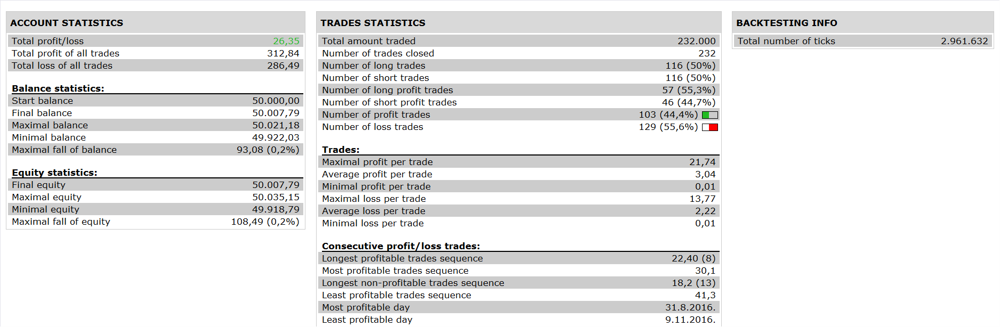

# Two Instrument Strategy

> Source: https://fxcodebase.com/code/viewtopic.php?f=31&t=64611  
> Forum: 31 · Topic 64611 · 2 post(s)

---

## Two Instrument Strategy

**Apprentice** · Fri Apr 21, 2017 6:59 am

 

Prerequisite for trade
1)
Instrument 1 > MA of Instrument 1
Instrument 2 < MA of Instrument 2
or
2)
Instrument 1 < MA of Instrument 1
Instrument 2 > MA of Instrument 2

If we have 1) or 2) we can enter into new trade

If Instrument 1 CrossOver MA of Instrument 1
Open Long in Instrument 1
Open Short in Instrument 2
If Instrument 1 CrossUnder MA of Instrument 1
Open Short in Instrument 1
Open Long in Instrument 2
Optional exit
3)
Instrument 1 > MA of Instrument 1
Instrument 2 > MA of Instrument 2
or
4)
Instrument 1 < MA of Instrument 1
Instrument 2 < MA of Instrument 2

 [Two Instrument Strategy.lua](files/112090/Two%20Instrument%20Strategy.lua)

The Strategy was revised and updated on January 21, 2019.

---

## Re: Two Instrument Strategy

**Apprentice** · Sat Dec 30, 2017 8:28 am

The strategy was revised and updated.
