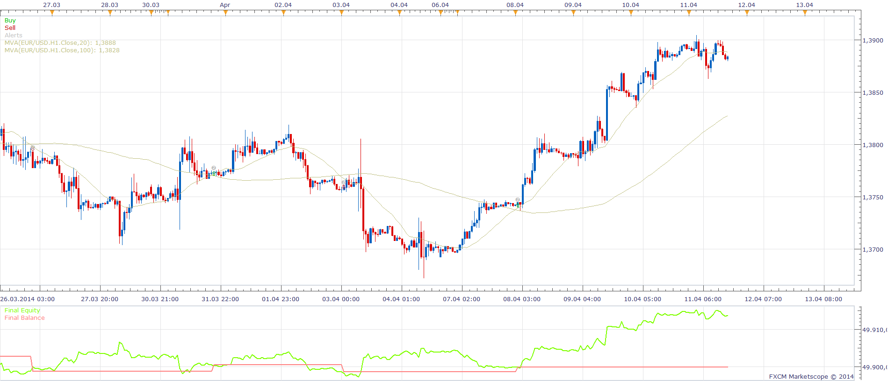

# Two MA Cross Strategy

> Source: https://fxcodebase.com/code/viewtopic.php?f=31&t=60657  
> Forum: 31 · Topic 60657 · 17 post(s)

---

## Two MA Cross Strategy

**Apprentice** · Wed May 07, 2014 3:39 am

Open Long
Short/Long MA CrossOver

Open Short
Short/Long MA CrossUnder

Open Short

 [Two MA Cross Strategy.lua](files/93888/Two%20MA%20Cross%20Strategy.lua)

Vama (if used can be found here)
[viewtopic.php?f=17&t=2349&hilit=vama](https://fxcodebase.com/code/viewtopic.php?f=17&t=2349&hilit=vama)
NonLagMA (if used can be found here)
[viewtopic.php?f=17&t=2231&p=5455&hilit=NONLAGMA#p5455](https://fxcodebase.com/code/viewtopic.php?f=17&t=2231&p=5455&hilit=NONLAGMA#p5455)

---

## Re: Two MA Cross Strategy

**JOKER83** · Tue Mar 03, 2015 7:20 pm

CAN YOU MAKE
CLOSE OPTION ON/OFF

---

## Re: Two MA Cross Strategy

**Apprentice** · Wed Mar 04, 2015 3:41 pm

Can you elaborate, this strategy do not have any advanced Exit logic.
Only close on the opposite.

---

## Re: Two MA Cross Strategy

**JOKER83** · Thu Mar 05, 2015 6:34 am

I HAVE SELL TRADE
BUY SIGNAL -CLOSE MY TRADE
THIS ON/OFF

AND CAN YOU MAKE TWO EMA TO CONFIRM
BUT BIGGER TIMEFRAME
ONE EMA
TIMEFRAME
CLOSE TRADE ON/OFF

TWO EMA
TIMEFRAME
CLOSE TRADE ON/OFF

---

## Two MA Cross Strategy

**akram66** · Sat Mar 14, 2015 2:37 am

AND CAN YOU MAKE TWO EMA TO CONFIRM
BUT BIGGER TIMEFRAME

---

## Re: Two MA Cross Strategy

**Apprentice** · Mon Mar 16, 2015 3:23 am

Your request is added to the development list.

---

## Re: Two MA Cross Strategy

**Fafountrader** · Wed Aug 03, 2016 4:24 pm

I get the following messages when attempting to load - attempt to index global 'strategy' (a nil value) and the parameter with the specified id already exists. Please help.

---

## Re: Two MA Cross Strategy

**Apprentice** · Mon Aug 08, 2016 6:15 am

Try it now.

---

## Re: Two MA Cross Strategy

**Fafountrader** · Wed Aug 10, 2016 11:14 am

works thanks apprendice

---

## Re: Two MA Cross Strategy

**Pied Pipper** · Fri Oct 21, 2016 3:25 pm

Dear Apprentice,

I am new to Forex and Lua scripting.

When I test the attached strategy the entry order is always created 2 or 3 candles after the cross took place. Why is that and is there a way to create the entry order as soon a the cross happened (or a set time later to confirm the cross did in fact happen)? I am also playing with the following exit strategy idea: wait for the fast MA to flatten out (iow see a reversal in slope) and then exit. Will you be able to do that? I have played with your slope strategy as well, but the 'sensitivity' seems to highas the system enters and exits multiple orders along a fairly straight line.

I am looking forward to your reply in this matter,
Thanks,

---

## Re: Two MA Cross Strategy

**Apprentice** · Mon Oct 24, 2016 3:22 am

Try to use "Live" Execution Type
Will this work for you?

---

## Re: Two MA Cross Strategy

**santiago** · Fri Nov 11, 2016 10:13 pm

start time for trading and stop time for trading inputs dont seem to be working. I dont think they were implemented.

---

## Re: Two MA Cross Strategy

**Apprentice** · Sun Nov 13, 2016 5:28 am

Fixed.

---

## Re: Two MA Cross Strategy

**Apprentice** · Sun Dec 18, 2016 8:39 am

Strategy was revised and updated.

---

## Re: Two MA Cross Strategy

**SasaOnline** · Wed Aug 02, 2023 9:29 pm

> **Apprentice wrote:**
> Strategy was revised and updated.

hello
please mt4 and mt5 version

---

## Re: Two MA Cross Strategy

**Apprentice** · Tue Aug 08, 2023 3:33 am

We have added your request to the development list.
Development reference 683.

---

## Re: Two MA Cross Strategy

**Apprentice** · Wed Jan 15, 2025 5:00 am

Quite a few implementations already exists for MT4:

[viewtopic.php?f=38&t=17979](https://fxcodebase.com/code/viewtopic.php?f=38&t=17979)

[viewtopic.php?f=38&t=64500](https://fxcodebase.com/code/viewtopic.php?f=38&t=64500)

[viewtopic.php?f=27&t=60829](https://fxcodebase.com/code/viewtopic.php?f=27&t=60829)

[viewtopic.php?f=38&t=70380](https://fxcodebase.com/code/viewtopic.php?f=38&t=70380)

[viewtopic.php?f=38&t=71838](https://fxcodebase.com/code/viewtopic.php?f=38&t=71838)

[viewtopic.php?f=31&t=60987](https://fxcodebase.com/code/viewtopic.php?f=31&t=60987)

[viewtopic.php?f=27&t=69208](https://fxcodebase.com/code/viewtopic.php?f=27&t=69208)

[viewtopic.php?f=27&t=69183](https://fxcodebase.com/code/viewtopic.php?f=27&t=69183)
