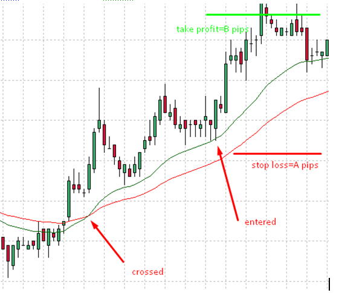

# Two MA Cross Strategy

> Source: https://fxcodebase.com/code/viewtopic.php?f=31&t=60987  
> Forum: 31 · Topic 60987 · 8 post(s)

---

## Two MA Cross Strategy

**Apprentice** · Sun Jul 27, 2014 1:46 pm

Posted by request.
[viewtopic.php?f=27&t=60829#p94547](https://fxcodebase.com/code/viewtopic.php?f=27&t=60829#p94547)

 

Open Long precondition
Short MA > Long MA

Open Long on Price/MA Touch
Low < Short MA
Close > Short MA

Open Short will be reversed

 [Two MA Cross Strategy.lua](files/95152/Two%20MA%20Cross%20Strategy.lua)

Two MA Cross Strategy
TWO MA CROSS

---

## Re: Two MA Cross Strategy

**bignall** · Wed Aug 06, 2014 7:23 pm

I have been trying to use this strategy, however Trading Station crashes when I add the strategy after setting the parameters. Does anyone have it successfully working, if so could you suggest anything I may be doing wrong? I am just learning to use strategies on FXCM.

Also is there anyway that the T3 Tilson and GD from this post [viewtopic.php?f=17&t=1302&p=2496#p2487](https://fxcodebase.com/code/viewtopic.php?f=17&t=1302&p=2496#p2487) could be included as options for the MAs?

Thanks for the help!

---

## Re: Two MA Cross Strategy

**Apprentice** · Sat Aug 09, 2014 4:37 am

Can you privide error message if any or/and crash report.

Available within the TS installation folder,
Make sure to copy / paste it prior to TS restart.
Will disappear after TS restart.

---

## Re: Two MA Cross Strategy

**bignall** · Wed Aug 13, 2014 8:05 pm

Well I was having consistent crashes. But I've been trying it again and now it is working. My apologies for the false alarm.

I would still like to know if it would be possible to add the T3 Tilson as one of the moving average options.

Thanks!
Rosina

---

## Re: Two MA Cross Strategy

**Laventus** · Sun Sep 27, 2015 10:38 am

Hey there I am wondering if some changes to this ea strategy could be made.

1. Allow you to choose an ema higher than 1000
2. This ea only gives you the option to trade on a retest of the fast ema, allow it to also have the option to take a touch of the slow ema too.
3. Can there be an option to restrict the amount of bars before it takes another trade. When the price comes up to the fast ema and starts to consolidate, the ea keeps taking multiple touches at the exact same spot.
4. Lastly, this option has to do with trading without stops. Say it takes a trade on the 50 ema for example but blows past it for 60 pips, if price comes back to within (x) amount of pips on a retracement from its original trade location, it needs to close the trade.

Thanks in advance!

ps. is it possible to get this ea on mt4 as well?

---

## Re: Two MA Cross Strategy

**Apprentice** · Wed Sep 30, 2015 7:56 am

Your request is added to the development list.

---

## Re: Two MA Cross Strategy

**Apprentice** · Wed Dec 14, 2016 4:19 am

Strategy was revised and updated.

---

## Re: Two MA Cross Strategy

**Alexander.Gettinger** · Tue Mar 26, 2019 10:01 pm

Please try this strategy:

 [Two_MA_Cross_Strategy.mq4](files/125348/Two_MA_Cross_Strategy.mq4)
