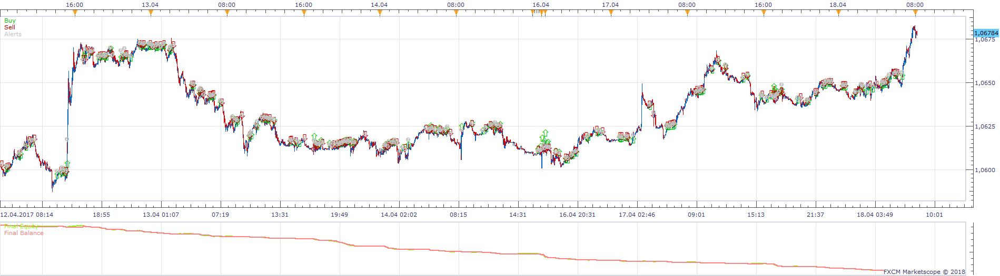
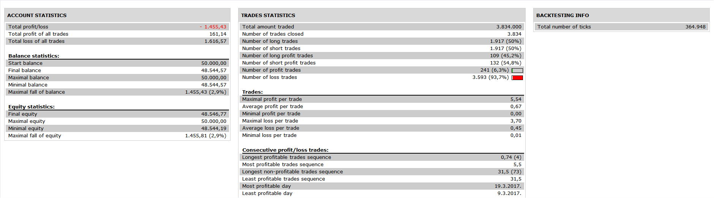

# Two MA Cross Strategy

> Source: https://fxcodebase.com/code/viewtopic.php?f=31&t=66186  
> Forum: 31 · Topic 66186 · 17 post(s)

---

## Two MA Cross Strategy

**Apprentice** · Mon Jun 11, 2018 12:13 pm

 

Open Long
Price CrossOver 1. MA of high

Open Short
Price CrossUnder 2. MA of low

 [Two MA Cross Strategy.lua](files/119537/Two%20MA%20Cross%20Strategy.lua)

 [Multi Time Frame Two MA Cross Strategy.lua](files/119537/Multi%20Time%20Frame%20Two%20MA%20Cross%20Strategy.lua)

MT4/MQ4 version
[viewtopic.php?f=38&t=70380](https://fxcodebase.com/code/viewtopic.php?f=38&t=70380)

---

## Re: Two MA Cross Strategy

**MC. Trend Trader** · Fri Aug 10, 2018 7:10 am

Hello.
I would like to have a MTF (Multi Time Frame) Version of this Strategy.
Best regards

---

## Re: Two MA Cross Strategy

**Apprentice** · Sat Aug 11, 2018 6:16 am

Multi Time Frame Two MA Cross Strategy.lua added.
As we have in Multi Time Frame Two MA Cross Strategy?
With separate Time Frame selector for Price and MA.

---

## Re: Two MA Cross Strategy

**MC. Trend Trader** · Sun Aug 19, 2018 4:12 am

Hello

Yes, with separate Time Frame selector for Price and MA.

1 Time Frame:

Open Long / Buy

Price Source
Fast Ma Period
MA Method
Slow MA Period
MA Method

2 Time Frame:

Open Short / Sell

Price Source
Fast Ma Period
MA Method
Slow MA Period
MA Method

Best regards

---

## Re: Two MA Cross Strategy

**Apprentice** · Wed Aug 29, 2018 3:59 am

Your request is added to the development list under Id Number 4242

---

## Re: Two MA Cross Strategy

**Apprentice** · Thu Aug 30, 2018 1:34 pm

Separate Time Frame selector added.

---

## Re: Two MA Cross Strategy

**MC. Trend Trader** · Wed Feb 05, 2020 6:58 am

Hello,

For instance if this strategy uses a 200 Moving Average on a 15 minute time frame am i correct in thinking this will need 200*15 minutes (which is 50 Hours) worth of closed price action candles to get started?

If so is there a way to preload historical data like an indicator does for instance?

Best regards

---

## Re: Two MA Cross Strategy

**Apprentice** · Mon Feb 10, 2020 6:30 am

Unfortunately no.

---

## Re: Two MA Cross Strategy

**willcsk** · Tue Feb 18, 2020 8:24 am

hi Apprentice,,

iz it possible to make this strategy work with averages.lua ?

thx for the help

-willie-

---

## Re: Two MA Cross Strategy

**Apprentice** · Tue Feb 18, 2020 9:01 am

Your request is added to the development list.
Development reference 740.

---

## Re: Two MA Cross Strategy

**Apprentice** · Wed Feb 19, 2020 2:37 pm

[Two MA Cross Strategy.lua](files/131365/Two%20MA%20Cross%20Strategy.lua)

Try this version.

---

## Re: Two MA Cross Strategy

**orlondo35** · Wed Aug 12, 2020 2:57 am

is it possible to get a m4t version please and thank you.

---

## Re: Two MA Cross Strategy

**Apprentice** · Thu Aug 13, 2020 6:18 am

Your request is added to the development list.
Development reference 1885.

---

## Re: Two MA Cross Strategy

**Apprentice** · Sat Sep 05, 2020 3:04 am

MT4/MQ4 version
[viewtopic.php?f=38&t=70380](https://fxcodebase.com/code/viewtopic.php?f=38&t=70380)

---

## Re: Two MA Cross Strategy

**shaloiulabcde** · Sun Jan 23, 2022 2:48 pm

how can I get this to create entry orders? Only seems to show entry signals

> **Apprentice wrote:**
>
>
> Two MA Cross Strategy.lua
>
>
> Try this version.

---

## Re: Two MA Cross Strategy

**Apprentice** · Mon Jan 24, 2022 5:55 am

Your request is added to the development list.
Development reference 76.

---

## Re: Two MA Cross Strategy

**shaloiulabcde** · Thu Mar 03, 2022 2:55 pm

any progress on this please?

> **Apprentice wrote:**
> Your request is added to the development list.
> Development reference 76.
