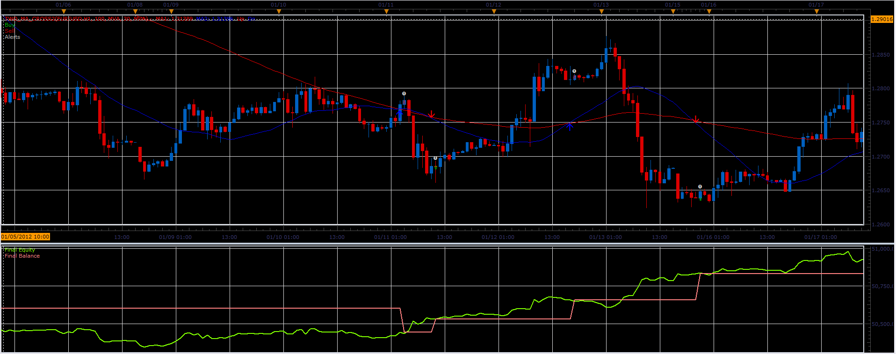

# Two MA cross strategy

> Source: https://fxcodebase.com/code/viewtopic.php?f=31&t=15504  
> Forum: 31 · Topic 15504 · 38 post(s)

---

## Two MA cross strategy

**Alexander.Gettinger** · Mon Apr 02, 2012 9:45 am

Strategy based on Two MA cross indicator: [viewtopic.php?f=17&t=11038&p=29206#p29206](https://fxcodebase.com/code/viewtopic.php?f=17&t=11038&p=29206#p29206)

 

Download strategy:

 [Two_MA_Cross_Strategy.lua](files/29207/Two_MA_Cross_Strategy.lua)

For this strategy must be installed Two MA cross indicator (Two_MA_Cross2.lua) from [viewtopic.php?f=17&t=11038&p=29206#p29206](https://fxcodebase.com/code/viewtopic.php?f=17&t=11038&p=29206#p29206)

The Strategy was revised and updated on January 21, 2019.

---

## Re: Two MA cross strategy

**rayjim** · Fri Apr 20, 2012 10:45 am

Is it possible to get this strategy with 1 value for the initial stop, and a different value for the trailing stop?

thanks

---

## Re: Two MA cross strategy

**rayjim** · Fri Apr 20, 2012 11:25 am

Is it possible to get this strategy with the option of adding an initial stop and a trailing stop that is a different value?

Thanks

---

## Re: Two MA cross strategy

**Apprentice** · Mon Apr 23, 2012 2:55 am

This functionality is possible.

---

## Re: Two MA cross strategy

**sergesp** · Tue Apr 24, 2012 9:13 pm

In the post with the strategy it says:

> For this strategy must be installed Two MA cross indicator (Two_MA_Cross2.lua) from viewtopic.php?f=17&t=11038&p=29206#p29206

If we want to debug this strategy with the strategy debugger how do we install the Two MA cross indicator so that the debugging process works correctly?

Thanks

---

## Re: Two MA cross strategy

**sergesp** · Tue Apr 24, 2012 9:38 pm

Also would it be possible to add a SAR indicator to the strategy to be able to check **direction** and **value**of SAR (dot) with **price** and the **two MA values** to be able to allow enter trade or Not.

I tried to add the SAR indicator but ran into code problems that I could not clear.

Thanks

---

## Re: Two MA cross strategy

**sunshine** · Tue Apr 24, 2012 11:09 pm

> **sergesp wrote:**
> In the post with the strategy it says:
>
>
>
> > For this strategy must be installed Two MA cross indicator (Two_MA_Cross2.lua) from viewtopic.php?f=17&t=11038&p=29206#p29206
>
>
>
>
> If we want to debug this strategy with the strategy debugger how do we install the Two MA cross indicator so that the debugging process works correctly?

To be able to debug this strategy in IndicoreSDK, you should copy the [Two_MA_Cross2.lua](https://fxcodebase.com/code/viewtopic.php?f=17&t=11038&p=29206#p29206) and [Averages.lua](https://fxcodebase.com/code/viewtopic.php?f=17&t=2430) indicators to the folder "IndicoreSDK\indicators".

---

## Re: Two MA cross strategy

**sergesp** · Wed Apr 25, 2012 7:49 am

Hi Sunshine, Thanks, very much.

Is there a way to become proficient in programming indicators / strategies in a more structured manner than the hunt and peck method I am now using such as any courses or workshop? ( have some programming experience in C for some factory machines etc).

---

## Re: Two MA cross strategy

**rayjim** · Fri May 04, 2012 10:39 am

> **Apprentice wrote:**
> This functionality is possible.

Thank you Alexander. I would like to request that this functionality (the option to add separate values for the stop and trailing stop) be added.

Thanks

---

## Re: Two MA cross strategy

**Apprentice** · Sun May 06, 2012 4:18 am

Your request is added to the development list.

---

## Re: Two MA cross strategy

**sergesp** · Wed May 09, 2012 8:53 pm

Thanks very much Apprentice - awaiting the modified version.

Thanks again

---

## Re: Two MA cross strategy

**arindam89** · Wed May 30, 2012 11:46 pm

> **Alexander.Gettinger wrote:**
> Strategy based on Two MA cross indicator: [viewtopic.php?f=17&t=11038&p=29206#p29206](https://fxcodebase.com/code/viewtopic.php?f=17&t=11038&p=29206#p29206)
>
>
>
> Two_MA_Cross_Strategy.PNG
>
>
>
> Download strategy:
>
>
> Two_MA_Cross_Strategy.lua
>
>
>
> For this strategy must be installed Two MA cross indicator (Two_MA_Cross2.lua) from [viewtopic.php?f=17&t=11038&p=29206#p29206](https://fxcodebase.com/code/viewtopic.php?f=17&t=11038&p=29206#p29206)

hi Alexander.Gettinger
thanks for the great job you are doing
i have a very simple request for you can you just add dynamic trailing stop loss to this strategy
thanks
by
arindam

---

## Re: Two MA cross strategy

**Alexander.Gettinger** · Fri Jun 01, 2012 1:11 pm

Trailing stop is present in this strategy.
Use "Trailing stop order" parameter.

---

## Re: Two MA cross strategy

**RJH501** · Fri Jun 01, 2012 3:04 pm

Apprentice could you please add the ability to trade only in one direction (short or long) or both.

Also the ability to only trade between specific hours.

Thank you in advance and regards.

RJH

---

## Re: Two MA cross strategy

**Apprentice** · Mon Jun 04, 2012 1:30 am

Your request is added to the development list.

---

## Re: Two MA cross strategy

**Coondawg71** · Thu Oct 11, 2012 10:23 am

Can we please request this Strategy support Pivot Point Moving Average? Or would that not make sense given the possibility one of the moving averages included in this strategy is nearly the same? If so, which moving average would be the same?

Thanks,

sjc

---

## Re: Two MA cross strategy

**Apprentice** · Thu Oct 11, 2012 2:00 pm

Your request is added to the development list.

---

## Re: Two MA cross strategy

**Outside_The_Box** · Thu Oct 10, 2013 7:52 pm

> **RJH501 wrote:**
> Apprentice could you please add the ability to trade only in one direction (short or long) or both.

Ditto. This is essential for all strategies in my opinion, to have the option at least.

---

## Re: Two MA cross strategy

**Kilgharrah** · Sun Oct 30, 2016 6:06 am

Hi, I do not know if I'm doing something wrong, but it does not work the option Start Time and Stop Time during the simulation run or backtesting. Not if I have to change the local time on my computer or change the Time zone in the MarketScope?

---

## Re: Two MA cross strategy

**Kilgharrah** · Sun Oct 30, 2016 5:03 pm

I do not know how hard it is to add a feature to this strategy.

It is to add a field to specify something like a kind of time out, after this time if there is profit at the time (but has not reached the limit yet) move or create a Trailing Stop (possibility to choose Dynamic or Fixed) to breakeven . And if there is no profit in that time would be excellent to have a yes / no field to choose whether to close the order or not after this time out (although not yet reached Stop).

Thank you so much in advance

---

## Re: Two MA cross strategy

**Kilgharrah** · Thu Nov 03, 2016 4:16 am

Hi, could you please explain the meaning of **Non Lag MA Parameters One and Two**, thank you very much.

---

## Re: Two MA cross strategy

**Kilgharrah** · Fri Nov 04, 2016 3:41 am

Is it possible to add a Stop order in pips based on the value of ATR (Price source, period and multiplier)?

Reason of edit: and would be spectacular if it is possible that the limit also had this feature

---

## Re: Two MA cross strategy

**Kilgharrah** · Fri Nov 25, 2016 3:18 am

I would really appreciate the implementation of all the new functionalities contained in this other strategy [3_10 Strategy](https://fxcodebase.com/code/viewtopic.php?f=31&t=64089) (Stop / Limit based on ATR, Use Position Cap, the correct operation of the parameters of time, etc.).

And if it were not too much to ask for the implementation of a new function in both strategies, the possibility of limiting the number of operations and reached that number of operations the strategy halt and does not open more operations.

thank you very much in advance

---

## Re: Two MA cross strategy

**Apprentice** · Sat Nov 26, 2016 8:23 am

Non Lag MA is moving average type.
Your request is added to the development list, Under Id Number 3679
 If someone is interested to do this task, please contact me.

---

## Re: Two MA cross strategy

**Kilgharrah** · Sat Nov 26, 2016 5:42 pm

I am very grateful for the wonderful work done. It is not my intention to overload them from work, I feel a bit embarrassed to request so many new features but I hope they will not be useful for me but for so many people in this forum.

I would like to know if it is possible to add a new functionality that I find interesting and is the possibility to choose between a fixed value or one calculated for Trade Amount in lots based on the following formula (see attached image):

Is a way to reduce risk by keeping it directly proportional to Equity and Usd Mr

**Note:** I would appreciate if it could be implemented in the 2 strategies I am using, this one and [3_10 Strategy](https://fxcodebase.com/code/viewtopic.php?f=31&t=64089) too.

thank you very much in advance

---

## Re: Two MA cross strategy

**Apprentice** · Mon Nov 28, 2016 4:46 am

While this is possible from strategy.
Will suggest this to development team, to be added as the standard TS functionality.
Lot size as a percentage of equity.

---

## Re: Two MA cross strategy

**Georgiy** · Tue Nov 29, 2016 4:26 am

Hi Kilgharrah,

Thanks for the suggestion. It was added to the development wish-list.

---

## Re: Two MA cross strategy

**Apprentice** · Sun Dec 18, 2016 9:42 am

Strategy was revised and updated.

---

## Re: Two MA cross strategy

**Kilgharrah** · Sun Jan 22, 2017 8:54 am

> **Apprentice wrote:**
> Non Lag MA is moving average type.
> Your request is added to the development list, Under Id Number 3679
> If someone is interested to do this task, please contact me.

Hi,

I'm wondering if there is an update to [this](https://fxcodebase.com/code/viewtopic.php?f=31&t=15504&start=20#p109202) request?

especially this part:

> **Kilgharrah wrote:**
> And if it were not too much to ask for the implementation of a new function in both strategies, the possibility of limiting the number of operations and reached that number of operations the strategy halt and does not open more operations.

I appreciate your time with this.

---

## Re: Two MA cross strategy

**Ehab.Ali** · Sun Feb 05, 2017 6:48 am

> **Alexander.Gettinger wrote:**
> Strategy based on Two MA cross indicator: [viewtopic.php?f=17&t=11038&p=29206#p29206](https://fxcodebase.com/code/viewtopic.php?f=17&t=11038&p=29206#p29206)
>
>
>
> Two_MA_Cross_Strategy.PNG
>
>
>
> Download strategy:
>
>
> Two_MA_Cross_Strategy.lua
>
>
>
> For this strategy must be installed Two MA cross indicator (Two_MA_Cross2.lua) from [viewtopic.php?f=17&t=11038&p=29206#p29206](https://fxcodebase.com/code/viewtopic.php?f=17&t=11038&p=29206#p29206)

can we get the same strategy for mt4
depending on ma 5 cross the ma 30 without any other thing else?
5 cross 30 up then go long
5 cross 30 down then go short

thanks a lot

---

## Re: Two MA cross strategy

**Apprentice** · Sat Feb 11, 2017 5:31 am

Your request is added to the development list, Under Id Number 3740
 If someone is interested to do this task, please contact me.

---

## Re: Two MA cross strategy

**Apprentice** · Sat Mar 04, 2017 7:47 am

Try this version.
[viewtopic.php?f=38&t=64500](https://fxcodebase.com/code/viewtopic.php?f=38&t=64500)

---

## Re: Two MA cross strategy

**nforex** · Wed Aug 09, 2017 2:13 pm

is it posible that a entry order 2 pips above 5 minutes moving averages ?

---

## Re: Two MA cross strategy

**Apprentice** · Sun Aug 13, 2017 5:15 am

For which version of strategy?

---

## Re: Two MA cross strategy

**nforex** · Mon Aug 14, 2017 8:56 am

for this one Two_MA_Cross_Strategy.lua

---

## Re: Two MA cross strategy

**Apprentice** · Thu Aug 17, 2017 2:56 am

Your request is added to the development list, Under Id Number 3859
 If someone is interested to do this task, please contact me.

---

## Re: Two MA cross strategy

**Alexander.Gettinger** · Fri Sep 29, 2017 12:50 pm

> **nforex wrote:**
> is it posible that a entry order 2 pips above 5 minutes moving averages ?

Please, try this strategy:

 [Two_MA_Cross_Strategy2.lua](files/115169/Two_MA_Cross_Strategy2.lua)

---

## Re: Two MA cross strategy

**Apprentice** · Sat Dec 30, 2017 8:17 am

The strategy was revised and updated.
