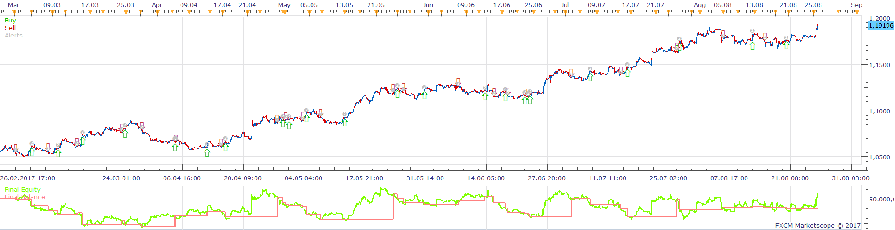
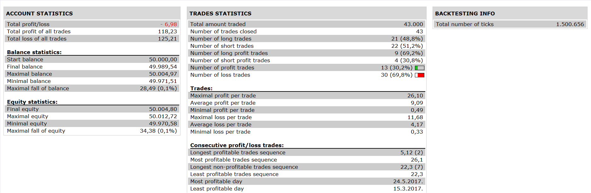

# Two MA Cross with var lot Strategy

> Source: https://fxcodebase.com/code/viewtopic.php?f=31&t=65465  
> Forum: 31 · Topic 65465 · 1 post(s)

---

## Two MA Cross with var lot Strategy

**Apprentice** · Tue Dec 19, 2017 4:45 am

 

Based on the request.
Open Long
Fast MA /Slow MA Cross Over

If confirmed by a higher time frame MA slope, use the whole lot, otherwise, use half the lot.

Vice versa for short.
[viewtopic.php?f=27&t=65428](https://fxcodebase.com/code/viewtopic.php?f=27&t=65428)

 [Two MA Cross with var lot Strategy.lua](files/116542/Two%20MA%20Cross%20with%20var%20lot%20Strategy.lua)

The Strategy was revised and updated on January 21, 2019.
