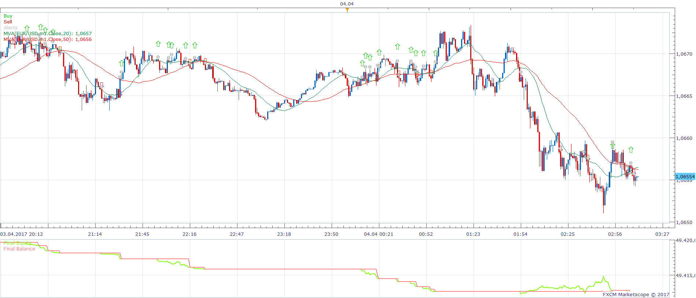
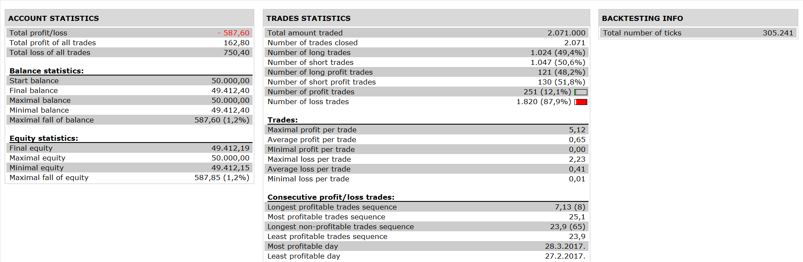

# Two MA Price Strategy

> Source: https://fxcodebase.com/code/viewtopic.php?f=31&t=65329  
> Forum: 31 · Topic 65329 · 5 post(s)

---

## Two MA Price Strategy

**Apprentice** · Sat Nov 04, 2017 5:03 am

 

Based on the request.
[viewtopic.php?f=27&t=65326](https://fxcodebase.com/code/viewtopic.php?f=27&t=65326)

Open Long
1. MA > 2. MA
Price / 1.MA Cross Over
Open Short
1. MA < 2. MA
Price / 1.MA Cross Under

Exit Long
 Price / 2. MA Cross Under
Exit Short
 Price / 2. MA Cross Over

 [Two MA Price Strategy.lua](files/115835/Two%20MA%20Price%20Strategy.lua)

The Strategy was revised and updated on January 21, 2019.

---

## Re: Two MA Price Strategy

**Apprentice** · Sat Dec 30, 2017 8:19 am

The strategy was revised and updated.

---

## Re: Two MA Price Strategy

**terminator2410** · Mon Oct 25, 2021 7:01 am

Sir

Can you combine this strategy with the engulfing pattern? I.e.:

1. fast MA>slow MA
2. price closes above fast MA with engulfing bar

open long

1. fast MA<slow MA
2. price closes below fast MA with engulfing bar

open short

Also, can you include the lot size calculation according to equity percentage?

Thank you

---

## Re: Two MA Price Strategy

**Apprentice** · Tue Oct 26, 2021 4:08 am

Your request is added to the development list.
Development reference 935.

---

## Re: Two MA Price Strategy

**Apprentice** · Tue Nov 02, 2021 1:50 pm

Try this version.
[https://fxcodebase.com/code/viewtopic.php?f=31&t=71617](https://fxcodebase.com/code/viewtopic.php?f=31&t=71617)
