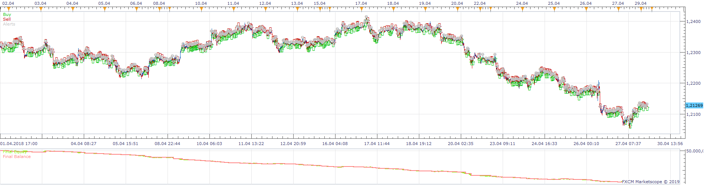
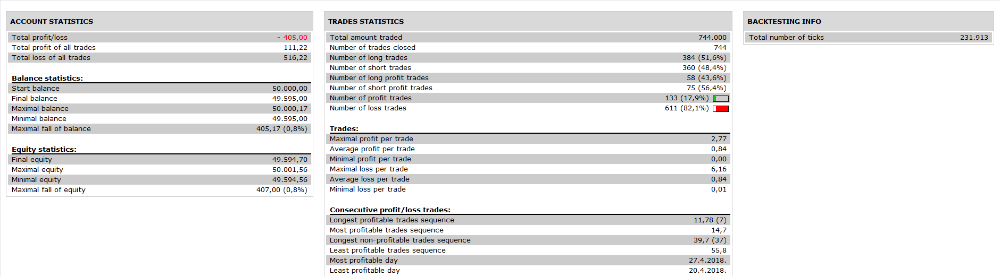

# Two MA RSI ADX Strategy

> Source: https://fxcodebase.com/code/viewtopic.php?f=31&t=67276  
> Forum: 31 · Topic 67276 · 20 post(s)

---

## Two MA RSI ADX Strategy

**Apprentice** · Thu Jan 17, 2019 4:38 am

 

Base on request.
[viewtopic.php?f=27&t=67273](https://fxcodebase.com/code/viewtopic.php?f=27&t=67273)
Open Long:
EMA 5 and EMA 10 Cross Over
RSI (10) > 50
ADX (14) > 25

Open Short:
EMA 5 and EMA 10 Cross Under
RSI (10) < 50
ADX (14) > 25

 [Two MA RSI ADX Strategys.lua](files/123392/Two%20MA%20RSI%20ADX%20Strategys.lua)

MT4/MT5 versions
[https://fxcodebase.com/code/viewtopic.php?f=38&t=71819](https://fxcodebase.com/code/viewtopic.php?f=38&t=71819)

---

## Re: Two MA RSI ADX Strategy

**Apprentice** · Thu Jan 24, 2019 6:28 am

ADX_Level added.

---

## Re: Two MA RSI ADX Strategy

**parisbruce** · Sat Mar 30, 2019 2:41 pm

would it be possible to allow the adx to be below a value instead of it only being above a certain value

---

## Re: Two MA RSI ADX Strategy

**Apprentice** · Mon Apr 01, 2019 10:06 am

Use_ADX option added.

---

## Re: Two MA RSI ADX Strategy

**parisbruce** · Sat Apr 06, 2019 3:22 am

hi maybe i was not clear in my request i want to be able to have adx below 30 not an option to use adx.i want to trade when the adx is below 30 so there is no trend and if it is above 30 i want the stratergy to ignore that trade because its above 30 does that make sense?

---

## Re: Two MA RSI ADX Strategy

**fortesan9** · Sun Jan 17, 2021 3:17 pm

Can the structure and functions of this strategie be propped up with the ones in the example, i've been trying to code it but haven't succeded in doing so properly.

Kind Regards,
fortesan9

P.D: the actual "TMRAS'' Strategie proved excelent results in optimizations, backtests and in demo account, but whatching it perform i've observed that it generates much signals so probably the trading in % of equity account function can smooth the drawdown amongst other options.

---

## Re: Two MA RSI ADX Strategy

**Apprentice** · Tue Jan 19, 2021 4:14 am

Can you specify, what exactly needs to be done?

---

## Re: Two MA RSI ADX Strategy

**fortesan9** · Wed Jan 20, 2021 1:05 pm

I suggest the following functions to be added on the current logic:

"" EMA (5) and EMA (10) Cross Over
RSI (10) > ''((RSI_LEVEL)USE_RSI)''
ADX (14) > ''((ADX_LEVEL)USE_ADX)''

Open Short:
EMA (5) and EMA (10) Cross Under
RSI (10) < ((RSI LEVEL)USE_RSI)
ADX (14) > (ADX_LEVEL)USE_ADX) ""

and Apprentice's newest version of Algorithm Parameters structure:

trade_direction
use_mandatory_closing
use_position_limit
position_limit
use_trailing
trailing
AllowedSide
entry_execution_type
limit_pips
use_limit
use_stop
stop_pips
AllowTrade
Account
Amount
amount_type (lot,%ofEquity)
close_on_opposite

---

## Re: Two MA RSI ADX Strategy

**Apprentice** · Thu Jan 21, 2021 3:10 pm

Your request is added to the development list.
Development reference 108.

---

## Re: Two MA RSI ADX Strategy

**Apprentice** · Sat Jan 30, 2021 10:16 am

[Two MA RSI ADX Strategys.lua](files/140448/Two%20MA%20RSI%20ADX%20Strategys.lua)

Try this version.

---

## Re: Two MA RSI ADX Strategy

**fortesan9** · Tue Feb 23, 2021 4:30 pm

May I suggest that be added the '''Use Own Positions Only'' function,

When applying the strategie in two time frames the stop function executes all positions.

Respectfully
fortesan9

---

## Re: Two MA RSI ADX Strategy

**Apprentice** · Wed Feb 24, 2021 3:53 am

Your request is added to the development list.
Development reference 225.

---

## Re: Two MA RSI ADX Strategy

**Apprentice** · Wed Feb 24, 2021 11:11 am

You can use "Custom ID" parameters for that. Just set it to different values.

---

## Re: Two MA RSI ADX Strategy

**fortesan9** · Wed Feb 24, 2021 4:57 pm

Thank you Don Apprenttice,

---

## Re: Two MA RSI ADX Strategy

**eduarescobar** · Tue Nov 16, 2021 3:24 pm

Its possible to have a version for mt4 and mt5.
Thanks a lot

---

## Re: Two MA RSI ADX Strategy

**Apprentice** · Thu Nov 18, 2021 4:59 am

Your request is added to the development list.
Development reference 995.

---

## Re: Two MA RSI ADX Strategy

**Apprentice** · Wed Jan 26, 2022 6:37 am

MT4/MT5 version.
[https://fxcodebase.com/code/viewtopic.php?f=38&t=71819](https://fxcodebase.com/code/viewtopic.php?f=38&t=71819)

---

## Re: Two MA RSI ADX Strategy

**fortesan9** · Thu Jan 27, 2022 7:35 pm

Can you Please add the ''Stop Units'' and ''Limit Units" to the parameters of the strategy ?

 strategy.parameters:addString("Stop_Units", "Stop Units", "", "Stop, pips");
 strategy.parameters:addStringAlternative("Stop_Units", "Pips", "", "lots");
 strategy.parameters:addStringAlternative("Stop_Units", "% of price", "", "price");
 strategy.parameters:addStringAlternative("Stop_Units", "% of balance", "", "balance");
 strategy.parameters:addStringAlternative("Stop_Units", "% of equity", "", "equity");
 strategy.parameters:addDouble("Stop_Amount", "Stop Amount", "", 1, 1, 1000000);

 strategy.parameters:addString("Limit_Units", "Limit Units", "", "Stop, pips");
 strategy.parameters:addStringAlternative("Limit_Units", "Pips", "", "lots");
 strategy.parameters:addStringAlternative("Limit_Units", "% of price", "", "price");
 strategy.parameters:addStringAlternative("Limit_Units", "% of balance", "", "balance");
 strategy.parameters:addStringAlternative("Limit_Units", "% of equity", "", "equity");
 strategy.parameters:addDouble("Limit_Amount", "Limit Amount", "", 1, 1, 1000000);

---

## Re: Two MA RSI ADX Strategy

**Apprentice** · Mon Jan 31, 2022 4:57 am

Your request is added to the development list.
Development reference 69.

---

## Re: Two MA RSI ADX Strategy

**fortesan9** · Tue Feb 01, 2022 12:31 am

Thank You Apprentice
