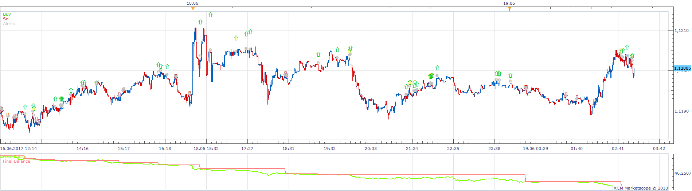
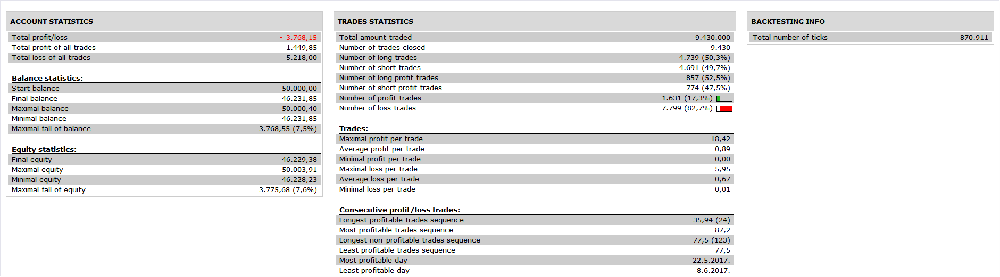

# Two MA Strategy

> Source: https://fxcodebase.com/code/viewtopic.php?f=31&t=66276  
> Forum: 31 · Topic 66276 · 1 post(s)

---

## Two MA Strategy

**Apprentice** · Tue Jul 17, 2018 7:43 am

 

Based on request.
[viewtopic.php?f=27&t=25914](https://fxcodebase.com/code/viewtopic.php?f=27&t=25914)

ENTRY CRITERIA (LONG)
20 EMA bounce:

a. 20 EMA is above 50 EMA
b. Daily low is lower than the 20 EMA
c. Daily open and close price is higher than the 20 EMA

OR
50 EMA bounce:

a. 20 EMA is above 50 EMA
b. Daily low is lower than the 50 EMA
c. Daily open and close price is higher than the 50 EMA

ENTRY CRITERIA (SHORT)
20 EMA bounce:

a. 20 EMA is below 50 EMA
b. Daily high is higher than the 20 EMA
c. Daily open and close price is lower than the 20 EMA

OR

50 EMA bounce:

a. 20 EMA is below 50 EMA
b. Daily high is higher than the 50 EMA
c. Daily open and close price is lower than the 50 EMA

 [Two MA Strategy.lua](files/119975/Two%20MA%20Strategy.lua)
