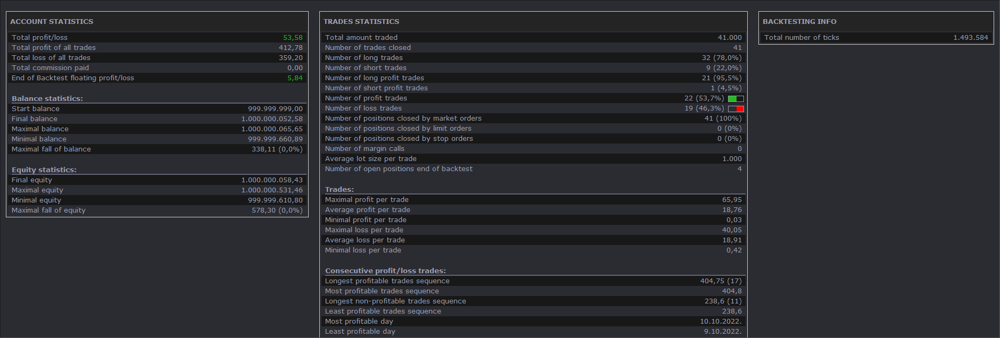
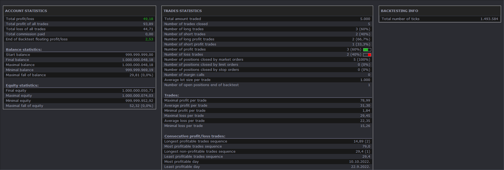

# Two Moving Average Cross Strategy

> Source: https://fxcodebase.com/code/viewtopic.php?f=31&t=74858  
> Forum: 31 · Topic 74858 · 1 post(s)

---

## Two Moving Average Cross Strategy

**Apprentice** · Sat May 11, 2024 3:39 am

Based on indicator.
[https://fxcodebase.com/code/viewtopic.php?f=17&t=74859](https://fxcodebase.com/code/viewtopic.php?f=17&t=74859)

 

Forecast On
Forecast within the next 5 Candles
The forecast will be used to enter a position 5 candles before the predicted MA1/MA2 cross.

 

Forecast Off
Simple MA1/MA2 cross.

 [Two Moving Average Cross Strategy.lua](files/155321/Two%20Moving%20Average%20Cross%20Strategy.lua)
