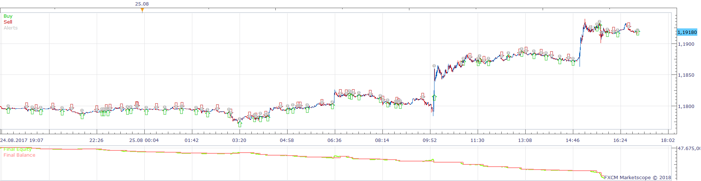
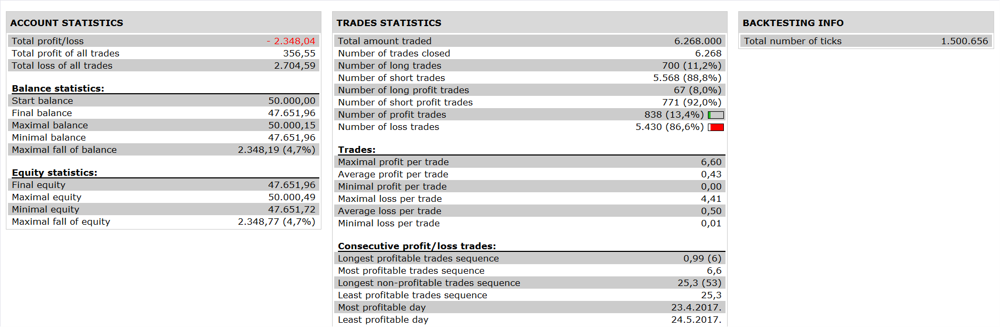

# Two Regression Lines MACD Strategy

> Source: https://fxcodebase.com/code/viewtopic.php?f=31&t=65626  
> Forum: 31 · Topic 65626 · 2 post(s)

---

## Two Regression Lines MACD Strategy

**Apprentice** · Fri Jan 12, 2018 7:24 am

 

Open Long
•	RLFast is Rising (Green)
•	RLFast > RLSlow
•	RLSlow is Rising (Green)
•	Price Close > RLSlow
•	MACD > Signal

Exit Long:
RLFast < RLSlow AND RLFast is Falling (Red)

Vice versa for Short

Regression_Line.lua is available here.
[viewtopic.php?f=17&t=2342&p=5004#p5004](https://fxcodebase.com/code/viewtopic.php?f=17&t=2342&p=5004#p5004)

 [Two Regression Lines MACD Strategy.lua](files/117002/Two%20Regression%20Lines%20MACD%20Strategy.lua)

---

## Re: Two Regression Lines MACD Strategy

**AussieOz** · Mon Jan 15, 2018 8:49 am

Thank you for doing this so promptly Apprentice. I have tested the strategy a number of times. The Regression Line cross over appears to be working well but whilst I can generate a positive result for the strategy with some inputs, the reference to the MACD/Signal for trend appears to be offering minimal benefit. Back to the drawing board I think. Thanks again. Mike
