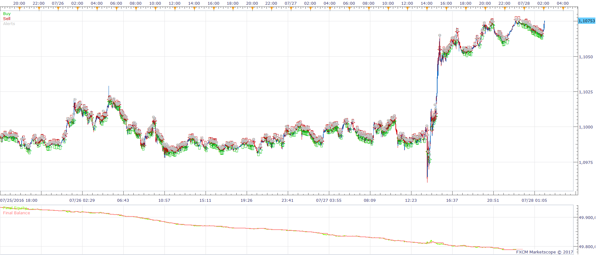
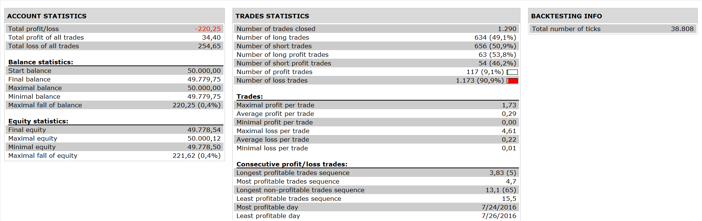

# Two RSI Cross Strategy

> Source: https://fxcodebase.com/code/viewtopic.php?f=31&t=64370  
> Forum: 31 · Topic 64370 · 5 post(s)

---

## Two RSI Cross Strategy

**Apprentice** · Tue Jan 31, 2017 4:14 am

 

Open Long
1. RSI / 2. RSI CrossOver
Open Short
1. RSI / 2. RSI CrossUnder
In addition, each RSI can be smoothed.

 [Two RSI Cross Strategy.lua](files/110808/Two%20RSI%20Cross%20Strategy.lua)

The Strategy was revised and updated on January 21, 2019.

---

## Re: Two RSI Cross Strategy

**davidnwatson** · Tue Jan 31, 2017 7:18 pm

Thank you.. this is awesome, now just to figure out how to show the indicators on the chart. lol ..

Tested the following put with profit
EURUSD 5min RSI(4)/RSI(14)
NZDUSD 4H RSI(4)/RSI(14)
USDCAD 1H RSI(4)/RSI(14)

---

## Re: Two RSI Cross Strategy

**Apprentice** · Tue Dec 26, 2017 6:48 am

The strategy was revised and updated.

---

## Re: Two RSI Cross Strategy

**parisbruce** · Sun Mar 03, 2019 4:26 pm

this is am excellent system but unfortunatley it will not work on my live account the settings are fifo non fifo and automatic for account types could you please allow it to trade on a real live account

---

## Re: Two RSI Cross Strategy

**Apprentice** · Mon Apr 01, 2019 10:28 am

If you use automatic should work on the live account.
