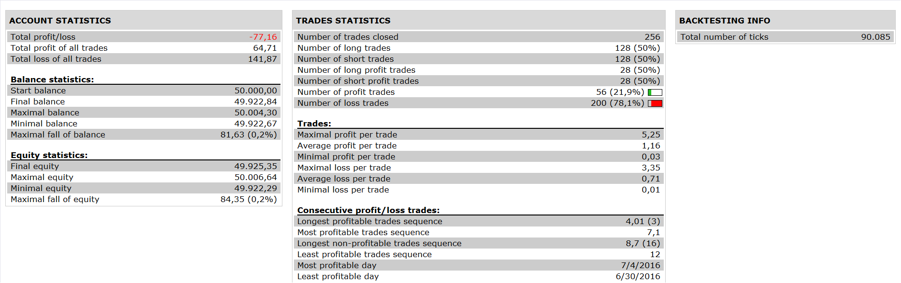

# TWO separate MA Crossovers Strategy

> Source: https://fxcodebase.com/code/viewtopic.php?f=31&t=64268  
> Forum: 31 · Topic 64268 · 5 post(s)

---

## TWO separate MA Crossovers Strategy

**Apprentice** · Fri Jan 06, 2017 11:01 am

 

Based on request.
[viewtopic.php?f=27&t=64256](https://fxcodebase.com/code/viewtopic.php?f=27&t=64256)

1. MA:
MVA(Heikin Ashi(HA(EUR/USD))close,1)
Crosses above or below
2. MA
MVA(NR_SUPER_TREND(HA(EUR/USD) 1,0.2), 1)

3. MA:
MVA(HA(EUR/USD)close,1)
Crosses above or below
4. MA
MVA(Heikin Ashi(HA(EUR.USD)close,1)

Open Long
 1 must be above 2 and 3 must be above 4.
Open Short
long trade 1 must be below 2 and 3 must be below 4.

 [TWO separate MA Crossovers Strategy.lua](files/110365/TWO%20separate%20MA%20Crossovers%20Strategy.lua)

NR_Super_Trend.lua is available here.
[viewtopic.php?f=17&t=41453](https://fxcodebase.com/code/viewtopic.php?f=17&t=41453)

The Strategy was revised and updated on January 22, 2019.

---

## Re: TWO separate MA Crossovers Strategy

**Desrow** · Fri Jan 06, 2017 2:34 pm

Apprentice,

Delete 3 and 4.

Use 1 over 2 as cross-over and 1 under 2 as cross-under.

Back-testing is not showing the same on my screen.

Thanks,
Jay

---

## Re: TWO separate MA Crossovers Strategy

**Desrow** · Sat Jan 07, 2017 6:30 am

Apprentice,

Your code shows to enter Long correctly but the code for Short should have 3 below 4 not above 4.

Thanks,
Jay

---

## Re: TWO separate MA Crossovers Strategy

**Apprentice** · Sun Jan 08, 2017 6:15 am

Code is Ok.
Description Typo was fixed.

---

## Re: TWO separate MA Crossovers Strategy

**Apprentice** · Fri Jan 05, 2018 8:20 am

The strategy was revised and updated.
