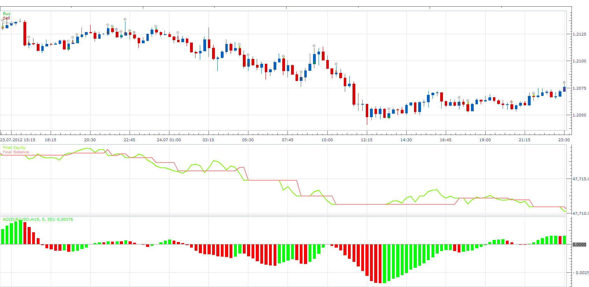

# TWO TF AWESOME OSCILATOR STRATEGY

> Source: https://fxcodebase.com/code/viewtopic.php?f=31&t=27217  
> Forum: 31 · Topic 27217 · 3 post(s)

---

## TWO TF AWESOME OSCILATOR STRATEGY

**Apprentice** · Fri Nov 30, 2012 5:50 am

buy:
1. TF
awesome oscilator < buy level and changes its color from red to green
2. TF (optinal)
awesome oscilator > buy level and have green color (optinal)

sell:
1. TF
awesome oscilator > sell level and changes its color from green to red
2. TF (optinal)
awesome oscilator ) < sell level and red in color

Exit (optinal)
Exit Long
 1. TF Color contraindication (optinal)
 2. TF Color contraindication (optinal)
Exit Short
 1. TF Color contraindication (optinal)
 2. TF Color contraindication (optinal)

 [MTF AO Strategy.lua](files/47458/MTF%20AO%20Strategy.lua)

The Strategy was revised and updated on December 10, 2018.

---

## Re: TWO TF AWESOME OSCILATOR STRATEGY

**newton** · Fri Nov 30, 2012 6:09 am

thank a lot for this wonderful work

---

## Re: TWO TF AWESOME OSCILATOR STRATEGY

**Apprentice** · Thu Dec 08, 2016 3:51 pm

Strategy has been revised and updated.
