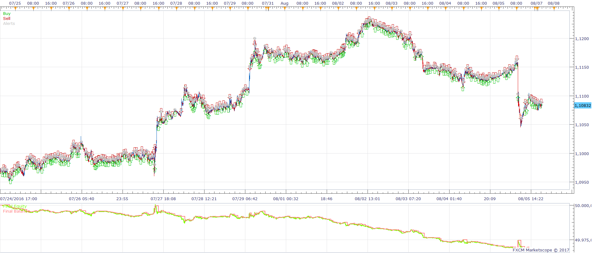
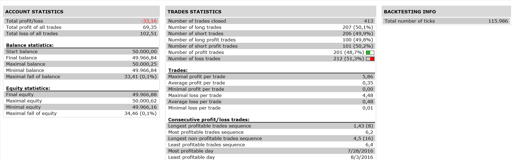

# TWO TIME FRAME MACD STOCHASTIC STRATEGY

> Source: https://fxcodebase.com/code/viewtopic.php?f=31&t=64345  
> Forum: 31 · Topic 64345 · 19 post(s)

---

## TWO TIME FRAME MACD STOCHASTIC STRATEGY

**Apprentice** · Thu Jan 26, 2017 5:10 am

 

A. Histogram Level: Off

i. If MACD histogram is rising in higher time frame
then, in lower time frame, stochastic K is smaller than oversold level or crosses oversold level declining
Open Long

ii. If MACD histogram is declining in higher time frame
then, in lower time frame, stochastic K is bigger than overbought level or crosses overbought level rising
Open Short

B. Histogram Level: On

i. If MACD histogram is rising in higher time frame
and histogram is smaller than zero
then, in lower time frame, stochastic K is smaller than oversold level or crosses oversold level declining
Open Long

ii. If MACD histogram is declining in higher time frame
and histogram is bigger than zero
then, in lower time frame, stochastic K is bigger than ovebought level or crosses overbought level rising
Open Short

 [TWO TIME FRAME MACD STOCHASTIC STRATEGY.lua](files/110716/TWO%20TIME%20FRAME%20MACD%20STOCHASTIC%20STRATEGY.lua)

---

## Re: TWO TIME FRAME MACD STOCHASTIC STRATEGY

**foreveryoung** · Thu Jan 26, 2017 6:42 am

That was fast Apprentice. Thank you very much!

However, trying to back test it, it says "238: MACD time frame must be equal or bigger than Stochastic time frame!" although this is not true with the strategy dialogue. The opposite works (i.e. small time frame for MACD, big time frame for stochastic).

---

## Re: TWO TIME FRAME MACD STOCHASTIC STRATEGY

**foreveryoung** · Thu Jan 26, 2017 7:25 am

Additionally, I had a look into it and found following bugs:

1. In the strategy dialogue, the time frame of stochastic controls the MACD (probably that is why it gives the in-previous-post-described error).
2. It uses the same time frame for stochastic as for MACD.
2. If Close On Opposite is set to "No", then no trade is executed.

Thanks

---

## Re: TWO TIME FRAME MACD STOCHASTIC STRATEGY

**foreveryoung** · Thu Jan 26, 2017 7:57 am

Finally, and most important, the clarification I made last night is the opposite (I got confused, sorry).
The order is triggered by the stochastic K, i.e.

1. If MACD histogram on long time frame is below zero & rising, open long when stochastic K on the short time frame is in the oversold territory or crosses the oversold level declining
2. If MACD histogram on long time frame is above zero & declining, open short when stochastic K on the short time frame is in the overbought territory or crosses the overbought level rising
3. Close on opposite

Thanks

---

## Re: TWO TIME FRAME MACD STOCHASTIC STRATEGY

**Apprentice** · Thu Jan 26, 2017 8:01 am

Time frame issue resolved.
Try to set "Account Type" to appropriate method
Now it is set as "Automatic"

---

## Re: TWO TIME FRAME MACD STOCHASTIC STRATEGY

**foreveryoung** · Thu Jan 26, 2017 9:31 am

Hi Apprentice

Tested it again, it now says "238: Stochastic time frame must be equal to or bigger than MACD time frame!", which obviously is not the case.

A final request, kindly introduce a "Histogram Level: Yes/No" in the strategy dialogue, which shall turn on/turn off the MACD histogram level precondition, i.e., when "No", strategy will be as well able to go long as when the histogram rises above the zero line, & vice versa.

Thank you very much your efforts

---

## Re: TWO TIME FRAME MACD STOCHASTIC STRATEGY

**Apprentice** · Fri Jan 27, 2017 3:24 am

> Tested it again, it now says "238: Stochastic time frame must be equal to or bigger than MACD time frame!", which obviously is not the case.

Can you share your settings.

> A final request, kindly introduce a "Histogram Level: Yes/No" in the strategy dialogue, which shall turn on/turn off the MACD histogram level precondition, i.e., when "No", strategy will be as well able to go long as when the histogram rises above the zero line, & vice versa.

Can you formulate this as pseudo code.

If ...
and ...
then ...
Open Long
...

---

## Re: TWO TIME FRAME MACD STOCHASTIC STRATEGY

**foreveryoung** · Fri Jan 27, 2017 4:15 am

Good Morning From Greece!

I. Settings Request

MACD Time Frame :5 minutes
Stochastic Time Frame: 1 minute
Account type : non FIFO

All other settings at default, it gives the following error when back tested: "238: Stochastic time frame must be equal to or bigger than MACD time frame!", which is not what we are looking for, it is the MACD time frame that needs to be bigger than the stochastic one in this strategy.

II. Psedocode Request

A. Histogram Level: Off

i. If MACD histogram is rising in higher time frame
then, in lower time frame, stochastic K is smaller than oversold level or crosses oversold level declining
Open Long

ii. If MACD histogram is declining in higher time frame
then, in lower time frame, stochastic K is bigger than overbought level or crosses overbought level rising
Open Short

B. Histogram Level: On

i. If MACD histogram is rising in higher time frame
and histogram is smaller than zero
then, in lower time frame, stochastic K is smaller than oversold level or crosses oversold level declining
Open Long

ii. If MACD histogram is declining in higher time frame
and histogram is bigger than zero
then, in lower time frame, stochastic K is bigger than ovebought level or crosses overbought level rising
Open Short

Thanks!

---

## Re: TWO TIME FRAME MACD STOCHASTIC STRATEGY

**Apprentice** · Sat Jan 28, 2017 9:45 am

Try it now.

---

## Re: TWO TIME FRAME MACD STOCHASTIC STRATEGY

**foreveryoung** · Sat Jan 28, 2017 1:21 pm

Hi Apprentice

It is great to have a manual strategy automated to that success, the only thing that is missing is the right stop loss. Back tested it with many different parameters, it always gives more winning orders than losing ones, however, in this version, losing orders are way too damaging, therefore, should a trade is not to work fast, better stop it. This could be implemented by introducing an optional exit where:

Optional Exit: Yes

If Long
Then MACD histogram at the higher time frame declines
Close

If Short
Then MACD histogram at the higher time frame rises
Close

Thank you for your prompt response & actions, as always

---

## Re: TWO TIME FRAME MACD STOCHASTIC STRATEGY

**foreveryoung** · Sat Jan 28, 2017 2:14 pm

Dear Apprentice

One Question

What Use Position Cap stands for? It seems to be giving so different results???

Thanks

---

## Re: TWO TIME FRAME MACD STOCHASTIC STRATEGY

**foreveryoung** · Mon Jan 30, 2017 4:56 am

Good Morning Everybody!

Continuing back testing, I found this very interesting result. Look at the 5th of October on the attachments, the MACD is rising on the daily (this was the MACD time frame in the parameters), and the strategy opens a short order while it should not. Look also at the 4 hours time frame (this was the Stochastic time frame in the parameters), the MACD is falling so, could it be that the large time frame is not connected at all, i.e., the whole strategy is taking place at the stochastic time framer only?

---

## Re: TWO TIME FRAME MACD STOCHASTIC STRATEGY

**foreveryoung** · Mon Jan 30, 2017 5:17 am

Well, no, this is not the case, if so, it would have closed the order down about 2nd of November and reverse...

---

## Re: TWO TIME FRAME MACD STOCHASTIC STRATEGY

**Apprentice** · Mon Jan 30, 2017 6:02 am

> the whole strategy is taking place at the stochastic time framer only?

This is true.

---

## Re: TWO TIME FRAME MACD STOCHASTIC STRATEGY

**foreveryoung** · Mon Jan 30, 2017 8:16 am

Well, I started a demo account, the coding is finally not doing what the strategy is, since it opened @ 14:00 L.T. a long order with EUR/USD, while MACD histogram (MACD time frame set @ 1 hour) has been declining. The triggering of order from stochastic works (stochastic time frame set @ 5 minutes), however, the histogram condition (i.e. histogram rising or declining) is not. Actually, what it seems to be doing is, every time there is a new candle in the MACD time frame (i.e. every one hour in my test above), and stochastic K is OS/OB in its time frame, then go long/short respectively

---

## Re: TWO TIME FRAME MACD STOCHASTIC STRATEGY

**Apprentice** · Fri Jan 05, 2018 8:22 am

The strategy was revised and updated.

---

## Re: TWO TIME FRAME MACD STOCHASTIC STRATEGY

**joseph16** · Fri Jul 20, 2018 9:59 am

Hi,
Was this strategy updated and is it available?

---

## Re: TWO TIME FRAME MACD STOCHASTIC STRATEGY

**joseph16** · Fri Jul 20, 2018 10:08 am

Hi guys,
I have a few ideas in line with what you are doing here, however I have no experience with coding, can you assist to tweek in order to test? I know this is a old post!
Sorry!
cheers

---

## Re: TWO TIME FRAME MACD STOCHASTIC STRATEGY

**Apprentice** · Sat Aug 04, 2018 6:58 am

The strategy was revised and updated.
You can find the updated version in the first post of this topic.
