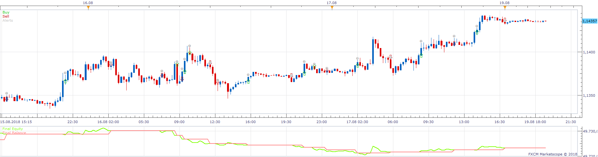
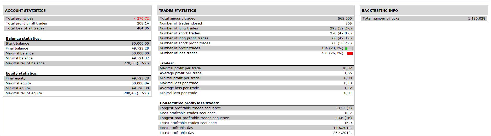

# Two time frame MACD Strategy

> Source: https://fxcodebase.com/code/viewtopic.php?f=31&t=67024  
> Forum: 31 · Topic 67024 · 1 post(s)

---

## Two time frame MACD Strategy

**Apprentice** · Thu Nov 29, 2018 1:29 pm

 

Based on request.
[viewtopic.php?f=27&t=67020](https://fxcodebase.com/code/viewtopic.php?f=27&t=67020)

enter long :
1 hour MACD > Signal
and
15 m MACD > Signal

exit long :
15m MACD < Signal

enter short:
1 hour MACD < Signal
and
15 m MACD < Signal

exit short :
15m MACD < Signal

 [Two time frame MACD Strategy.lua](files/122417/Two%20time%20frame%20MACD%20Strategy.lua)
