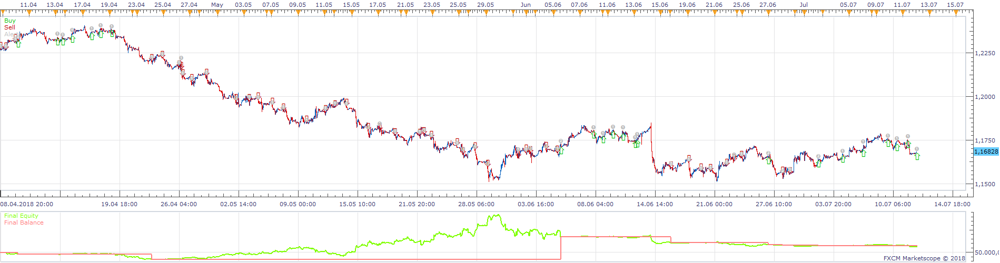
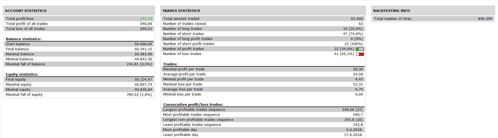

# Two Time Frame SSL

> Source: https://fxcodebase.com/code/viewtopic.php?f=31&t=67065  
> Forum: 31 · Topic 67065 · 3 post(s)

---

## Two Time Frame SSL

**Apprentice** · Fri Dec 07, 2018 7:16 am

 

Based on SSL.lua
[viewtopic.php?f=17&t=139](https://fxcodebase.com/code/viewtopic.php?f=17&t=139)

 [Two Time Frame SSL.lua](files/122568/Two%20Time%20Frame%20SSL.lua)

---

## Re: Two Time Frame SSL

**Daveatt** · Sun Dec 09, 2018 6:53 am

Thanks Apprentice
It seems to work well

I have a last question regarding this topic
I was trying to copy what you did in the Sample-strategy_3.lua file. This is a sample strategy using the new code framework you created (using modules like trading_logic, DailyLimitProfit, etc)

I need a version that works with this new framework because I developed a lot of code for a strategy using it - and coming back to the old framework won't be ideal

So I updated the functions **trading_logic:Prepare and trading_logic:Ext_update** to create the **trading_logic.Source_SSL** object
Seems only the first few candles are loaded with the T1_SSL object though and for the life of mine, I can't figure out what's wrong here
The code is extremly simple, and I used ExtSubscribe as I always do

Code: [Select all](https://fxcodebase.com/code/)
`if instance.parameters.T1_Check_SSL then
      T1_TF_SSL = instance.parameters.T1_TF_SSL;
      self._trading_source_SSL_id = self._ids_start + 4;
      self.Source_SSL = ExtSubscribe(self._trading_source_SSL_id, nil, instance.parameters.T1_TF_SSL, instance.parameters.is_bid, "bar");
      PrepareTrend1_SSL();
   end`

I looked for a few days and didn't find why the code A) is not working and B) doesn't take any trade in the backtest

I would really appreciate from an educational perspective, to learn where I'm wrong here

Thanks so much
Daveatt

---

## Re: Two Time Frame SSL

**Daveatt** · Fri Dec 14, 2018 5:18 am

Hi Apprentice

Please disregard that one too. I managed to make it work

Thanks
Daveatt
