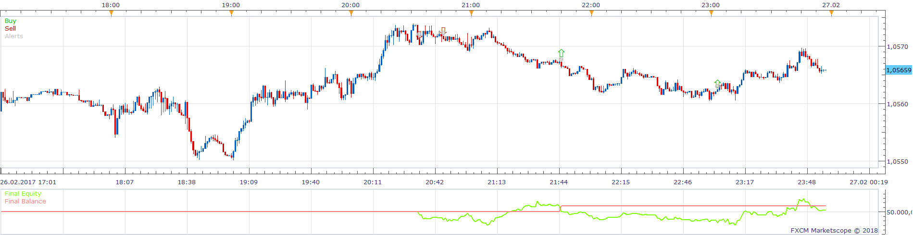
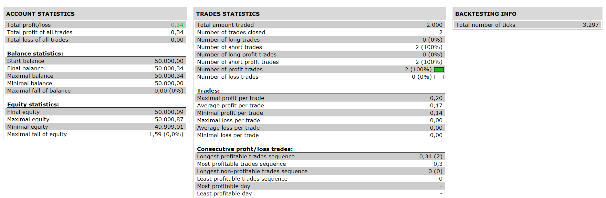

# Two ZigZag CCI MACD Strategy

> Source: https://fxcodebase.com/code/viewtopic.php?f=31&t=65628  
> Forum: 31 · Topic 65628 · 1 post(s)

---

## Two ZigZag CCI MACD Strategy

**Apprentice** · Sat Jan 13, 2018 8:43 am

 

Based on the request.
[viewtopic.php?f=27&t=65627](https://fxcodebase.com/code/viewtopic.php?f=27&t=65627)

Open Long;
1. zig zag1=down and zig zag 2=down
2.zig zag1=zig zag 2 or zig zag 1>zig zag2
3.macd > signal and signal >buy level
4.cci cross over buy level

Open Short:
1.zig zag1=up and zig zag 2=up
2.zig zag1=zig zag 2 or zig zag 1<zig zag2
3.macd<signal and signal< sell level
4.cci cross under sell level

 [Two ZigZag CCI MACD Strategy.lua](files/117023/Two%20ZigZag%20CCI%20MACD%20Strategy.lua)
