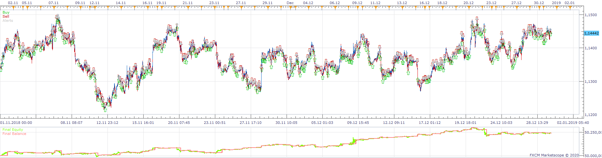
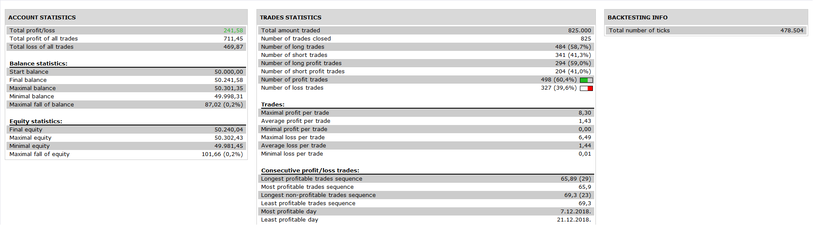
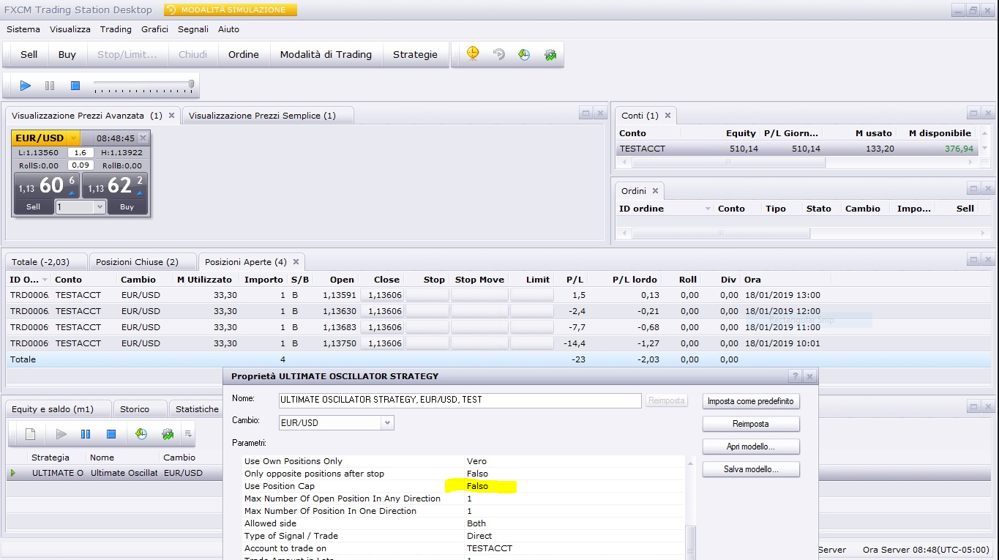

# Ultimate Oscillator Strategy

> Source: https://fxcodebase.com/code/viewtopic.php?f=31&t=69943  
> Forum: 31 · Topic 69943 · 11 post(s)

---

## Ultimate Oscillator Strategy

**Apprentice** · Sun May 31, 2020 5:05 am

 

Based on request.
[viewtopic.php?f=17&t=1024](https://fxcodebase.com/code/viewtopic.php?f=17&t=1024)

 [Ultimate Oscillator Strategy.lua](files/134466/Ultimate%20Oscillator%20Strategy.lua)

UOSC.lua
[viewtopic.php?f=17&t=1024](https://fxcodebase.com/code/viewtopic.php?f=17&t=1024)

---

## Re: Ultimate Oscillator Strategy

**yolerap** · Mon Jun 01, 2020 5:51 am

Hi,

Thank you for the rapidity. However, many positions are not opened with the strategy whereas the conditions are available. I think, the positions are not opened because the strategy wants the UOSC line always upper or lower the 70 or 30 level when the conditions are available.

Could please just adjust the strategy ; when the UOSC line crosses the levels, no matter his position, open the trade always without forgotting the conditions issued before. I rewrite them here :
"But open the trade from that moment :
If it's a long trade, wait a green candle and open on the next candle ( through the option " end of turn " )
If it's a short trade, wait a red candle and open on the next candle ( through the option " end of turn " )."

Thank you

---

## Re: Ultimate Oscillator Strategy

**marcoleghorn1972** · Mon Jun 01, 2020 11:56 am

Good evening Apprentice, it seems that the strategy open more than one position in the same direction despite the fact that it is indicated 1. Is it possible to correct? Would it also be possible to insert one filter with ema and one with rsi with buy level and sell level?
Thanks so much.

---

## Re: Ultimate Oscillator Strategy

**marcoleghorn1972** · Tue Jun 02, 2020 5:40 am

what i am wrong?

---

## Re: Ultimate Oscillator Strategy

**Apprentice** · Tue Jun 02, 2020 6:10 am

To limit the number of positions set Set "Use Position Cap" to yes.

About filter can you provide clear pseudo code rules?

Open Long
if Price > MA of price.

if RSI> MA of RSI.
or similar...
...

---

## Re: Ultimate Oscillator Strategy

**Apprentice** · Tue Jun 02, 2020 8:57 am

---

## Re: Ultimate Oscillator Strategy

**yolerap** · Thu Jun 04, 2020 10:43 am

Hello,

Is my request added to the development list ?

Thank you,

---

## Re: Ultimate Oscillator Strategy

**yolerap** · Fri Jun 12, 2020 6:13 am

Hi,

Thank you for the rapidity. However, many positions are not opened with the strategy whereas the conditions are available. I think, the positions are not opened because the strategy wants the UOSC line always upper or lower the 70 or 30 level when the conditions are available.

Could please just adjust the strategy ; when the UOSC line crosses the levels, no matter his position, open the trade always without forgotting the conditions issued before. I rewrite them here :
"But open the trade from that moment :
If it's a long trade, wait a green candle and open on the next candle ( through the option " end of turn " )
If it's a short trade, wait a red candle and open on the next candle ( through the option " end of turn " )."

Thank you

---

## Re: Ultimate Oscillator Strategy

**yolerap** · Thu Jul 02, 2020 8:36 am

Hello,
Any news about my request ?

Thank you,

---

## Re: Ultimate Oscillator Strategy

**Apprentice** · Fri Jul 03, 2020 4:25 am

Your request is added to the development list.
Development reference 1619.

---

## Re: Ultimate Oscillator Strategy

**Apprentice** · Mon Jul 06, 2020 2:06 pm

[Ultimate Oscillator Strategy v2.lua](files/135684/Ultimate%20Oscillator%20Strategy%20v2.lua)

Try this version.
