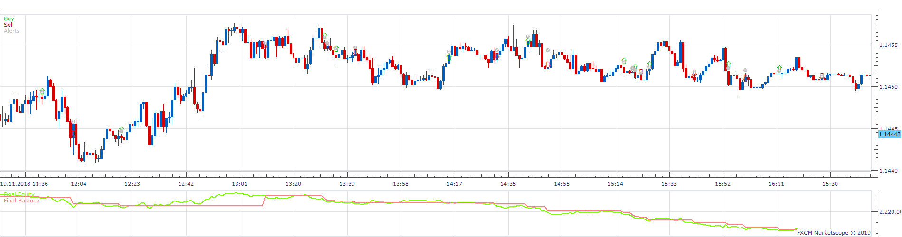
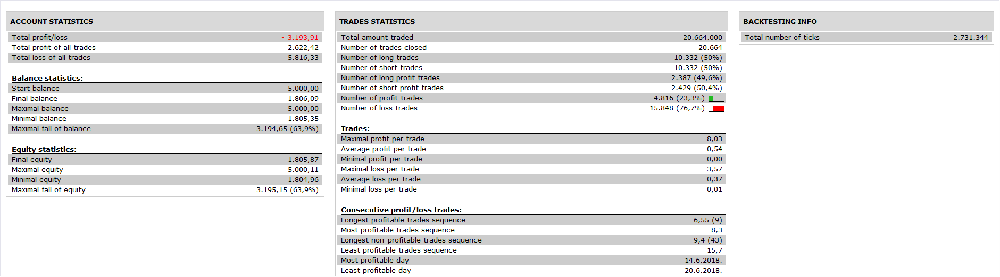

# UNIVERSAL CHANNEL OSCILLATOR Strategy

> Source: https://fxcodebase.com/code/viewtopic.php?f=31&t=68476  
> Forum: 31 · Topic 68476 · 1 post(s)

---

## UNIVERSAL CHANNEL OSCILLATOR Strategy

**Apprentice** · Sun May 19, 2019 5:16 am

 

Based on UNIVERSAL CHANNEL OSCILLATOR
[viewtopic.php?f=17&t=68394](https://fxcodebase.com/code/viewtopic.php?f=17&t=68394)

Open Long
UNIVERSAL VALUE / UniAvgline CrossOver
Open Short
UNIVERSAL VALUE / UniAvgline CrossUnder

 [UNIVERSAL CHANNEL OSCILLATOR Strategy.lua](files/126415/UNIVERSAL%20CHANNEL%20OSCILLATOR%20Strategy.lua)
