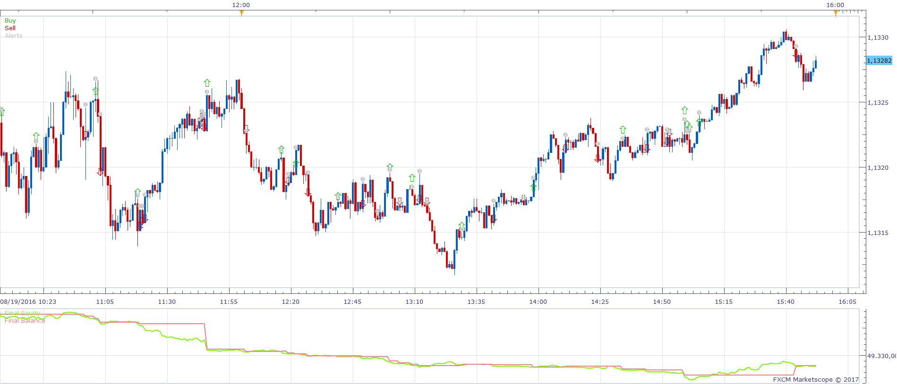
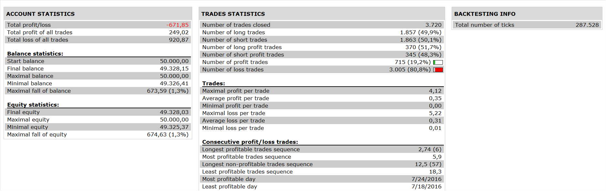

# Universal Oscillator Strategy

> Source: https://fxcodebase.com/code/viewtopic.php?f=31&t=64303  
> Forum: 31 · Topic 64303 · 2 post(s)

---

## Universal Oscillator Strategy

**Apprentice** · Mon Jan 16, 2017 4:34 am

 

Open Long
Universal Oscillator / Zero Line CrossOver
Open Short
Universal Oscillator / Zero Line CrossUnder

 [Universal Oscillator Strategy.lua](files/110538/Universal%20Oscillator%20Strategy.lua)

Universal Oscillator It is available here.
[http://www.fxcodebase.com/code/viewtopi ... 37#p110537](http://www.fxcodebase.com/code/viewtopic.php?f=17&t=61997&p=110537#p110537)

The Strategy was revised and updated on January 21, 2019.

---

## Re: Universal Oscillator Strategy

**Apprentice** · Sat Dec 23, 2017 1:08 pm

The strategy was revised and updated.
