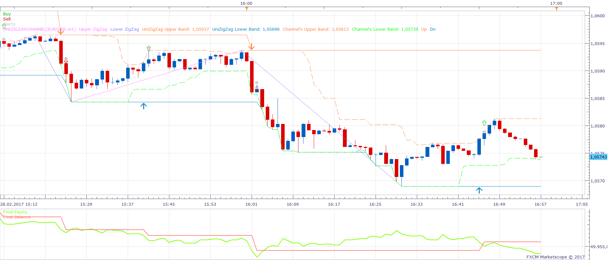
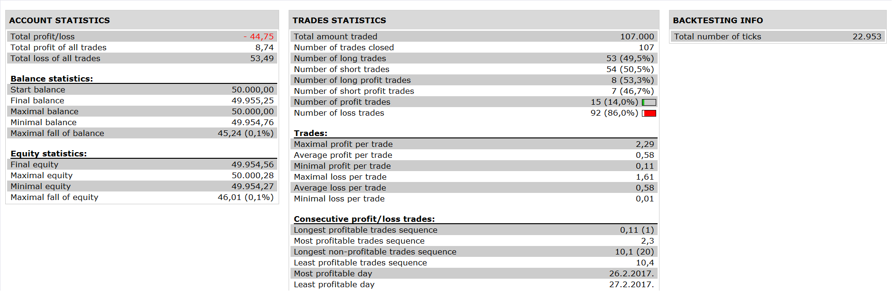

# Universal ZigZag Strategy

> Source: https://fxcodebase.com/code/viewtopic.php?f=31&t=65356  
> Forum: 31 · Topic 65356 · 5 post(s)

---

## Universal ZigZag Strategy

**Apprentice** · Sun Nov 12, 2017 1:07 pm

 

UniZigZagChannel.lua is available here.
[viewtopic.php?f=17&t=65327&p=116001#p116001](https://fxcodebase.com/code/viewtopic.php?f=17&t=65327&p=116001#p116001)
Long on Down Signal
Short on Up Signal

 [Universal ZigZag Strategy.lua](files/116002/Universal%20ZigZag%20Strategy.lua)

The Strategy was revised and updated on January 21, 2019.

---

## Re: Universal ZigZag Strategy

**papynou34** · Mon Nov 13, 2017 8:39 am

Hello,
I got the following error when backtesting the strategy?

---

## Re: Universal ZigZag Strategy

**Apprentice** · Mon Nov 13, 2017 4:23 pm

You probably have an old version of UniZigZagChannel.lua
Please re-download.

---

## Re: Universal ZigZag Strategy

**papynou34** · Tue Nov 14, 2017 5:24 am

Hello Apprentice,
I downloaded the indicator and the stratégy and all is right now.
Thanks a lot for your help.

---

## Re: Universal ZigZag Strategy

**Santoine** · Fri Dec 01, 2017 1:57 am

> **Apprentice wrote:**
>
>
> 1.png
>
>
>
>
> 2.png
>
>
> UniZigZagChannel.lua is available here.
> [viewtopic.php?f=17&t=65327&p=116001#p116001](https://fxcodebase.com/code/viewtopic.php?f=17&t=65327&p=116001#p116001)
> Long on Down Signal
> Short on Up Signal
>
>
> Universal ZigZag Strategy.lua

I found that strategy very useful on a longer time frame I mean over 1H. To avoid false detection or the wrong entries the missing part can be the cross MA condition for confirmation. You did it previously in the zigzag MA strategy but the issue is that the zigzag and the MA's are in the same time frame. A shorter time frame for the cross MA's will have a better responsiveness to a trend change. Thanks
