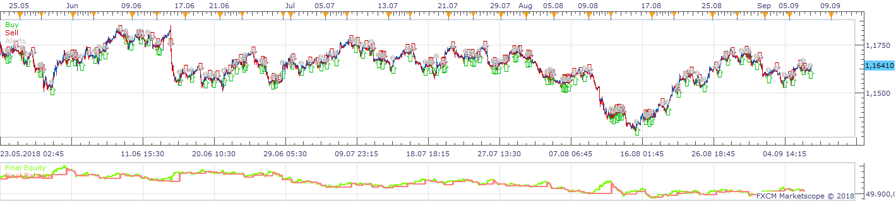
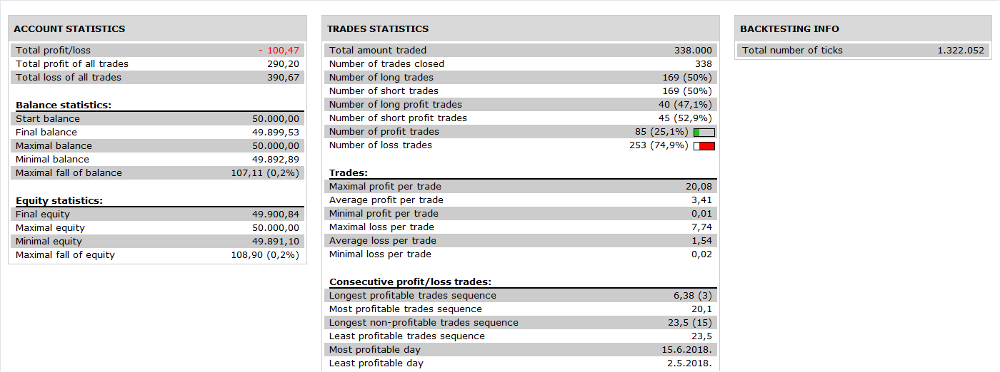

# [Upd Oct, 05] Trend Lord Strategy

> Source: https://fxcodebase.com/code/viewtopic.php?f=31&t=2262  
> Forum: 31 · Topic 2262 · 5 post(s)

---

## [Upd Oct, 05] Trend Lord Strategy

**Apprentice** · Sat Sep 25, 2010 4:55 pm

Update Oct, 05:
1) The indicator is updated to protect the strategy from re-calculations in past. Now the strategy is based on the internal indicator's "direction" data rather than on the colors of bars.

2) The new optional feature - the strategy increases the trade size in case the previous trade(s) had loss.

Pay attention. On the backtesting you'll see that the strategy enters at second bar past the change. This happen because the indicator redraws one bar in past AFTER the moment when signal appears.

 

 

 

The strategy provides signals, trade based on Trend Lord indicator.

Please download and install Trend Lord indicator. Please pay attention that the indicator was updated Oct, 05 in order to support this strategy! The strategy will not work without the latest version of this indicator.
[viewtopic.php?f=17&t=2068](https://fxcodebase.com/code/viewtopic.php?f=17&t=2068)

 [Trend Lord_Strategy.lua](files/4786/Trend%20Lord_Strategy.lua)

---

## Re: [Upd Oct, 05] Trend Lord Strategy

**cminvest** · Sun Oct 31, 2010 10:43 pm

Hi Apprentice,
exist this Trend Lord Strategy for Meta4 Accounts?
Where can I find it?

---

## Re: [Upd Oct, 05] Trend Lord Strategy

**Apprentice** · Mon Nov 01, 2010 3:45 am

This forum is dedicated to the development of indicators for Marketscope, charting platform.
And promotion of related Indicore SDK package.
If you want to develop indicators for other platforms,
This is possible through our Premium Development Services
[viewforum.php?f=32&start=0](https://fxcodebase.com/code/viewforum.php?f=32&start=0)
Through which we'll provide all necessary assistance.

---

## Re: [Upd Oct, 05] Trend Lord Strategy

**Apprentice** · Wed Nov 30, 2016 5:22 am

Bump up.

---

## Re: [Upd Oct, 05] Trend Lord Strategy

**Apprentice** · Tue Nov 13, 2018 8:39 am

The Strategy was revised and updated on November 13. 2018.
