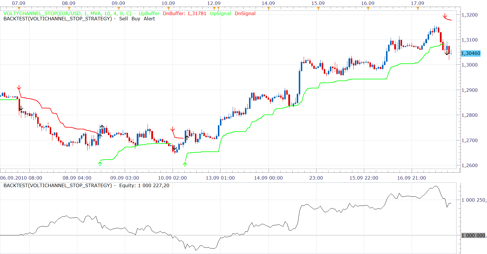
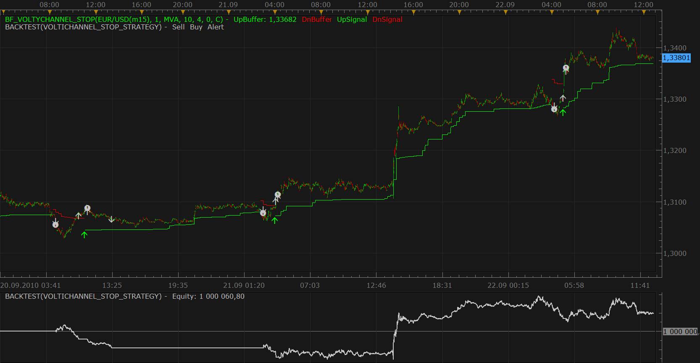
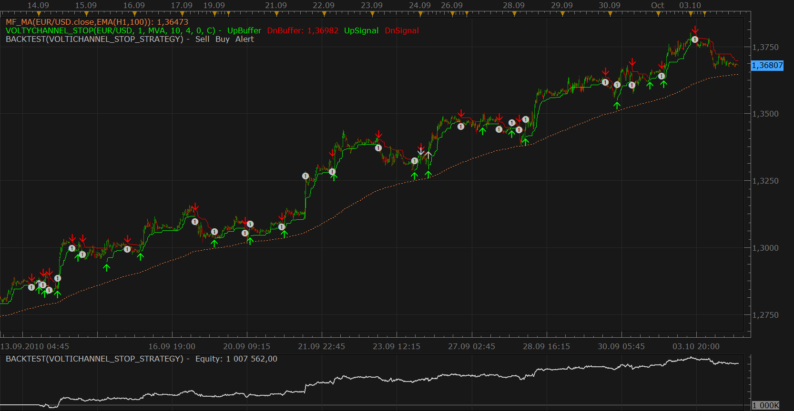
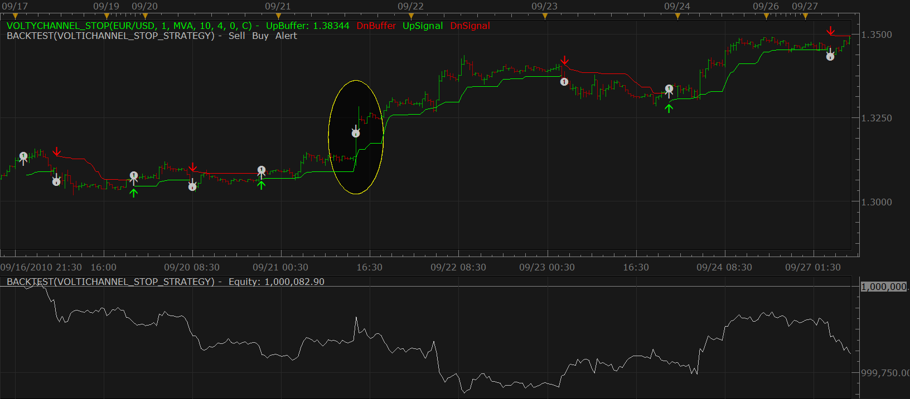
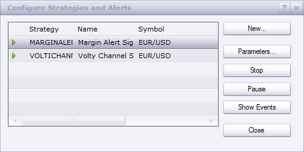

# [Upd, Oct 25] Volty Channel Stop Strategy

> Source: https://fxcodebase.com/code/viewtopic.php?f=31&t=2208  
> Forum: 31 · Topic 2208 · 54 post(s)

---

## [Upd, Oct 25] Volty Channel Stop Strategy

**Nikolay.Gekht** · Fri Sep 17, 2010 10:50 am

This post contains latest version of strategy within all recent updates (Oct 04, Oct 12, Oct 14).
Please, see history of changes below.

The strategy is based on the Volty Channel Stop indicator:
[viewtopic.php?f=17&t=893](https://fxcodebase.com/code/viewtopic.php?f=17&t=893)

The strategy sells when indicator switches up and buys when indicator switches down. The position is closed when indicator switches or when prices breaks the indicator line (i.e. indicator-based stop).

The strategy shows good result on long trends and usually loss when the indicator switches in range smaller than 3-7 bars.

The strategy works on completely closed candle, so the trade is opened or closed on the first tick of the candle, next to the bar at which signal to sell, buy or close appeared.

 

Download strategy:

 [VoltiChannel_Stop_Strategy.lua](files/4595/VoltiChannel_Stop_Strategy.lua)

Please **also** download and install [Volty Channel Stop indicator](https://fxcodebase.com/code/viewtopic.php?f=17&t=893) indicator. The strategy **will not** work without it.

**Note**. By default, the trading is disabled. Please set "Allow Strategy to Trade" parameter to "Yes". Please do not use the strategy on live accounts unless you carefully checked and implicitly decided that the strategy meets your trading goals. Please do not forget that you are solely and fully responsible for all the trades made by the strategy exactly like for the trades executed manually.

**Changes history:**
Oct 14, 2010
1) Incorrect index fix.

Oct 12, 2010
1) New option "Exit from position on non-confirmed signals" in the "Trading" section.
2) New section "Method and Schedule" in parameters.

Oct 04, 2010
1) Recurrent sound parameter for the signal is added
2) The moving average can be used to confirm the signal (see "Confirmation Parameters" section). By default the option is switched off.
3) The strategy does not enter twice in the same direction even in case the position exists at the moment of strategy start or when opposite signal appeared but was not confirmed.
4) The checking of the parameters is improved.
5) The strategy is written for (and, therefore requires) Autotrading patch installed.

Sep 22, 2010.
1) Fix the problem with double sell buy due to incorrect interpretation of the indicator.
2) Non-US clients now can specify limit and stop orders.

Please, do not hesitate to discuss any improvements this strategy right here.

The Strategy was revised and updated on January 19, 2019.

---

## Re: Volty Channel Stop Strategy

**sho-me-pips** · Fri Sep 17, 2010 12:14 pm

GREAT strategy!!

One improvement I would like.

"Check the trend before entering a trade. Check MVA current vs 10-20 bars back, of MVA of your choosing, to determine the direction of the trend and only trade in that direction."

I think I personally would use the 200EMA on any time frame. Others may want to use something different.

Nikolay you do us a great service here, thank you!

---

## Re: Volty Channel Stop Strategy

**Nikolay.Gekht** · Fri Sep 17, 2010 2:13 pm

I'll do it the next week. Thank you for the idea!

---

## Re: Volty Channel Stop Strategy

**sho-me-pips** · Mon Sep 20, 2010 12:03 pm

Nikolay,

I am getting double entries with this strategy. 2 buys or 2 sells.

---

## Re: Volty Channel Stop Strategy

**Nikolay.Gekht** · Mon Sep 20, 2010 1:18 pm

Could you please give me a bit more details?

What kind of account do you use? U.S. (FIFO), non US (hedging), non US (non-hedging)? What currency did you use? On what timeframe? Does it happen in backtesting or on demo account?

... oups ... I guess it's backtesting! In the production release (both 082610 and 091010) there is a small problem with backtesting. It does not simulate properly netting close orders which are used in this strategy, so, it just does not close simulated positions. To see the simulation properly in the current release please replace the simulator file in TS with the file attached to this post.

To replace please do the following steps:
a) Close TS.
b) Go to the C:\Program Files\Candleworks\FXTS2\
c) Find signaltester.dll file and rename it (just to keep an original copy)
d) Save signaltester.dll file attached to this post to C:\Program Files\Candleworks\FXTS2\ folder.
e) Start TS back.
[Oct, 04, NG] This problem is completely solved by [Autotrading patch](https://fxcodebase.com/code/viewtopic.php?f=31&t=2337), so, please, use it instead these steps.

I apologize for this inconvenience. Unfortunately we found a few such small nuances after the release. All these things will be fixed in upcoming "fast-login" release (I expect it in a few weeks).

---

## Re: Volty Channel Stop Strategy

**sho-me-pips** · Tue Sep 21, 2010 8:21 pm

non US (hedging), DEMO, EUR/USD, One minute

---

## Re: Volty Channel Stop Strategy

**Nikolay.Gekht** · Wed Sep 22, 2010 12:32 pm

Gotcha problem with double enter. Repeats when strategy is applied on the market and don't in backtesting. I also added stops and limits but look still for a good idea for filtering.

---

## Re: [Upd, Sep 22] Volty Channel Stop Strategy

**Nikolay.Gekht** · Wed Sep 22, 2010 4:26 pm

Yep, found. The volti channel indicator can have both up and down channel sometimes. Fixed data interpretation, so double positions must not appear anymore. Thank you for reporting the problem.

Plus added stops and limits. On the back-test below I put very close stop, so you can see an arrows between the signals - it's stop order filling.

 

For backtesting of the stop orders I recommend to choose smaller time frame, for example 1 minute for 15-minutes backtesting. Then apply bigger time frame version of volti stop indicator and choose the time frame you plan to backtest on, for example 15 minutes. After, when backtesting is applied set "Set the period of the ..." (second parameter) of backtester to no and choose 15 minutes in the strategy parameters. That's all. 1 minute is used to simulate ticks (so we have 45 ticks per 15 minutes candle), but indicator and strategy works in 15 minute time frame.

---

## Re: [Upd, Sep 22] Volty Channel Stop Strategy

**boursicoton** · Thu Sep 23, 2010 4:25 pm

bug ?

between two lines , short is positive but on the test...line isn't move !
long is good, short isn't write on backtest.

---

## Re: [Upd, Sep 22] Volty Channel Stop Strategy

**Nikolay.Gekht** · Thu Sep 23, 2010 10:49 pm

Have you updated signaltester.dll I attached to this post above [viewtopic.php?f=31&t=2208#p4651](https://fxcodebase.com/code/viewtopic.php?f=31&t=2208#p4651)? There is a bug in prod. version, the netting close order is not simulated properly.

---

## Re: [Upd, Sep 22] Volty Channel Stop Strategy

**boursicoton** · Fri Sep 24, 2010 12:40 am

i update....
rename old dll...
take a new dll on folder
argh
platform lauchn...
marketscope launch, but few seconds.....close !
reset ordi...
same problem...
i rename old dll and it's ok....
system windows seven 32 bits

---

## Re: [Upd, Sep 22] Volty Channel Stop Strategy

**Nikolay.Gekht** · Fri Sep 24, 2010 1:40 am

Could you also tell me whether the version is 091010 or 082610?

---

## Re: [Upd, Sep 22] Volty Channel Stop Strategy

**boursicoton** · Fri Sep 24, 2010 2:14 am

082610
update in progress....

---

## Re: [Upd, Sep 22] Volty Channel Stop Strategy

**boursicoton** · Fri Sep 24, 2010 2:52 am

i'm a stupid boy !!!
problem is ok !!!
thnaks

---

## Re: [Upd, Sep 22] Volty Channel Stop Strategy

**Nikolay.Gekht** · Fri Sep 24, 2010 9:20 am

This is rather the extremely inconvenient way with the last release which has to be updated via install and then another file has to be replaced. Easy to use wrong version. I'm do all my best to push cumulative update and hope that it will be available soon.

---

## Re: [Upd, Sep 22] Volty Channel Stop Strategy

**boursicoton** · Fri Sep 24, 2010 1:35 pm

what's ....?
02/04/2010 one buy....which stop a short trade....

---

## Re: [Upd, Sep 22] Volty Channel Stop Strategy

**Apprentice** · Tue Sep 28, 2010 5:26 am

Email functionality is added.

---

## Re: [Upd, Sep 22] Volty Channel Stop Strategy

**robin76** · Wed Sep 29, 2010 4:53 am

Hi,
I downloaded and set the strategy, and it correcly works on backtest, but on my demo version, it doesn't open any positions. In my Log window I can read the following message:
[string "VoltyChannel_Stop.lua"]:13 attempt to index global 'indicator' (a nil value)
[string "Bf_VoltyChannel_Stop.lua"]:13 attempt to index global 'indicator' (a nil value)

What's the problem? I correctly installed both .lua of the indicators...
Thanks

---

## Re: [Upd, Sep 22] Volty Channel Stop Strategy

**Nikolay.Gekht** · Wed Sep 29, 2010 9:15 am

Please, install the strategy as a strategy, using the "Strategy->Manage Custom Strategies".

---

## Re: [Upd, Sep 22] Volty Channel Stop Strategy

**robin76** · Thu Sep 30, 2010 4:24 am

Hi, I did it. the situation is the following:
I upload the strategy as you said, and the next window after the upload is the result: "Error". Anyway right now I see the strategy and I can configure it as I prefer, but it doesn't start any position, even if I installed indicators, changed the dll, and made backtests.
And I still have the error I said in the log page.
Thanks

---

## Re: [Upd, Sep 22] Volty Channel Stop Strategy

**Nortal** · Thu Sep 30, 2010 1:06 pm

Hi Nikolai, thanks for this good strategy.
I need that this strategy sells when indicator switches up and buys when indicator switches down. The position is closed when indicator switches but dont close it when prices breaks the indicator line.
Can you do this for me please? Thank you very much!

---

## Re: [Upd, Sep 22] Volty Channel Stop Strategy

**Apprentice** · Thu Sep 30, 2010 1:28 pm

Added on developmental cue.

---

## Re: [Upd, Sep 22] Volty Channel Stop Strategy

**Nortal** · Sun Oct 03, 2010 4:49 pm

Thanks Apprentice, I will wait impatient for the update.
I think that's always good to exit when prices breaks the indicator line.
Try to set volty channel ATR 2 and Multipler 2 when the markets are open. For me it is good!
Thanks

---

## Re: [Upd, Sep 22] Volty Channel Stop Strategy

**Nikolay.Gekht** · Mon Oct 04, 2010 4:17 pm

I didn't have much time to test, so I would really appreciate if somebody will play with testing carefully.

What's done:

1) Recurrent sound parameter for the signal is added
2) The moving average can be used to confirm the signal (see "Confirmation Parameters" section). By default the option is switched off.
3) The strategy does not enter twice in the same direction even in case the position exists at the moment of strategy start or when opposite signal appeared but was not confirmed.
4) The checking of the parameters is improved.
5) The strategy is written for (and, therefore **requires**) [Autotrading patch](https://fxcodebase.com/code/viewtopic.php?f=31&t=2337) installed.

Backtesting using autotrading patch (so: 12 ticks per bar) on M15 with standard VOLTY_CHANNEL_STOP parameters and with EMA(H1, 100) 20 bars ago confirmation. Up to me - it looks too good to be truth.

 

---

## Re: [Upd, Sep 22] Volty Channel Stop Strategy

**Nortal** · Tue Oct 05, 2010 8:12 am

Thanks for your work Nikolai
I use these parameters in the opening of London and I think they are good.
In this strategy when the signal appear wait to candle close and open or close position y the next candle.
Would it be possible that he should make at the time that signals appear?
In rapid movements expect to close a few pips can escape us.

---

## Re: [Upd, Sep 22] Volty Channel Stop Strategy

**Nikolay.Gekht** · Tue Oct 05, 2010 11:07 am

I can provide this mode, but I tested VoltiStop indicator and it is a bit noisy, especially on "flat" market. In other words, the signal can appear, then disappear and then appear again. If this is not a problem - I can provide a mode when the strategy will take the lastest (alive) bar instead of recently closed bar.

---

## Re: [Upd, Sep 22] Volty Channel Stop Strategy

**Nortal** · Tue Oct 05, 2010 2:15 pm

Hi Nikolay I think works best opening and closing position when the signal appears, but you must filter the time when it is used. I use it in the early hours of the market, they appear more spacious movements and disposal of the signals when the market starts to come into range. The best times to use the strategy include the opening of new york and london. In the Asian session the market often does not move too much.
Thanks for your work and I hope the next update to follow by testing.

---

## Re: [Upd, Sep 22] Volty Channel Stop Strategy

**sho-me-pips** · Wed Oct 06, 2010 2:47 pm

Testing on AUD/USD 15 min DEMO account. Confirmation is MVA 100, Lookback 5, 60 min chart. Strategy buys but doesn't close position when I get opposite signal. Events log shows "Enter Short is not confirmed" but still doesn't close open position.

The next long position on the event log show "Enter Long" but didn't enter an order, maybe because there was already an open position that didn't close.

---

## Re: [Upd, Sep 22] Volty Channel Stop Strategy

**Nikolay.Gekht** · Tue Oct 12, 2010 3:34 pm

Ok, another update.

1) New option "Exit from position on non-confirmed signals" in the "Trading" section. In case is set to "yes", the strategy will close existing trade when volti_channel signal appear but is not confirmed by moving average (if confirmation is switched on).

2) New section "Method and Schedule" in parameters:

a) "Check method" let you choose how to check the indicators. By default "On Recently Closed Bar" is chosen. This is a standard way how it work. It waits for the first tick after the candle is closed and then check for signal on the recently closed candle. Another option is "On Alive Bar". In this case the strategy recalculated the indicator on every tick and checks the condition.

b) Schedule. You can choose start hour and end hour for strategy work.

Notes:

1) I tried to play with "Alive Bar" and "Schedule" (I chosen 03:00->14:00 (london and new york start). The results wasn't impressive. Could you check this mode and recommend me better parameters for testing?

2) As I said, it's possible that signal appeared and then disappeared in the "final" version of the candle. In that case the trades which looks "false" can appear. Look at the snapshot below. I highlighted the sell operation at the bar for which voltychannel didn't give a signal. I traced this period carefully and find that voltichannel given the red signal at this bar, which disappears on following ticks of the same bar.

 

Get another beta:

 [VoltiChannel_Stop_Strategy.lua](files/5155/VoltiChannel_Stop_Strategy.lua)

---

## Re: [Upd, Sep 22] Volty Channel Stop Strategy

**Mr_Don** · Wed Oct 13, 2010 11:33 am

well first of all i want to thank you for sharing your work, my english isn't good so if i made a mistake please be patient.....i've been following your post and i will make the test as you said, i will let you know....as an idea i propose to publish a video with a short explanation, y think is much better than a screnshot, thanks again for this post.

---

## Re: [Upd, Sep 22] Volty Channel Stop Strategy

**Nortal** · Thu Oct 14, 2010 8:00 am

It does not work, open the first position but do not close and open the next.
I get this error 458: Attempt to index global 'bid' (a nil value)

---

## Re: [Upd, Sep 22] Volty Channel Stop Strategy

**Nikolay.Gekht** · Thu Oct 14, 2010 6:26 pm

> **Mr_Don wrote:**
> well first of all i want to thank you for sharing your work, my english isn't good so if i made a mistake please be patient.....i've been following your post and i will make the test as you said, i will let you know....as an idea i propose to publish a video with a short explanation, y think is much better than a screnshot, thanks again for this post.

Thank you for idea. Now, on the new server, I think it will be much simpler for us to host such things like video.

> **Nortal wrote:**
> It does not work, open the first position but do not close and open the next.
> I get this error 458: Attempt to index global 'bid' (a nil value)

Oups. Fix is here.

 [VoltiChannel_Stop_Strategy.lua](files/5215/VoltiChannel_Stop_Strategy.lua)

However, this problem caused by the close order which wasn't executed at all. It's sorrowful because I didn't touch this part since the first version. I fixed the problem, so now it must alert a error text which appears when it tries to close position. Could you please try again. If error appears - please also tell me which connection (fifth indicator is the Trading Station status bar, something like "MiniDemo" or "U100D1") and which instrument did you use.

---

## Re: [Upd, Sep 22] Volty Channel Stop Strategy

**Nortal** · Fri Oct 15, 2010 6:23 am

Hi Nikolay, I try again with the new update but it doesnt work.
When volty signal appear buy and sell, but dont close the previous signal.
I added an image to this post to explain the failure.
Thank you

---

## Re: [Upd, Sep 22] Volty Channel Stop Strategy

**Nikolay.Gekht** · Fri Oct 15, 2010 8:27 am

> **Nortal wrote:**
> Hi Nikolay, I try again with the new update but it doesnt work.
> When volty signal appear buy and sell, but dont close the previous signal.
> I added an image to this post to explain the failure.
> Thank you

Oh. I see. Did you installed autotrading patch?

---

## Re: [Upd, Sep 22] Volty Channel Stop Strategy

**Nortal** · Fri Oct 15, 2010 12:04 pm

Ooops
You are a genious
Excelent work Nikolay
Thank you very much!

---

## Re: [Upd, Sep 22] Volty Channel Stop Strategy

**Nikolay.Gekht** · Fri Oct 15, 2010 1:19 pm

Please report any problems/ideas. I plan to update the version in top post in a week if this version works good enough.

---

## Re: [Upd, Oct 25] Volty Channel Stop Strategy

**vstrelnikov** · Mon Oct 25, 2010 12:41 pm

Top post updated.

---

## Re: [Upd, Oct 25] Volty Channel Stop Strategy

**danieldd** · Wed Nov 03, 2010 2:59 am

hi, thx for ur system, its cool
however, i got the same problem as Nortal has,
but i am using the latest er. of trading station already
would you mind to help me?? thx a lot

---

## Re: [Upd, Oct 25] Volty Channel Stop Strategy

**Giantball** · Wed Mar 30, 2011 5:05 pm

> **Nikolay.Gekht wrote:**
> This post contains latest version of strategy within all recent updates (Oct 04, Oct 12, Oct 14).
> Please, see history of changes below.
>
> The strategy is based on the Volty Channel Stop indicator:
> [viewtopic.php?f=17&t=893](https://fxcodebase.com/code/viewtopic.php?f=17&t=893)
>
> The strategy sells when indicator switches up and buys when indicator switches down. The position is closed when indicator switches or when prices breaks the indicator line (i.e. indicator-based stop).
>
> The strategy shows good result on long trends and usually loss when the indicator switches in range smaller than 3-7 bars.
>
> The strategy works on completely closed candle, so the trade is opened or closed on the first tick of the candle, next to the bar at which signal to sell, buy or close appeared.
>
>
>
> volychannel.png
>
>
>
> Download strategy:
>
>
> VoltiChannel_Stop_Strategy.lua
>
>
>
> Please **also** download and install [Volty Channel Stop indicator](https://fxcodebase.com/code/viewtopic.php?f=17&t=893) indicator. The strategy **will not** work without it.
>
> **Note**. If you still use 082610 version of the Trading Station it is strongly recommended to download and install the new (091010) version from the [FXCM's download page](http://www.fxcm.com/forex-software-download.jsp) or Software download page of your broker:
>
> **Note**. By default, the trading is disabled. Please set "Allow Strategy to Trade" parameter to "Yes". Please do not use the strategy on live accounts unless you carefully checked and implicitly decided that the strategy meets your trading goals. Please do not forget that you are solely and fully responsible for all the trades made by the strategy exactly like for the trades executed manually.
>
> **Changes history:**
> Oct 14, 2010
> 1) Incorrect index fix.
>
> Oct 12, 2010
> 1) New option "Exit from position on non-confirmed signals" in the "Trading" section.
> 2) New section "Method and Schedule" in parameters.
>
> Oct 04, 2010
> 1) Recurrent sound parameter for the signal is added
> 2) The moving average can be used to confirm the signal (see "Confirmation Parameters" section). By default the option is switched off.
> 3) The strategy does not enter twice in the same direction even in case the position exists at the moment of strategy start or when opposite signal appeared but was not confirmed.
> 4) The checking of the parameters is improved.
> 5) The strategy is written for (and, therefore requires) Autotrading patch installed.
>
> Sep 22, 2010.
> 1) Fix the problem with double sell buy due to incorrect interpretation of the indicator.
> 2) Non-US clients now can specify limit and stop orders.
>
>
> Please, do not hesitate to discuss any improvements this strategy right here.

Hi,

Thank you for doing great work with all the indicators. I would like to make a request regarding the email function of this Volty stop strategy. Please have it attach to the market ie.(EUR/USD) it's trading and the price it traded at on the alert. Also please have the Name/Title of the strategy as the alert titlle.

Thank you
G

---

## Re: [Upd, Oct 25] Volty Channel Stop Strategy

**Apprentice** · Thu Mar 31, 2011 2:15 am

Your request has been added to developmental cue-

---

## Re: [Upd, Oct 25] Volty Channel Stop Strategy

**luigipg** · Fri Dec 30, 2011 12:01 pm

Hi, please, what does it mean: "Use Indicator Value as additional stop"? Thanks. Luigi!!!

---

## Re: [Upd, Oct 25] Volty Channel Stop Strategy

**luigipg** · Sun Jan 01, 2012 11:54 am

Hi Nikolay, please can you add to this strategy the possibility to choose the number of buy and the number of sell positions (separetly) to open per day, BUT NOT MULTIPLE, and the possibility to close all the opened positions at xx:xx time. All this would be basical for me to use this strategy. Thank you for all your work. Best regards. Luigi!!!

---

## Re: [Upd, Oct 25] Volty Channel Stop Strategy

**Apprentice** · Mon Jan 02, 2012 4:41 am

Your request is added to the developmental cue.

---

## Re: [Upd, Oct 25] Volty Channel Stop Strategy

**luigipg** · Tue Jan 03, 2012 6:27 am

Always thanks apprentice!!!

---

## Re: [Upd, Oct 25] Volty Channel Stop Strategy

**zmender** · Tue Jan 03, 2012 4:09 pm

Backtesting is looking really great!

---

## Re: [Upd, Oct 25] Volty Channel Stop Strategy

**Rebel1984** · Wed Jan 18, 2012 4:26 pm

Hi Nikolay

Some excellent work on your part!! Nice

Just 1 prob,mine doesnt seem to work in the demo acc, its works perfect in backtesting, but not on my demo acc.

I have the latest version of marketscope, so im not sure. All i get is siganls or "conditions met", no actual trades being made. I enabled the "allow trading" but nothing, could you maybe help me.. its probably something so stupid i missed, but ye would love to find out how to make it work.

Regards & keep up the excellent work.

---

## Re: [Upd, Oct 25] Volty Channel Stop Strategy

**Apprentice** · Sun Jan 22, 2012 5:23 pm

Have you load/start strategy to Marketcope.
Active strategy should look like this.

 

---

## Re: [Upd, Oct 25] Volty Channel Stop Strategy

**rtsayers** · Wed May 30, 2012 6:08 pm

I was wondering if someone could explain the High/Low break and the High/Low envelope on this strategy?

Thanks!

---

## Re: [Upd, Oct 25] Volty Channel Stop Strategy

**RJH501** · Mon Jul 23, 2012 1:45 pm

Gentlemen,

Would you please create a FIFO version of the Volty Channel Strategy.

It will be most appreciated!

Regards,

RJH

---

## Re: [Upd, Oct 25] Volty Channel Stop Strategy

**RJH501** · Mon Jul 23, 2012 10:34 pm

Oops it is FIFO except for stop loss.

Can that be corrected?

Thanks,

RJH

---

## Re: [Upd, Oct 25] Volty Channel Stop Strategy

**rtsayers** · Sun Oct 21, 2012 2:46 pm

Hi awesome indicator!!

I was wondering if it is possible to add 4 take profit levels with this strategy!

---

## Re: [Upd, Oct 25] Volty Channel Stop Strategy

**Apprentice** · Tue Oct 23, 2012 6:19 am

Your request is added to the development list.

---

## Re: [Upd, Oct 25] Volty Channel Stop Strategy

**Apprentice** · Wed Dec 07, 2016 3:32 pm

Strategy has been revised and updated.

---

## Re: [Upd, Oct 25] Volty Channel Stop Strategy

**netmstar** · Mon Apr 10, 2017 10:35 am

The account is locked
