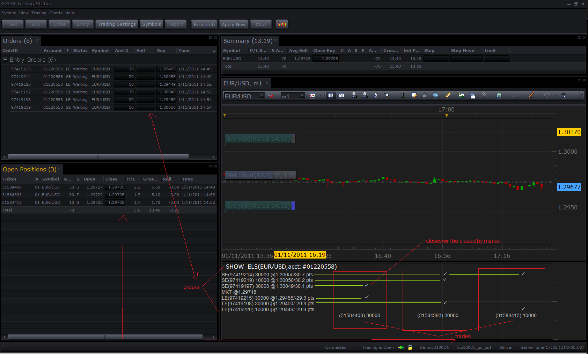
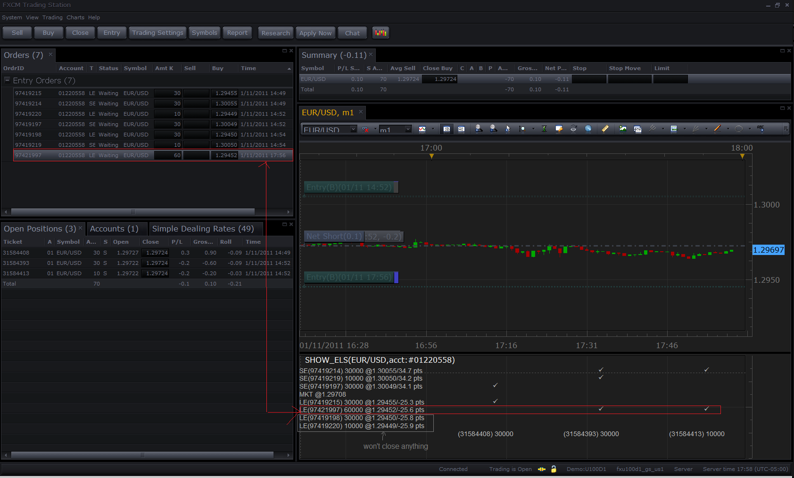
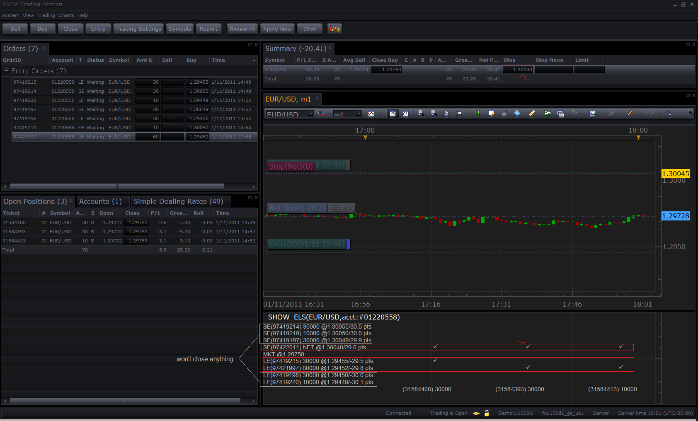
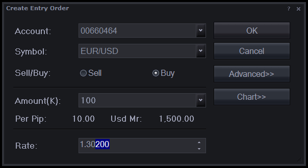
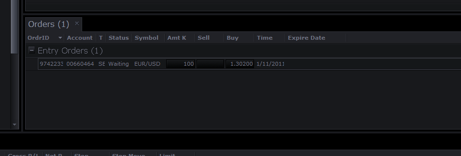
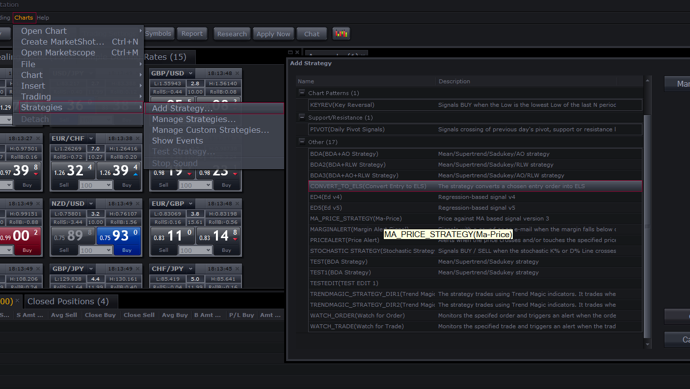
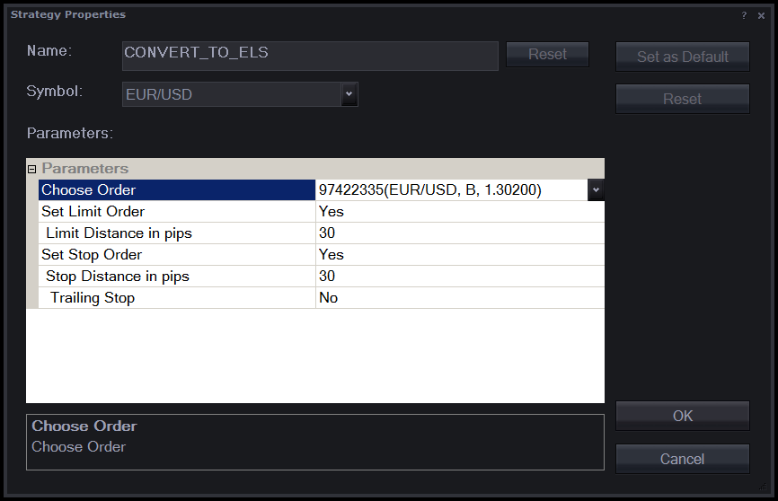
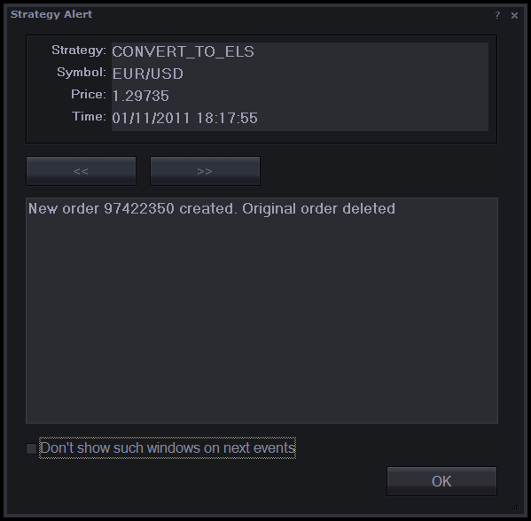
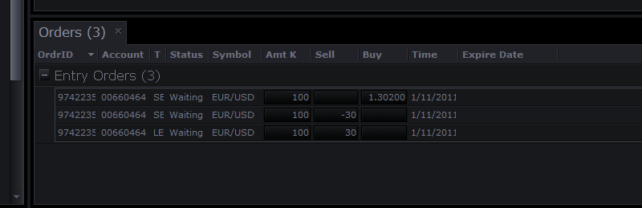
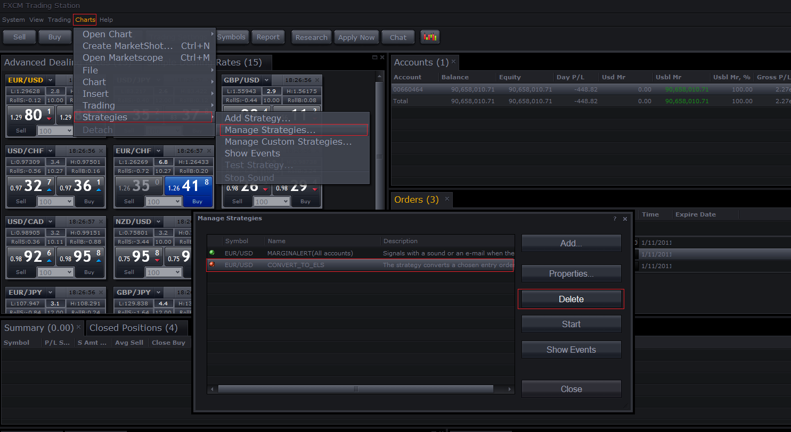

# Using ELS Orders in Trading

> Source: https://fxcodebase.com/code/viewtopic.php?f=31&t=3154  
> Forum: 31 · Topic 3154 · 4 post(s)

---

## Using ELS Orders in Trading

**Nikolay.Gekht** · Wed Jan 12, 2011 3:13 pm

What are ELS Orders?

This article also explains the basics of the risk management under the FIFO rule. If you are already familiar with this topic, [just skip to ELS Order section](https://fxcodebase.com/code/viewtopic.php?f=31&t=3154#p7404).

**NFA Rule 2-43(b) (aka FIFO Rule) and Stop/Limit Orders**

As you probably know, NFA introduced rule 2-43(b) in 2009. All U.S. based accounts are subject to this rule. The two most important points of this rule are:
1) The rule forbids hedging.
2) The rule forbids “selective position management”.

In other words:
1) You cannot keep both short and long positions in one instrument at the same time.
2) You cannot close any position (of your choice) in the instrument. The positions in one instrument must be closed exactly in the same order as they were opened. So, you must always close the oldest position in the instrument first.

In fact, the second point forbids you to use stop and limit orders. These orders are attached to a position and when a market condition is met, these orders must close the position they are attached to, even if this position is not the oldest one. So, these orders can violate rule 2-43(b) and, therefore, are forbidden for all U.S. accounts.

**Risk Management under FIFO Rule**

Despite the fact that Stop and Limit orders are forbidden, you still can use conditional orders to protect your positions. If you look at point 1 of the Rule – the hedging is forbidden too, so the opposite entry orders will close the existing opposite positions if such positions exist.

So, let’s see how we can protect a position under the FIFO rule.

Let’s say we opened 10K EUR/USD long position at 1.3. Then we create a 10K entry sell order at 1.28 (order 1) and a 10K entry sell order at 1.32 (order 2) and join these orders into OCO (One-Cancels-Others).

In case the price touches 1.28, order 1 gets filled. It sells 10K of EUR/USD. Since hedging is disabled, no new position is created, the existing long position is closed instead. Since order 1 and order 2 are joined as OCO, order 2 is cancelled.

So, when we have only one position per instrument, the pair of opposite entry orders joined into OCO works almost like stop and limit.

However, this approach has two serious disadvantages:

1) When the position is created using an Entry order, you cannot create Entry Stop and Limit until the Entry Order is executed. So, there is a chance that the position will be unprotected on the market during the time period when the entry order is already executed but Entry Stop and Limit orders aren’t created.

2) If the position is closed manually, the Entry Stop and Limit orders remain active and will create a new position when the market condition is met.

So, using regular entry orders for protecting positions requires monitoring the market all the time to create and/or delete opposite entry orders.

---

## Using ELS Orders part II

**Nikolay.Gekht** · Wed Jan 12, 2011 3:15 pm

Fortunately, there are ELS (Entry Limit Stop) orders which can help us.

**What is ELS?**

ELS is a set of three orders. One order is called the main (or the root) order and can be either an entry or a market order. The order behaves in a regular way. This is the order you expect to create a position.

There are also two entry orders which are opposite to the main order (for example they are sell orders if the main order is a buy order), which:
1) Are inactive until the position is created by the main order.
2) Are joined into OCO-like group, so, when one order is executed, the other order is cancelled.
3) Never create a position, only close the opposite position if such position exists.
4) Are cancelled if there are no more opposite positions in the instrument.

So, ELS orders are much closer to regular stops and limits than regular entry orders.

However, ELS aren’t a kind of wonderwork. These orders are still just entry orders and have to follow NFA 2-43(b) rule, so:

1) ELS orders do not close the position they are created for. The ELS which is closer to the Market (so is triggered first) closes the oldest of the existing positions in the instrument.

2) If a position is closed manually, but other positions in the same instrument remain, ELS orders aren’t cancelled until all positions in the instrument are closed.

3) Also, Netting Stop and Limit orders and even regular Entry Orders also affect the ELS execution if they are closer to the market than ELS orders.

**How ELS works?**

Let’s look at the examples to understand how ELS orders work.

We have three short positions in EUR/USD. Each of these positions is created using entry ELS orders, with corresponding stops and limits.

31584408 for 30K (the oldest one) with Limit at 1.29455, Stop at 1.30055
31584393 for 30K with Limit at 1.29450, Stop at 1.30049
31584413 for 10K (the newest one) with Limit at 1.29449 and Stop at 1.30050.

We also use the show_els indicator which shows us all trades and all opposite entry orders on the chosen account and instrument and makes a prediction map of which orders would close which trades when the market touches the order price. The orders are shown at the left, from the highest to the lowest prices and the trades are shown at the bottom, the oldest trade being at the left. The check mark shows that stop or limit order will close a trade.

 [show_els.lua](files/7404/show_els.lua)

Look at the situation right after creating the latest of the trades.

 

(hint: click on image to see in full size)

Let’s look at the stop orders.

The closest to the market is the stop order at 1.30049, which was created for the second of the trades (31584393). But, it is closest to the market, so, it will be executed first (if the market will go upward) and will close the oldest of the existing trades (31584408).

The second order is the stop order at 1.30050 for 10K which is created for the third trade (31584413). But this order will close the oldest of the remaining trades, or the second trade (31584393). However, the order is smaller than the trade, so it will close it partially. After the order execution we will have 20K trade in place of 31584393 (partially closed) and 10K trade (31584413).

These two trades are covered by the last of stop orders, 30K at 1.30050 which was created for the first of the trades. When this order is triggered, it will close both of the remaining positions.

The situation with the limit orders is different. Two limit orders which are closest to the market are 30K, and two oldest positions are also 30K, so no partial closing is expected in case the market is moved downward.

Now let’s create a buy entry order at 1.29452 for 60K to see how such order will affect the closing of the existing positions. This order is next to the 1.29455 Limit Order, so it will be executed before the other Limit Orders we created. Look at the prediction map. Now the second and the third trade will be closed by this entry order. The second and the third limit order will close nothing.

 

Now use the summary window to set the netting stop order at 1.30040 (or closer to the market than any of the stop orders created). Look at the prediction map. Now all the positions will be closed by the netting stop order (because it is the closest to the market) and all other stop orders will do nothing.

 

---

## Creating ELS orders

**Nikolay.Gekht** · Wed Jan 12, 2011 3:19 pm

**How to Create ELS?**

Doesn’t all this frighten you and you still want to use ELS orders in trading? Well, unfortunately, at this moment ELS orders are available form Java API and from Marketscope strategies only. To use the ELS orders from the Trading Station, please install the convert_to_els strategy.

 [convert_to_els.lua](files/7405/convert_to_els.lua)

(See also [How to Download and Install a Custom Signal/Strategy](https://fxcodebase.com/code/viewtopic.php?f=31&t=2310))

**How to use the strategy.**

1) Create a regular entry order.

 

 

Now you have a regular entry order. Let’s add ELS limits and stops to this order. Go to the Marketscope and click on Strategies->Add Strategy. In the “Add Strategy” window find the “CONVERT_TO_ELS” strategy and click OK.

 

In the strategy parameters form choose the entry order you would like to convert into ELS and enter Limit and Stop distance in pips. You can also switch off creating a Limit or Stop order, but at least one of them must be chosen. The symbol does not matter for such strategy, so you can choose any. When the order to convert is chosen and the stop and limit parameters are filled – click OK.

 

After a very short time the message that the conversion is done and the original order is deleted must appear:

 

Click OK to close the message. You can see that now three orders exist – the entry order at the same level and for the same amount and two pegged orders (the orders with the price expressed in pips). These orders are inactive until the position is created. When the position is created, these orders will become active and the initial price of the order will be calculated as the position initial close price plus the distance specified in the order and expressed in pips).

If you want to remove entry or limit order – just select them in the Trading Station and remove it using “Remove Order” command. If you want to change the order rate before the order becomes active – just remove both orders and then run the convert_to_els strategy again with the new parameters. If you want to change the order rate or amount after the order comes active – just change it as for a regular entry order.

 

After converting the order, the strategy is automatically stopped. Now you can just delete it from the list of the strategies. Just click Chart->Strategies->Manage Strategies, then find CONVER_TO_ELS in the strategies list. You can see that the strategy is marked with the red circle, that means that the strategy is already stopped. Just select it and then click Delete to remove it from the active strategies list.

 

---

## Re: Using ELS Orders in Trading

**Apprentice** · Mon Jan 29, 2018 7:55 am

Bump Up
