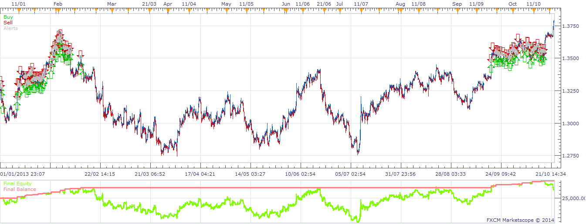

# Very Blonde System

> Source: https://fxcodebase.com/code/viewtopic.php?f=31&t=60343  
> Forum: 31 · Topic 60343 · 6 post(s)

---

## Very Blonde System

**moomoofx** · Sun Feb 23, 2014 9:10 pm

Ported over from MQ4 as requested on: [viewtopic.php?f=27&t=60247](https://fxcodebase.com/code/viewtopic.php?f=27&t=60247)

Basically a martingale grid that enters on a particular price volatility.

Changes from the original implementation I've done.
- Default implementation always forced the initial amount size of 1% of equity. This has been changed such that you can specify this number. Also, regardless of what is specified it cannot be less than the minimum trade size.
- Default implementation always created a grid with 5 levels. I've made this configurable with a 'Orders Limit' parameter so you can have more or less as required.
- Supports any timeframe for trade execution including ticks.

Please note that the Lockdown parameter does not work with FIFO accounts as it is not possible to track stop orders properly on these account types. Otherwise, enjoy.

 

Cheers,
MooMooFX

The Strategy was revised and updated on January 18, 2019.

---

## Re: Very Blonde System

**xpertizetrading** · Wed Feb 26, 2014 2:23 am

Thank you.

---

## Re: Very Blonde System

**Atmotrader** · Thu Mar 10, 2016 7:22 am

Hello,

the above link to the old mq4 request is not working.

Could you please explain the strategy and paramaters a bit more in detail?

Thanks
Masoud

---

## Re: Very Blonde System

**w3althy1** · Tue Nov 22, 2016 8:03 pm

I really like the concept of this strategy. i was running it on my demo account to test and I can't seem to get it to trade more than 1K lots or .1 per pip positions as the initial entry no matter what % equity I choose. Is it possible to have it use more lots? Also I was trying to backtest with different pairs and I seem to be generating using a data set that is too large. Any suggestions?
Sincerely,
w3althy1

---

## Re: Very Blonde System

**w3althy1** · Tue Nov 22, 2016 8:18 pm

I was looking into the strategy and I can seem to get the initial position to be more that a 1k position on matter what % equity I set. Is there a way to change this? Could it be set to a particular number of lots? Also I was trying to back test and seems to be using a sample size that is too large. Do you have any suggestions?

---

## Re: Very Blonde System

**Apprentice** · Sun Dec 18, 2016 10:04 am

Strategy was revised and updated.
