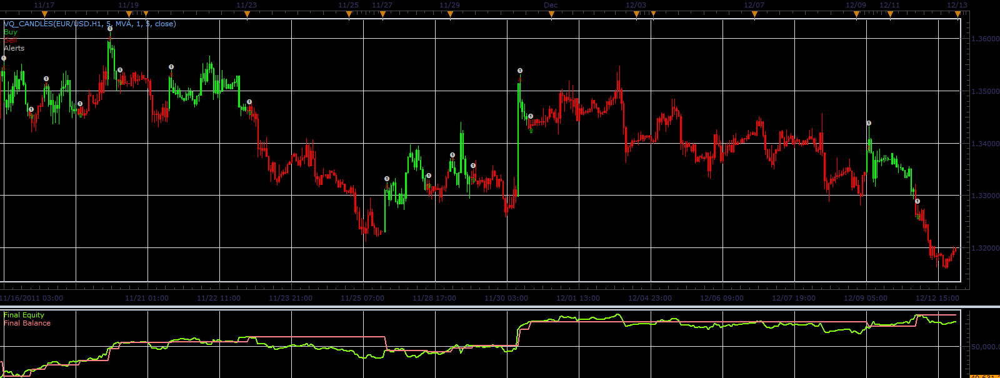

# VQ strategy

> Source: https://fxcodebase.com/code/viewtopic.php?f=31&t=12173  
> Forum: 31 · Topic 12173 · 2 post(s)

---

## VQ strategy

**Alexander.Gettinger** · Mon Jan 23, 2012 2:58 am

Strategy based on the VQ indicator ([viewtopic.php?f=17&t=12170](https://fxcodebase.com/code/viewtopic.php?f=17&t=12170)).

The strategy opens/closes orders when indicator changes color.

 

Download strategy:

 [VQ_Strategy.lua](files/24134/VQ_Strategy.lua)

Strategy is needed for this indicator:

 [VQ_Trigger.lua](files/24134/VQ_Trigger.lua)

The Strategy was revised and updated on November 21, 2018.

---

## Re: VQ strategy

**Apprentice** · Sun Dec 04, 2016 6:01 am

Bump up.
