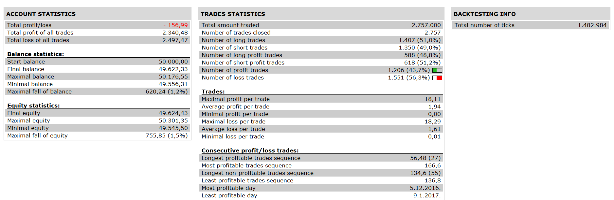

# Vqi Rsi Ma Strategy

> Source: https://fxcodebase.com/code/viewtopic.php?f=31&t=64594  
> Forum: 31 · Topic 64594 · 2 post(s)

---

## Vqi Rsi Ma Strategy

**Apprentice** · Sat Apr 15, 2017 2:04 pm

 

Open LOng
VQI s2>s3
rsi cross over rsi ma
rsi ma < buy level

Open Short
VQI s2<s3
rsi cross under rsima
rsima > sell level

 [Vqi Rsi Ma Strategy.lua](files/111998/Vqi%20Rsi%20Ma%20Strategy.lua)

Required indicator are.

rsi_ma : [http://www.fxcodebase.com/code/viewtopi ... =17&t=5502](http://www.fxcodebase.com/code/viewtopic.php?f=17&t=5502)
vqi: [http://www.fxcodebase.com/code/viewtopi ... 17&t=10504](http://www.fxcodebase.com/code/viewtopic.php?f=17&t=10504)

The Strategy was revised and updated on January 21, 2019.

---

## Re: Vqi Rsi Ma Strategy

**Apprentice** · Thu Dec 21, 2017 10:54 am

The strategy was revised and updated.
