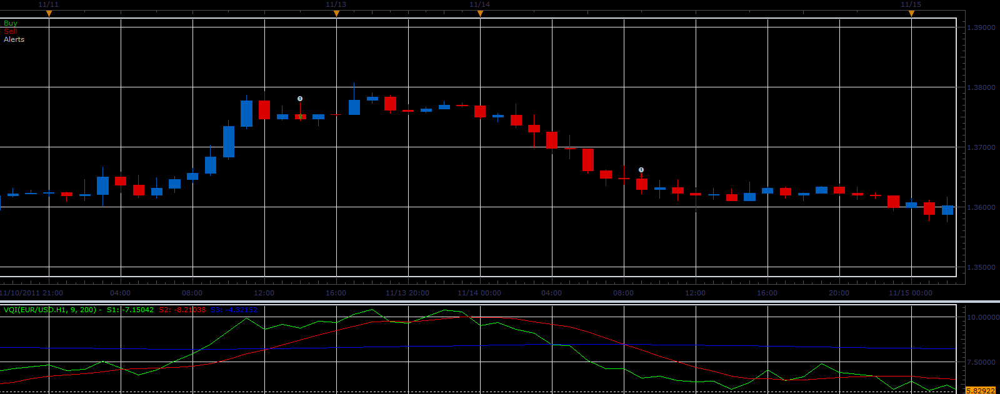

# VQI strategy

> Source: https://fxcodebase.com/code/viewtopic.php?f=31&t=12221  
> Forum: 31 · Topic 12221 · 5 post(s)

---

## VQI strategy

**Alexander.Gettinger** · Tue Jan 24, 2012 4:05 am

Strategy based on VQI indicator ([viewtopic.php?f=17&t=10504&start=0](https://fxcodebase.com/code/viewtopic.php?f=17&t=10504&start=0)).

BUY condition:
s2 cross over s3

SELL condition:
s2 cross under s3

 

Download strategy:

 [VQI_Strategy.lua](files/24208/VQI_Strategy.lua)

For this strategy must be installed VQI indicator ([viewtopic.php?f=17&t=10504&start=0](https://fxcodebase.com/code/viewtopic.php?f=17&t=10504&start=0)).

The Strategy was revised and updated on November 21, 2018.

---

## Re: VQI strategy

**virgilio** · Tue Jan 24, 2012 5:04 pm

Any chances we can include the S1 line with this strategy?

---

## Re: VQI strategy

**Apprentice** · Wed Jan 25, 2012 6:35 pm

Sure we can.
Can you describe the algorithm that you want to use in your strategy.

---

## Re: VQI strategy

**virgilio** · Wed Jan 25, 2012 7:48 pm

Yes, that should be algorithm one. Thank you!

---

## Re: VQI strategy

**Apprentice** · Sun Dec 04, 2016 7:55 am

Bump up.
