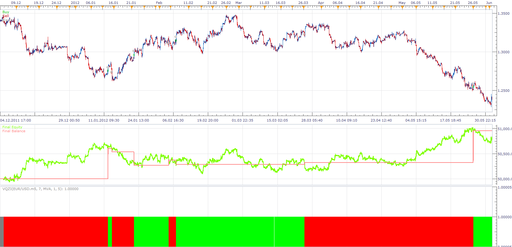

# VQz Indicator Strategy

> Source: https://fxcodebase.com/code/viewtopic.php?f=31&t=23740  
> Forum: 31 · Topic 23740 · 2 post(s)

---

## VQz Indicator Strategy

**Apprentice** · Mon Sep 24, 2012 1:06 pm

Long: when color changes from red to green
Short: when color changes from green to red

 [VQz Indicator Strategy.lua](files/40830/VQz%20Indicator%20Strategy.lua)

Install VQZI.lua from this page, [http://fxcodebase.com/code/viewtopic.php?f=17&t=23002&p=40829#p40829](https://fxcodebase.com/code/viewtopic.php?f=17&t=23002&p=40829#p40829) If you want to use this strategy.

The Strategy was revised and updated on January 21, 2019.

---

## Re: VQz Indicator Strategy

**Apprentice** · Sat Dec 23, 2017 12:59 pm

The strategy was revised and updated.
